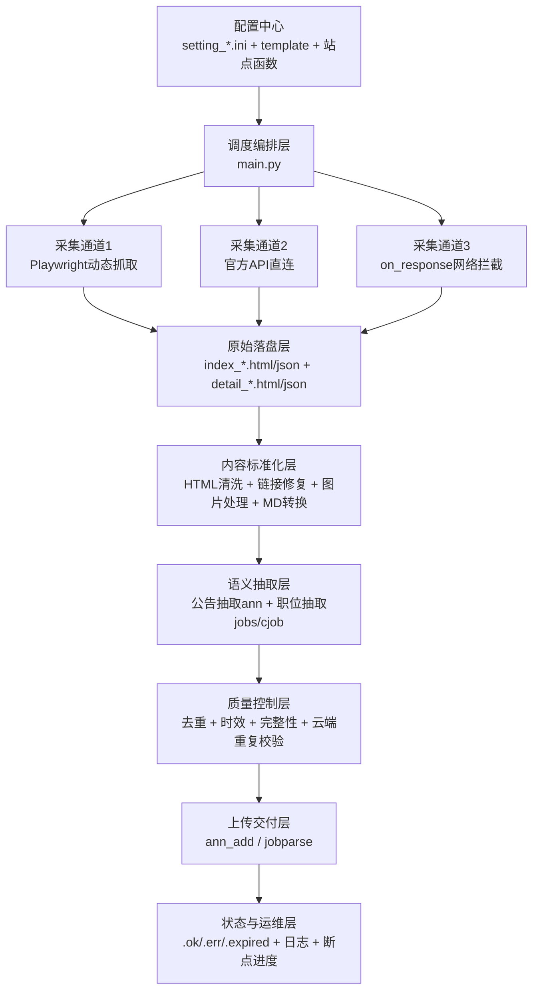

# 招聘数据采集与结构化系统技术方案详解

文档版本：v1.0\
编写日期：2026-04-09\
适用范围：`qzclawler` 项目（学校公告 + 企业职位）

***

## 1. 文档目标与系统定位

本文档从**原理层**与**工程实现层**两条主线，完整说明系统采用的技术方案，重点回答以下问题：

1. 系统如何稳定获取多源异构招聘数据（网站/API/微信）
2. 如何把脏乱页面、图片内容转为可结构化数据
3. 如何通过多模型与规则协同提高抽取准确率与可用率
4. 如何进行去重、质控、上传、追踪与运维
5. 当前技术增量在哪里，后续可如何优化

系统定位：\
该系统是一个“**采集-解析-质控-入库**”闭环的数据生产流水线，服务招聘场景的数据聚合与结构化交付。

***

## 2. 总体技术路线

### 2.1 总体架构图（技术路线框架）



### 2.2 分层职责

1. 配置与编排层：控制“抓谁、怎么抓、跑几步、跑到哪一步”
2. 采集层：保证“拿得到”
3. 标准化层：保证“看得懂”
4. 抽取层：保证“提得准”
5. 质控与交付层：保证“传得进、可追踪、可重试”

***

## 3. 核心设计思路（解决问题的方法论）

### 3.1 多通道采集冗余

针对站点反爬与结构差异，系统不押注单一抓取方式，采用三通道冗余：

1. 页面DOM抓取（通用）
2. API抓取（高稳定、低噪音）
3. 前端响应监听（解决JS动态接口不可见问题）

### 3.2 规则 + 模型协同

1. 规则擅长：清洗、过滤、补全、标准化、边界判定
2. 模型擅长：语义理解、字段抽取、复杂文本结构化
3. 协同策略：先规则降噪，再模型抽取，再规则回补/验收

### 3.3 中间态落盘与状态机

每一步均可落盘（html/json/md/model），并使用 `.ok/.err/.expired/.job` 状态标记，使任务具备：

1. 可恢复
2. 可重跑
3. 可定位问题
4. 可增量处理

***

## 4. 详细模块设计（原理 + 实现）

## 4.1 配置驱动与调度编排

### 原理

通过 `setting_default.ini` + `setting_sch_xx.ini` + `setting_com_xx.ini` + `setting_template.ini` 实现站点能力配置化，避免在主代码硬编码站点规则。

### 实现

1. 入口文件：`main.py`
2. 支持方法模式（`-m`）：
   - 学校链路：`p` / `ann` / `ann_wx` / `ann_api` / `all_ann`
   - 企业链路：`cp` / `cp_full` / `cjob` / `cjob_api` / `all_job`
   - 微信手工链路：`wxhand` / `wxhand_api` / `all_wxhand`
3. 支持参数化：
   - `-f` 指定配置分片
   - `-d` 指定上传环境（dev/prod）
   - `-c` 单公司定向跑
   - `-s` 单文件调试
   - `-t` 分页起始控制

### 技术要点

1. 通过 `progress_*.txt` 实现断点续跑
2. 通过 `_stat` 上下文在流程间传递状态（计数、重试、环境、过滤条件）
3. 分阶段处理，减少长链路失败影响范围

***

## 4.2 采集层（SpiderSch / SpiderCom）

## 4.2.1 学校采集链路（SpiderSch）

### 原理

“列表页解析 + 明细页抓取”两段式采集。

### 实现流程

1. 打开入口URL并执行前置动作（可配置函数）
2. 抽取列表容器HTML，调用站点专属 `gen_xxxxx.extract_table_from_html` 解析成列表JSON
3. 逐条进入详情页，处理：
   - 直接链接
   - 相对链接补全
   - 无链接时按标题点击反查URL
4. 提取正文节点，失败时回退 iframe / 全文策略
5. 输出 `detail_*.html` + `detail_*.json`

### 算法要点

1. 时间窗口过滤：`is_near_month`，默认180天
2. 标题过滤：黑名单正则（`black_wx_exclude_title.txt`）
3. URL归一化：跳转跟踪 + `get_final_url`
4. 随机停顿：降低行为模式固定度

## 4.2.2 企业采集链路（SpiderCom）

### 原理

在学校链路基础上增强“动态加载与多分页策略”。

### 实现增强点

1. 自动滚动加载（按页面高度变化判停）
2. “加载更多”双模式：
   - 函数式点击：`click_load_more_func_name`
   - 元素式点击：`load_more_selector`
3. 分页函数 `page_func_name` 与可配置起始页
4. 明细抓取新开tab，适配复杂前端站点

### 技术增量

1. 前端路由URL（`#`）保护：避免被重定向逻辑误改
2. 已抓文件仅刷新mtime，保留缓存与增量语义

## 4.2.3 API采集通道（auto\_api）

### 原理

绕开前端渲染，直接请求官方职位接口，提升稳定性与效率。

### 实现

1. 统一入口：`auto_api/baidu_data_proc_api.py::api_proc`
2. 按公司键分派到专属适配器（百度/京东/金蝶/软通/人保）
3. 接口数据统一映射为内部 `detail_*.json` 字段模型
4. 同步生成可解析HTML（供后续抽取统一处理）

## 4.2.4 on\_response通道（auto\_on\_response）

### 原理

监听浏览器网络响应，直接拿前端XHR返回JSON，适配接口签名复杂或页面难解析场景。

### 实现

1. 在页面对象注册 `page.on('response', handler)`
2. 匹配目标接口URL
3. 提取响应JSON并直接落盘为内部结构

***

## 4.3 内容标准化层（HTML/Markdown/微信）

### 原理

抽取模型对输入质量敏感，先做“结构清洗与统一表示”。

### 核心步骤

1. HTML黑名单清理（广告、页脚、免责声明等）
2. DOM精修：
   - 移除无关 class/id 节点
   - 提取硬编码字段（公司名、公告名等）
3. 链接修复：
   - 相对路径转绝对URL
   - javascript链接剔除
4. 图片路径修复与替换
5. HTML -> Markdown 转换

### 微信专项处理

1. Playwright获取微信文章完整DOM
2. 处理“阅读全文”跳转
3. 提取公众号信息（名称、发布时间、标题）
4. 调用外部工具转md并回转html以统一后续流程

***

## 4.4 图片处理、OCR与二维码链路（ann\_img / ocr\_api / utils\_img）

### 原理

招聘关键信息常以海报/长图/二维码形式存在，必须做图文融合抽取。

### 流程

1. 下载图片并读取尺寸、格式、MD5、相似哈希
2. 二维码检测：
   - 主引擎 `pyzbar`
   - 回退引擎 `zxingcpp`
   - 标记 `full_qr`（整图/局部）
3. OCR识别：
   - 常规图：单图OCR
   - 长图：切片OCR（连通域辅助切分）
4. 图片质量过滤：
   - 尺寸阈值
   - OCR文本长度阈值
   - 透明度阈值
   - 黑名单MD5/相似哈希/OCR文本哈希
5. 图片上传OBS，正文替换为公网URL

### 关键算法

1. 相似去重：平均哈希（aHash）
2. 透明图过滤：Alpha像素占比 > 30% 判定
3. 二维码裁剪回传：局部二维码坐标截取 + 上传
4. OCR缓存：图片旁路 `.txt` 缓存减少重复耗时

***

## 4.5 语义结构化抽取层（parsegpt）

## 4.5.1 公告抽取（ann\_model）

### 原理

通过提示模板把公告语义映射为固定JSON字段，后续规则再做标准化与兜底。

### 模型链路

1. 主抽取：`call_gpt`（豆包/DeepSeek链路）
2. 职位列表抽取：公告中抽职位数组
3. Markdown优化：豆包/Qwen二次优化

### 字段策略

1. 主体字段：ComName、JobTitle、ApplyTypeLink、GraduationYear 等
2. 派生字段：
   - `AnnType`（wx\_ann/sch\_ann）
   - `FileId`（全文MD5）
   - `JobLink`、微信来源信息
3. 规则修复：
   - 学历枚举规范
   - 毕业届次推断（标题正则 + 当前时间兜底）
   - 多公司公告归一

### 质量判定

1. 缺少公司或标题 -> 失败
2. 无任何投递信息（链接/邮箱/二维码/联系人）-> 失败
3. 过期公告 -> 失败
4. 云端重复检测失败 -> 失败

## 4.5.2 企业职位抽取（cjob\_model）

### 原理

面向企业职位详情，抽取岗位强结构字段（职责、要求、年龄、薪资、标签等）。

### 实现

1. DOM提取核心详情块并转纯文本
2. 调用增强提示词模型（DeepSeek Responses缓存链路）
3. 回填字段（公司、地区、类型、发布时间等）
4. 输出 `cjob + other` 双节点模型

### 技术要点

1. 使用 `previous_response_id` 做上下文缓存，降低重复token开销
2. token细分统计：input/cached/output/reasoning

## 4.5.3 公告内单职位抽取（ann\_model\_job）

针对“公告型页面但实际是单职位”的场景，二次调用模型将公告转换为岗位结构，避免损失职位细节。

***

## 4.6 质控、去重与上传层（SpiderData + quanzhi\_api）

### 原理

将“模型结果”变为“可生产入库数据”，并保证幂等与可回放。

### 质控机制

1. 本地文件级去重：URL/内容MD5
2. 图片黑名单去重：URL哈希、内容哈希、文本哈希
3. 云端重复校验：`/checkrepeat`
4. 时间窗与老文件过滤：
   - 10秒内新文件跳过（防并发冲突）
   - 10天前旧文件跳过（避免陈旧重复处理）

### 上传协议

1. 公告上传：`/ann_add`（JSON）
2. 职位上传：`/jobparse`（form-data: comFrom/fileName/content/retry）
3. 业务状态码处理：
   - `200` 成功
   - `301~305` 业务拒收（过期/重复/人工改过等）写过期标记

### 状态文件语义

1. `.ok`：上传成功
2. `.err`：上传失败需排查
3. `.expired`：业务拒收/不可处理
4. `.job`：公告内职位类型标记

***

## 4.7 自动化解析函数机制（auto\_gen / auto\_gen\_com）

### 原理

列表页结构变化频繁，系统采用“预置解析函数 + 失败时自动生成草稿”的低成本扩展策略。

### 机制

1. 运行时动态导入 `gen_xxxxx.py` 的 `extract_table_from_html`
2. 解析结果为空时，触发LLM生成候选解析函数代码并写入 `data/gen_func_code_*_tmp.py`
3. 人工审核后固化到 `auto_gen*/gen/`

### 价值

1. 快速适配新站点
2. 降低大规模手工编码压力
3. 形成“站点模板资产库”

***

## 5. 模型、协议、算法清单

## 5.1 模型与推理服务

1. 豆包/DeepSeek（Ark）
2. Qwen（DashScope兼容）
3. OpenAI/Azure兼容调用（历史接口保留）

## 5.2 协议与接口

1. HTTP/HTTPS（requests）
2. 浏览器自动化协议（Playwright）
3. REST接口：
   - 数据去重校验
   - 公告/职位上传
   - 代理获取
4. OBS对象存储上传协议

## 5.3 关键算法

1. 内容去重：MD5 / 相似哈希aHash
2. 时效判定：dateparser + 天数阈值
3. 二维码识别：pyzbar + zxingcpp 双引擎回退
4. 长图OCR：连通域辅助切片
5. 动态页面加载判停：滚动高度收敛
6. 数据规范化：学历枚举、届次推断、地区回填、URL归一

***

## 6. 工程实现细节

## 6.1 目录与职责

1. `main.py`：总编排
2. `spider_sch.py / spider_com.py`：采集内核
3. `spider_data.py`：数据处理与上传编排
4. `parsegpt/`：语义抽取与模板
5. `api/`：模型/云端/OCR/存储接口封装
6. `auto_api/`：企业API适配器
7. `auto_on_response/`：响应监听适配器
8. `auto_gen*/gen/`：站点解析与点击函数库
9. `data/*.ini`：配置中心

## 6.2 运行生命周期

1. 启动读取配置
2. 扫描渠道节点
3. 采集生成 detail 文件
4. 标准化与模型抽取
5. 质控与上传
6. 记录状态并循环或退出

## 6.3 CLI“用户界面”

系统主要界面是命令行 + 日志：

1. 参数即操作入口
2. 日志即过程观测
3. 中间文件即结果可审计快照

***

## 7. 数据来源、训练与改进闭环

## 7.1 数据来源

1. 学校就业信息网
2. 企业招聘官网
3. 企业招聘官方接口
4. 微信公众号招聘文章（自动/手工）

## 7.2 训练范式

当前不做模型参数微调，采用：

1. 提示词工程迭代（模板持续优化）
2. 规则层修正（黑名单、正则、字段校正）
3. 失败样本驱动（解析失败 -> 新函数/新规则）

## 7.3 增量改进闭环

1. 采集失败样本归档
2. 调整 template/selector/函数
3. 调整提示词和字段规则
4. 回归重跑并比较成功率

***

## 8. 部署与运维方案

## 8.1 依赖

Python包（示例）：

1. `playwright`
2. `openai`
3. `paddleocr` / `paddlepaddle`
4. `opencv-python` / `pyzbar` / `zxing-cpp`
5. `esdk-obs-python`

系统依赖：

1. Chrome/Chromium
2. zbar（二维码）
3. 外部转换工具：
   - `wechatmp2markdown`
   - `html2markdown`

## 8.2 配置与启动

1. 修改 `data/setting_default.ini` 中路径（浏览器、数据目录、工具路径）
2. 选择配置分片 `-f`
3. 选择运行模式 `-m`
4. 选择环境 `-d`

示例：

```bash
python main.py -m p -f 99 -d dev
python main.py -m ann -f 99 -d dev
python main.py -m ann_api -f 99 -d prod
python main.py -m cp_full -f 50 -d dev
python main.py -m cjob -f 50 -d dev
python main.py -m cjob_api -f 50 -d prod
```

## 8.3 观测与运维

1. 日志：`log/log_*.txt`
2. 进度：`data/progress_*.txt`
3. 状态文件：`.ok/.err/.expired`
4. 数据目录按渠道拆分，支持快速定位问题站点

***

## 9. 关键困难与解决策略

| 困难           | 影响       | 解决策略                       |
| ------------ | -------- | -------------------------- |
| 页面结构不统一且频繁变化 | 采集失败率高   | 配置驱动 + 模板库 + 动态函数扩展        |
| 强JS渲染/接口隐藏   | DOM抓取不稳定 | API直连 + on\_response拦截     |
| 图片与二维码承载关键信息 | 字段缺失     | OCR + 双引擎二维码 + 图片上传回填      |
| 公告文本噪声大      | 模型幻觉/漏提  | 清洗降噪 + 严格提示模板 + 后处理规则      |
| 重复与过期数据多     | 入库污染     | 本地去重 + 云端查重 + 时效过滤 + 业务码分流 |
| 长链路失败难恢复     | 运维成本高    | 中间态落盘 + 状态机文件 + 分段执行       |

***

## 10. 技术增量总结（相对基础爬虫方案）

1. 从“单页面抓取”升级为“多通道采集冗余”
2. 从“纯文本抽取”升级为“图文融合抽取（OCR+二维码）”
3. 从“单模型直出”升级为“多模型协同 + 规则闭环”
4. 从“一次性脚本”升级为“可断点、可重试、可状态追踪的流水线”
5. 从“站点硬编码”升级为“配置化 + 插件化 + 自动生成函数草稿”

***

## 11. 下一步算法与工程优化建议

## 11.1 算法侧

1. 多模型一致性校验（投票/置信度）
2. OCR后文本纠错（领域词典 + 拼写纠错）
3. 基于学习的页面噪声识别替代部分黑名单规则
4. 增加字段级质量评分（可解释）

## 11.2 工程侧

1. 将接口密钥迁移到环境变量与密钥管理（避免明文）
2. 任务队列化（异步并发 + 失败重试策略）
3. 增加结构化监控指标：
   - 抓取成功率
   - 抽取成功率
   - 上传成功率
   - 重复率
4. 增加自动回归样本集，保障配置改动不回退

***

## 12. 验收指标建议（可用于里程碑）

1. 采集覆盖率：目标站点近7天新增信息覆盖率 >= 95%
2. 抽取成功率：可结构化出核心字段的比例 >= 90%
3. 上传成功率：接口成功入库比例 >= 98%
4. 重复拦截率：重复数据入库率 <= 1%
5. 异常恢复时间：单站点修复平均时长 <= 1天

***

## 13. 附录：常用运行组合

1. 学校全链路（分阶段）
   - `p -> ann -> ann_api`
2. 企业全链路（分阶段）
   - `cp/cp_full -> cjob -> cjob_api`
3. 微信手工链路
   - `wxhand -> wxhand_api`
4. 循环任务
   - `all_ann` / `all_job` / `all_wxhand`

***

