# Pin 智能招聘数据分析系统 V1.0 技术文档

---

## 1 引言

### 1.1 编写目的

本文档介绍 Pin 智能招聘数据分析系统的软件架构、功能模块划分、核心算法设计及技术实现方式，供软件著作权登记评审使用。

### 1.2 项目背景

在招聘行业信息化进程中，企业 HR 和求职者面临着严重的信息碎片化问题——招聘数据分散在数十个招聘平台、企业官网及行业论坛中，格式不统一、字段缺失、数据重复等问题导致人工筛选效率低下。本系统正是为解决这一行业痛点而设计。

系统目标用户包括企业人力资源从业者、猎头顾问、行业分析机构及求职者。核心技术价值体现在：通过 Playwright 自动化浏览器引擎和 BeautifulSoup 解析库实现异构招聘页面的统一采集；借助火山引擎豆包大模型和通义千问等 AI 服务从非结构化文本中提取七十余维结构化字段；结合全文检索、组合筛选及多维度聚合统计，为用户提供实时、精准的招聘数据分析能力。

### 1.3 术语定义

| 术语 | 说明 |
|------|------|
| Playwright | 微软开源的浏览器自动化引擎，支持 JavaScript 渲染页面抓取 |
| LLM | 大语言模型（Large Language Model），用于非结构化文本结构化提取 |
| Pipeline | 数据流水线调度器，编排抓取→解析→入库三个阶段的状态机 |
| 字段映射 | 将 LLM 输出的 JSON 字段转换为数据库列的逻辑，包含类型转换和多格式解析 |
| dedupe_key | 去重键，由公司标识和职位标题拼接构建，用于同一职位不同来源的合并 |
| 缓存预热 | 应用启动时预先将高频访问统计数据加载到内存缓存 |

---

## 2 总体设计

### 2.1 需求概述

系统需满足以下核心功能需求：

1. 支持多源异构招聘页面的自动化采集，覆盖企业官网、行业招聘平台等数据源，可处理静态 HTML 和 JavaScript 动态渲染页面。
2. 通过大语言模型对抓取的原始文本进行结构化解析，自动提取职位名称、薪资范围、学历要求、技能标签等七十余维字段。
3. 提供全文检索和多维度组合筛选能力，用户可按城市、职位类别、薪资范围、发布时间等条件快速定位目标数据。
4. 实现招聘数据的多维度聚合分析，包括技能热度趋势、薪资分布统计、城市需求对比及 AI 岗位专项追踪。
5. 提供实时数据监控和异常告警能力，保障数据采集链路的持续稳定运行。

### 2.2 软件体系结构

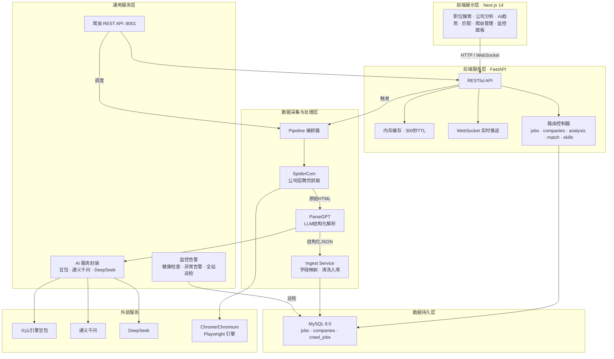

前端层基于 Next.js 框架构建单页应用，通过 RESTful API 和 WebSocket 双通道与后端交互。后端层以 FastAPI 为核心，集成内存缓存加速高频查询，WebSocket 连接实现爬虫状态实时推送。数据采集层通过 Pipeline 状态机编排抓取、解析、入库三阶段流水线，每阶段独立运行并记录状态。服务层提供爬虫管理 REST API、多 LLM 提供商统一封装以及定时监控告警能力。数据层采用 MySQL 8.0 存储清洗后数据和各阶段中间状态。整体架构遵循单向数据流原则，从采集到展示逐层单向传递。

### 2.3 模块结构图

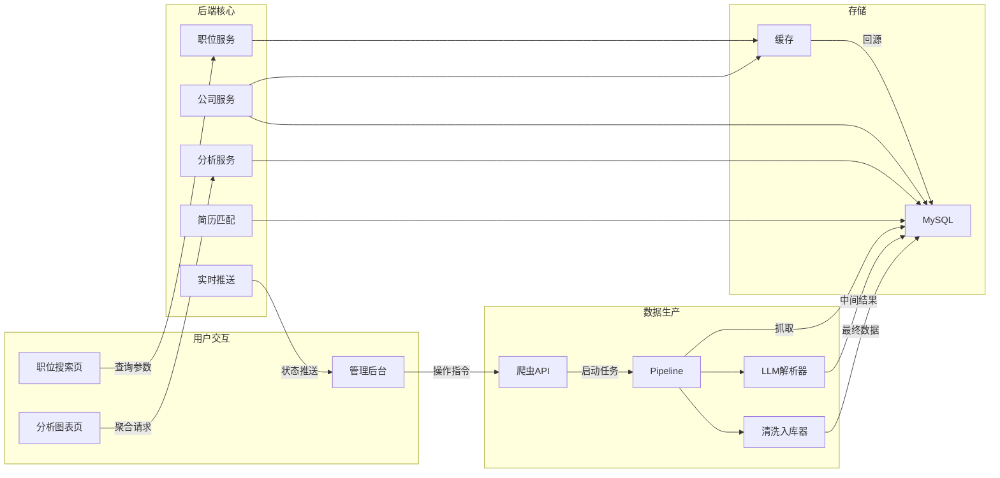

系统采用前后端分离和数据采集独立部署的双层架构。前端用户交互模块通过 HTTP 请求调用后端各业务服务，管理后台则通过爬虫 API 触发数据采集任务。后端核心服务共享同一份数据库连接池和内存缓存实例。数据生产模块通过 Pipeline 协调器驱动解析器和清洗入库器顺序执行，每阶段状态持久化到数据库。实时推送服务独立于主请求链路，通过 WebSocket 长连接将爬虫进度实时传递到管理后台。

### 2.4 技术栈

| 层级 | 技术 |
|------|------|
| 前端框架 | Next.js 14 + React 18 + TypeScript |
| 前端 UI 库 | Material UI (MUI) + TailwindCSS |
| 前端图表 | ECharts |
| 后端框架 | FastAPI + Uvicorn ASGI 服务器 |
| 数据库 | MySQL 8.0 + PyMySQL + DBUtils 连接池 |
| AI 服务 | 火山引擎豆包大模型、通义千问、DeepSeek（OpenAI 兼容接口） |
| 爬虫引擎 | Playwright (Chromium) + BeautifulSoup + lxml |
| 实时通信 | WebSocket 协议 |

---

## 3 程序描述

### 3.1 职位搜索与展示子系统

本子系统是系统面向用户的核心流量入口，接收用户输入的多维度查询条件（关键词、城市、职位类型、经验要求、学历范围、发布时间区间等），构建动态 SQL 查询并返回分页职位列表。

查询请求首先尝试命中内存缓存（键为查询参数组合的哈希），未命中则拼接 MySQL 查询语句。系统利用复合索引 (is_active, status, published_at) 加速高频查询，支持游标分页和传统 offset 分页两种模式。职位详情查询同时关联 job_sources 表返回来源链接，为溯源提供支持。

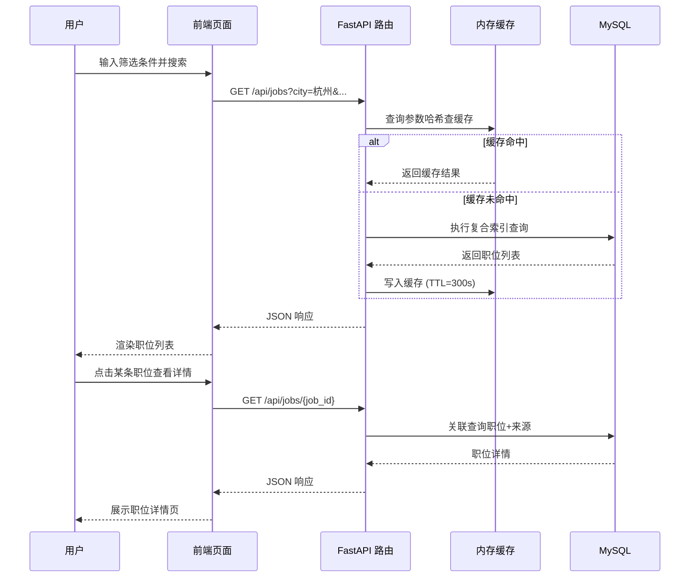

### 3.2 爬虫数据采集子系统

子系统负责自动化获取招聘页面原始 HTML，是公司招聘页抓取能力的执行核心。它基于 Playwright 启动 Chromium 无头浏览器，支持静态页面和 JavaScript 动态渲染页面的统一处理。

Pipeline 编排器作为中枢调度器，维护一套状态机模型：初始状态「待抓取」→「已抓取」→「已解析」→「已入库」，每个状态转换都有对应的数据库记录更新。当状态回退或异常时，系统支持断点续传——从最后一个成功状态继续执行，已完成的步骤不会重复运行。Pipeline 支持单公司和批量公司模式，通过命令行参数或 REST API 触发。

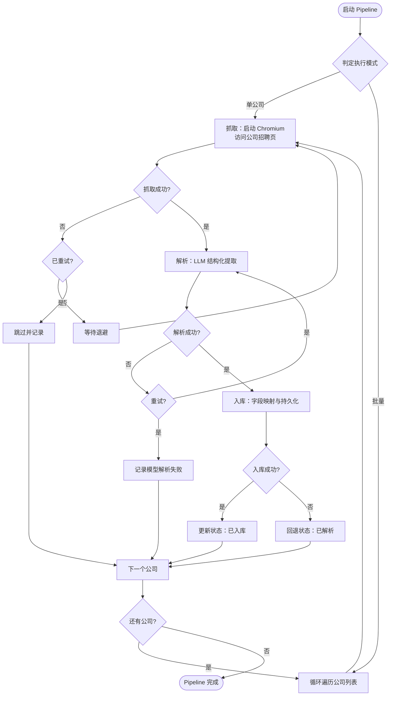

### 3.3 LLM 结构化解析子系统

本子系统负责将抓取到的非结构化职位文本转换为标准化结构化字段，是本系统 AI 能力的核心实现。

解析流程首先对原始 HTML 进行清洗——去除样式脚本、提取正文、识别关键词区块。随后将清洗后的文本连同精心设计的提示词模板一起发送给大语言模型（支持豆包、通义千问、DeepSeek 三种提供商），模型返回约 70 个结构化字段组成的 JSON。系统内置双重容错：优先信任模型直接输出的 JSON；若 JSON 格式损坏，则通过正则表达式从文本中二次提取。

解析器设计了缓存层以提升重复请求效率，相同文本不会重复调用 API。模型输出的 JSON Schema 定义在独立的模型描述文件中，便于新字段扩展时无需修改解析逻辑。

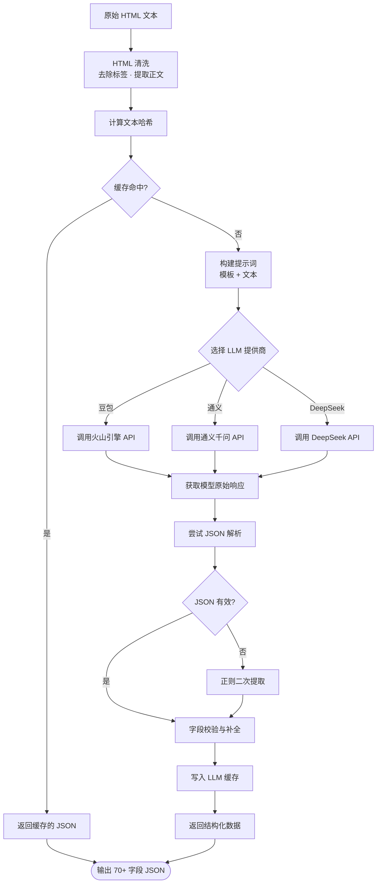

### 3.4 数据清洗与入库子系统

子系统负责将 LLM 输出的结构化 JSON 转换为数据库记录，是数据生产链路的最后一环。

入库流程包含三个核心步骤：首先是字段映射——将模型 JSON 键名映射为数据库列名，其间完成多种格式转换（如薪资文本拆解为最低值和最高值、城市文本匹配省级行政区、发布日期统一标准化为 Date 格式、技能列表 JSON 序列化存储）；其次是去重判断——结合公司标识和职位标题生成 dedupe_key，若库中已存在相同键，则更新原记录而非插入；最后是来源关联——将职位的来源链接、申请链接持久化到 job_sources 表。

入库模块支持三种粒度的执行：全量入库、按公司 ID 入库、按任务 ID 入库，通过命令行参数或定时任务触发。

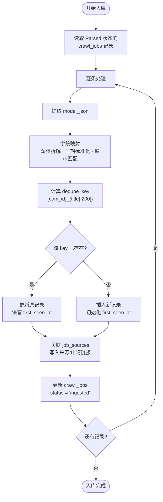

### 3.5 多维度聚合分析子系统

子系统为系统提供丰富的数据分析能力，包含技能热度统计、薪资区间分布、城市需求对比和 AI 岗位专项追踪四个核心分析维度。

分析服务接收前端请求后，构建聚合查询 SQL（通常包含 COUNT、AVG、GROUP BY 等聚合操作），这些查询同样走缓存系统，TTL 设为 300 秒。技能分析通过拆解 skill_tags JSON 数组的每个元素进行频次统计；薪资分析按城市和职位类别两个维度生成盒须图数据；城市分析统计每个城市的活跃职位数量；AI 趋势分析基于 is_ai_related 标记反映行业变化。

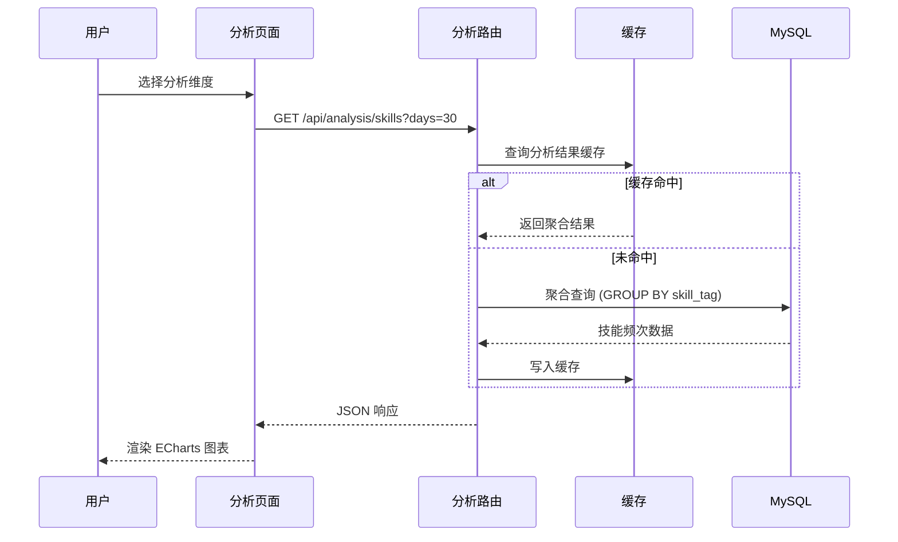

### 3.6 简历匹配分析子系统

本子系统的核心功能是评估求职者简历与职位要求的匹配度，为用户提供量化的投递建议。

匹配流程为：系统从简历文本中提取技能关键词、期望薪资、工作年限、期望城市等维度，与职位的对应字段逐一对比。每个维度独立打分（完全匹配 100 分、部分匹配按比例、完全不匹配 0 分），最终加权平均得到综合匹配度分数。权重可在配置中调整，默认技能匹配权重最高。

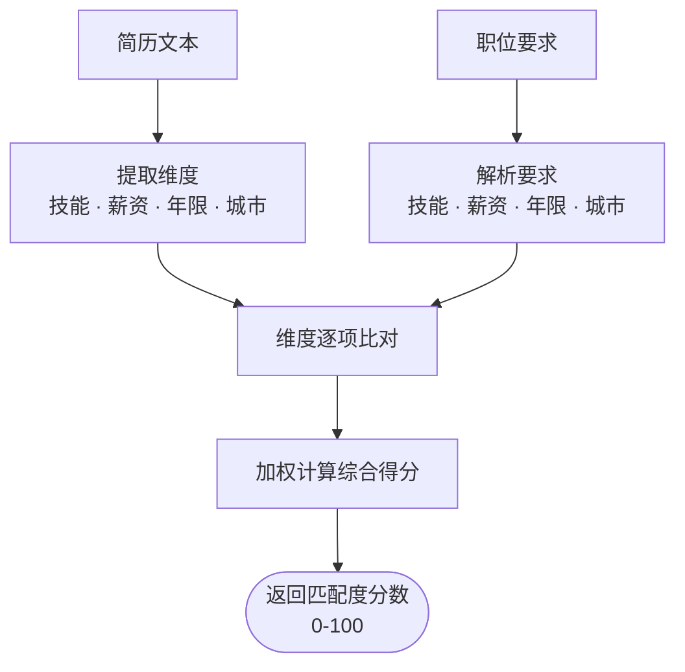

### 3.7 爬虫监控告警子系统

为保障数据采集链路的持续稳定运行，系统内置了一套完整的监控告警体系。

监控服务定时巡检数据库，以最近 N 小时为单位统计各公司的抓取成功率、LLM 解析成功率、入库成功率三个核心指标。当任一指标低于阈值时触发告警，告警信息通过日志系统和 WebSocket 双通道通知管理员。全站巡检功能会扫描所有启用的数据源，生成包含耗时、数据量、失败原因等维度的巡检报告，为运维决策提供数据支撑。

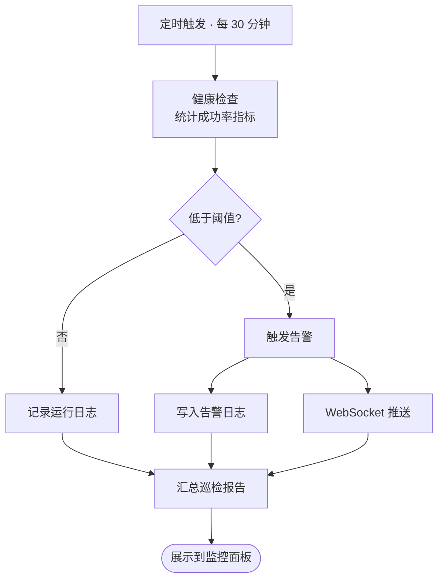

### 3.8 数据库层

系统采用 MySQL 8.0 关系型数据库，核心设计如下：

- **jobs 表**：清洗后职位主表，包含 title、salary_min/max、city、education_level、skill_tags、published_at、is_ai_related、dedupe_key 等字段，通过复合索引支持多维度检索。
- **companies 表**：公司信息表（去重），通过唯一名称与公司来源表关联。
- **crawl_jobs 表**：流水线状态表，记录每条数据从抓取到入库的全过程状态，status 字段取值为 raw/crawled/parsed/ingested/failed。
- **crawl_companies 表**：爬虫目标配置表，存储公司标识、招聘页 URL 及抓取配置。
- **job_sources 表**：职位来源链接表，与 jobs 表一对多关联。
- **crawl_tasks 表**：批任务执行日志，记录每次 Pipeline 运行的整体情况。

```mermaid
erDiagram
    companies ||--o{ crawl_companies : "拥有爬虫配置"
    companies ||--o{ jobs : "拥有职位"
    crawl_companies ||--o{ crawl_jobs : "产生流水线记录"
    crawl_jobs ||--|| jobs : "清洗后生成"
    jobs ||--o{ job_sources : "拥有来源"
    crawl_jobs ||--o{ crawl_tasks : "归属批任务"

    companies {
        int id PK
        varchar name UNIQUE
        varchar industry
        tinyint status
    }
    jobs {
        int id PK
        int company_id FK
        varchar title
        int salary_min
        int salary_max
        varchar city
        text skill_tags
        date published_at
        varchar dedupe_key UNIQUE
    }
    crawl_jobs {
        int id PK
        varchar com_id FK
        text raw_html
        text model_json
        varchar status
        datetime crawled_at
    }
    job_sources {
        int id PK
        int job_id FK
        varchar source_url
        varchar apply_url
    }
    crawl_companies {
        int id PK
        varchar com_id UNIQUE
        varchar career_url
        json json_config
        tinyint is_active
    }
```

---

## 4 接口设计

### 4.1 RESTful API 总览

系统采用统一的 RESTful 架构风格，所有接口返回 MIME 类型为 application/json。接口路径以 /api 为前缀，版本通过 Future-Proof 路径策略预留（当前为 V1，直接使用根路径）。

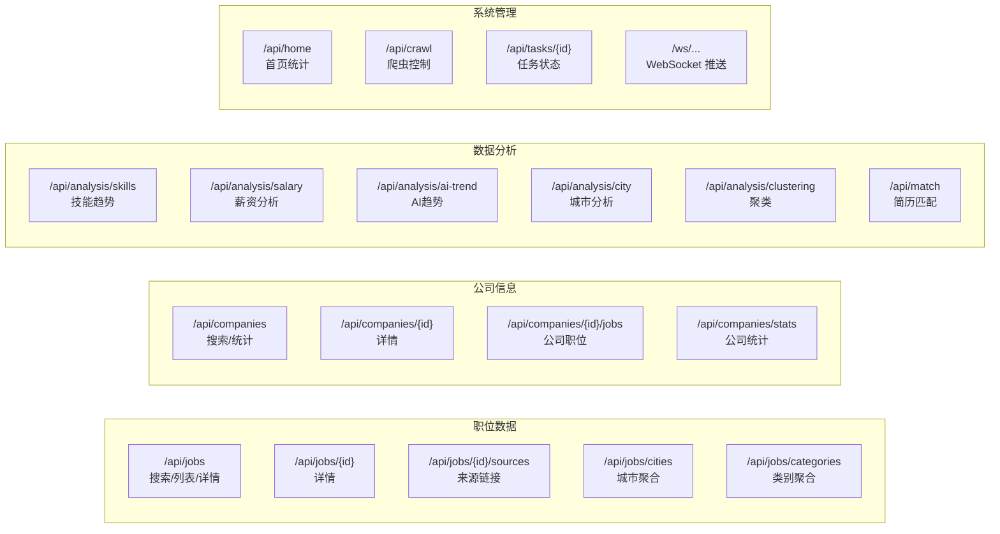

接口设计遵循资源 RESTful 原则：资源名使用复数形式，动作由 HTTP 方法表达（GET 查询、POST 创建、PATCH 部分更新），状态变更通过路径动词或 action 子资源实现。统一错误处理中间件确保异常返回一致的 JSON 结构（包含 code、message、detail 字段）。

### 4.2 核心接口详情

**职位搜索接口** `/api/jobs` 是系统最高频的查询入口。接收 page、page_size、keyword、city、employment_type、is_intern、education_level、published_days、sort_by、sort_order 等十一个查询参数，内部首先对所有参数合法性校验（城市必须在允许列表中、排序字段必须在白名单内），然后构建动态 SQL WHERE 子句，命中缓存则直接返回，未命中则执行 MySQL 查询。响应结构遵循统一分页格式：`{ "items": [...], "total": N, "page": P, "page_size": S }`，便于前端表格组件直接消费。

**数据检索与管理接口** `/api/jobs/{id}` 是单条职位详情查询接口。路径参数为自增主键 job_id，接口内通过 JOIN 查询同时获取职位本身记录和关联来源链接，返回聚合后的详细信息对象。当请求不存在的 ID 时返回 404，前端据此展示空态提示。

**分析聚合接口** `/api/analysis/skills` 是数据分析类接口中的代表性实现。接收 days 参数限定统计窗口，内部执行 GROUP BY + COUNT 聚合，返回每个技能的职位数量。数据按数量降序排列，默认返回前 50 条。该接口结果受缓存保护，每 300 秒刷新一次，确保高频访问场景下数据库压力可控。

---

## 5 运行设计

### 5.1 服务器端环境

| 项目 | 要求 |
|------|------|
| 操作系统 | Windows 10/11 / Linux (Ubuntu 22.04+) / macOS 13+ |
| Python 运行时 | Python 3.10 或更高版本 |
| Node.js 运行时 | Node.js 18+ (前端开发环境) |
| 数据库 | MySQL 8.0.30+ |
| 内存 | 推荐 16GB 或更高（Playwright Chromium 需约 1GB） |
| 磁盘 | 推荐 SSD 50GB+（原始 HTML 数据量较大） |
| 网络 | 可正常访问火山引擎 API、通义千问 API、DeepSeek API |

### 5.2 客户端环境

| 项目 | 要求 |
|------|------|
| 浏览器 | Chrome 110+ / Edge 110+ / Firefox 115+ / Safari 16+ |
| 屏幕分辨率 | 推荐 1920×1080 及以上,支持响应式布局 |
| 网络 | 正常宽带连接，防火墙允许 8000、8001、3000 端口 |

### 5.3 部署架构

系统采用前后端分离部署模式，生产环境下每个组件独立启动并监听不同端口。

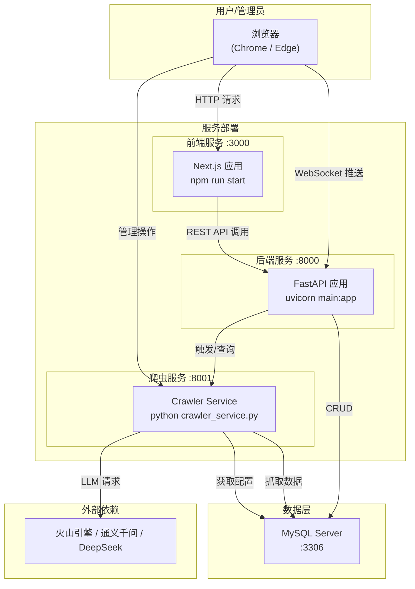

部署流程简洁：先在服务器上初始化 MySQL 数据库 schema，然后依次启动后端 FastAPI 服务（:8000）、爬虫 REST API 服务（:8001）和 Next.js 前端（:3000）。三者通过本地网络调用，无需额外的 API 网关或负载均衡。监控告警服务作为后台定时任务运行，巡检结果通过 WebSocket 实时推送到管理后台。

---

## 6 技术指标汇总

### 6.1 后端核心业务代码

| 指标 | 数值 |
|------|------|
| 核心业务文件数 | 35 |
| 有效代码行数 | 7048 |
| 编程语言 | Python |

### 6.2 前端核心业务代码

| 指标 | 数值 |
|------|------|
| 核心页面组件数 | 34 |
| 编程语言 | TypeScript / TSX |

### 6.3 第三方组件与依赖

| 组件 | 用途 |
|------|------|
| FastAPI | Python Web 框架 |
| Uvicorn | ASGI 服务器 |
| PyMySQL + DBUtils | MySQL 连接池与数据库操作 |
| Playwright | 浏览器自动化引擎（Chromium） |
| BeautifulSoup + lxml | HTML 解析库 |
| openai | OpenAI 兼容 LLM 客户端 |
| volcengine-python-sdk | 火山引擎 API SDK |
| Next.js 14 | React 全栈框架 |
| React 18 | UI 渲染库 |
| @mui/material | Material Design 组件库 |
| ECharts | 数据可视化图表库 |
| TailwindCSS | 原子化 CSS 框架 |

### 6.4 全部源码统计

| 指标 | 数值 |
|------|------|
| 后端源码文件总数 | 35（核心业务） |
| 前端源码文件总数 | 34（页面组件） |
| 全部有效代码行数 | ≥7048（后端核心） |
| 源代码文档页数 | 约 150 |
