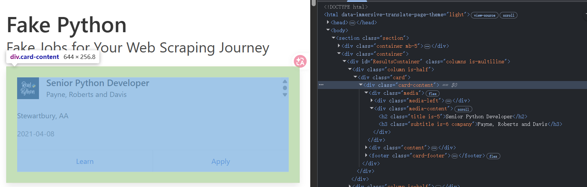
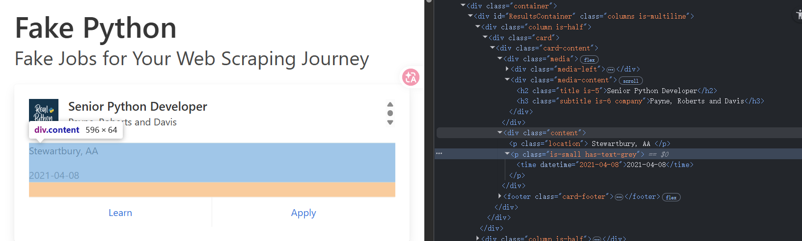
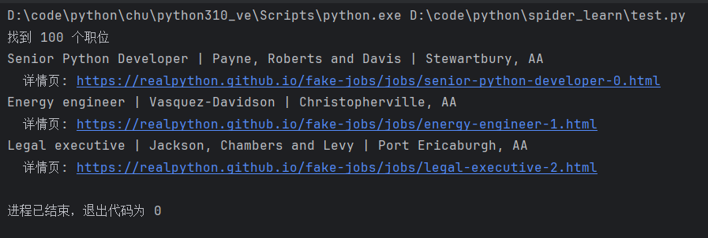
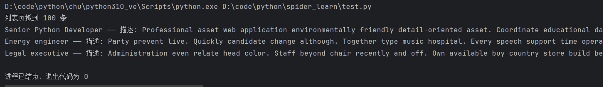
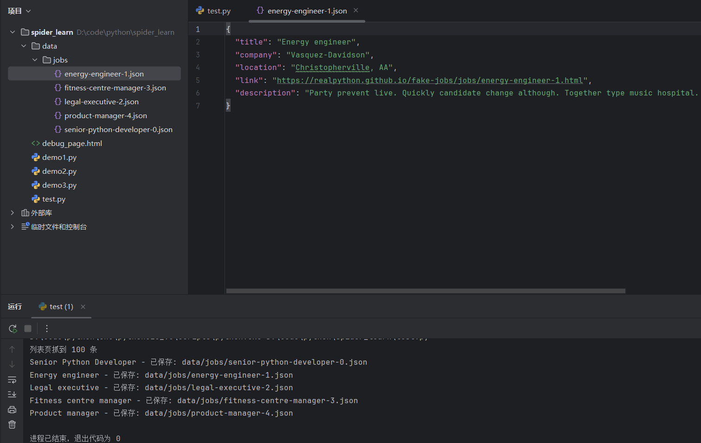
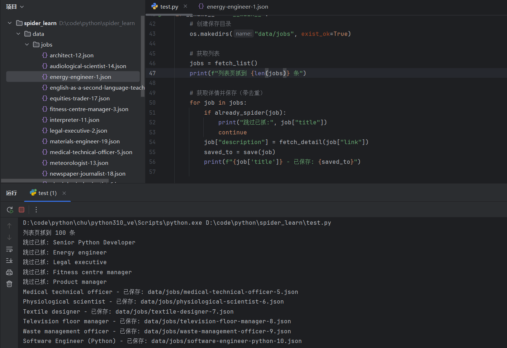
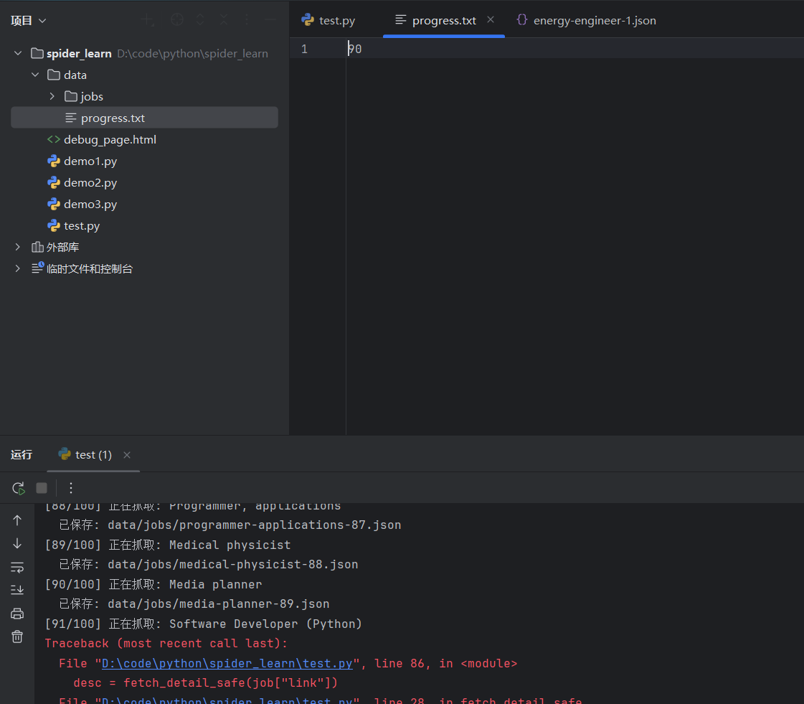

# 练手
开始**真正动手**——用最少的代码,搭一个**能跑、能看到数据、能反复运行的**职位爬虫。

用一个**专门给爬虫练手的网站** [quotes.toscrape.com](https://quotes.toscrape.com)(它的"职位版"是 [realpython.github.io/fake-jobs](https://realpython.github.io/fake-jobs/))作为目标。 <a class="reference-link" href="%E7%BB%83%E6%89%8B/%E7%BB%83%E6%89%8B%E7%BD%91%E7%AB%99.md">练手网站</a>

这个站点是**官方明确允许爬取的**,结构和真实招聘网站非常像(列表页 → 详情页 → 字段抽取),非常适合作为我们的"第一只麻雀"。

学完这一讲,会清晰地感受到:**项目里那些复杂的工程代码,不是天才设计出来的,而是一个最简单的爬虫,在不断遇到问题、不断打补丁的过程中"长大"的**。

## **一、目标定义:我们要抓什么**

在写任何一行代码之前,先问自己三个问题:

1.  **抓哪个网站?​** —— `https://realpython.github.io/fake-jobs/`
2.  **要抓什么字段?​** —— 职位标题、公司名、地点、发布时间、详情页链接、职位描述
3.  **抓多少?​** —— 全站(这个练习站只有约 100 条)

这三个问题就是"产品需求"。真实项目里也是一样——**先想清楚要什么,再决定怎么抓**,顺序不能反。

## **二、第 0 步:用浏览器先"踩点"​**

这是初学者最容易跳过的一步,也是**最关键的一步**。

打开网址,按 `F12` 打开开发者工具,看三件事:

1.  **Elements 面板**:看 HTML 结构,找出"职位卡片"用的是什么标签和 class
2.  **Network 面板**:刷新页面,看数据是 HTML 直出还是接口加载
3.  **手动点一个职位**:看详情页的 URL 规律和字段位置

通过踩点,我们会发现:

*   列表页:每张卡片是 `<div class="card-content">`,里面有标题、公司名、地点、详情链接
    
    
*   详情页:职位描述在 `<div class="content">` 里
    
    
*   数据是**服务端直接渲染**到 HTML 的,**不是接口加载**——所以用 `requests` 就够了,不需要 Playwright

**这就是第 2 讲讲过的"采集通道选择"​**:能用静态抓的,绝不上动态抓。

## **三、第一版:30 行代码,先把数据抓回来**

```
import requests
from bs4 import BeautifulSoup

URL = "https://realpython.github.io/fake-jobs/"
headers = {"User-Agent": "Mozilla/5.0"}

resp = requests.get(URL, headers=headers, timeout=10)
soup = BeautifulSoup(resp.text, "lxml")

cards = soup.select("div.card-content")
print(f"找到 {len(cards)} 个职位")

for card in cards[:3]:
    title   = card.select_one("h2.title").get_text(strip=True)
    company = card.select_one("h3.company").get_text(strip=True)
    location = card.select_one("p.location").get_text(strip=True)

    # 方法1: 选择 footer 中的第二个 a 标签（Apply按钮）
    # apply_link = card.select_one("footer.card-footer a:last-child")

    # 方法2: 或者通过文本内容查找
    apply_link = card.find("a", string="Apply")

    if apply_link:
        link = apply_link["href"]
    else:
        link = "N/A"

    print(title, "|", company, "|", location)
    print("  详情页:", link)

```



**这就是一个最小的爬虫了**。这一版用到的积木:

*   `requests.get()` —— 发请求
*   `BeautifulSoup` —— 解析 HTML
*   `select` / `select_one` —— 用 CSS 选择器抠数据

**注意一个细节**:我们加了 `User-Agent`。这就是第 3 讲讲的"伪装",虽然这个练习站不需要,但养成习惯。

## **四、第二版:加上详情页抓取**

光有列表页字段不够,职位描述在详情页里。我们需要"两段式抓取"——列表页拿基础字段 + 详情页链接,再逐个打开详情页补充。

```
import requests
from bs4 import BeautifulSoup

headers = {"User-Agent": "Mozilla/5.0"}

def fetch_list():
    resp = requests.get("https://realpython.github.io/fake-jobs/", headers=headers, timeout=10)
    soup = BeautifulSoup(resp.text, "lxml")
    jobs = []
    for card in soup.select("div.card-content"):
        jobs.append({
            "title":    card.select_one("h2.title").get_text(strip=True),
            "company":  card.select_one("h3.company").get_text(strip=True),
            "location": card.select_one("p.location").get_text(strip=True),
            "link": card.find("a", string="Apply")["href"] if card.find("a", string="Apply") else None,
        })
    return jobs

def fetch_detail(url):
    resp = requests.get(url, headers=headers, timeout=10)
    soup = BeautifulSoup(resp.text, "lxml")
    desc_node = soup.select_one("div.content")
    return desc_node.get_text(strip=True) if desc_node else ""

jobs = fetch_list()
print(f"列表页抓到 {len(jobs)} 条")

# 先只测试前 3 条
for job in jobs[:3]:
    job["description"] = fetch_detail(job["link"])
    print(job["title"], "—— 描述:", job["description"])

```



**这一版的关键变化:​**

1.  把"抓列表"和"抓详情"**拆成两个函数** —— 这就是项目里 `__spider()` 和 `fetchDetail()` 分离的雏形。
2.  先抓所有列表数据,再统一去抓详情 —— **职责分明,出错也容易定位**。

**项目映射:​** 猎聘的 `spider_liepin.py` 也是这种结构——`onResponse` 拿列表,`__spider()` 遍历每条职位再打开详情页补字段。只是它把"列表"换成了"接口监听",把"requests"换成了"Playwright"。

## **五、第三版:落盘 —— "先文件、后处理"​**

现在程序一关,数据就丢了。我们要把抓到的每条职位**存成 JSON 文件**。

```python
import requests
from bs4 import BeautifulSoup
import os
import json

headers = {"User-Agent": "Mozilla/5.0"}

def fetch_list():
    resp = requests.get("https://realpython.github.io/fake-jobs/", headers=headers, timeout=10)
    soup = BeautifulSoup(resp.text, "lxml")
    jobs = []
    for card in soup.select("div.card-content"):
        jobs.append({
            "title":    card.select_one("h2.title").get_text(strip=True),
            "company":  card.select_one("h3.company").get_text(strip=True),
            "location": card.select_one("p.location").get_text(strip=True),
            "link": card.find("a", string="Apply")["href"] if card.find("a", string="Apply") else None,
        })
    return jobs

def fetch_detail(url):
    resp = requests.get(url, headers=headers, timeout=10)
    soup = BeautifulSoup(resp.text, "lxml")
    desc_node = soup.select_one("div.content")
    return desc_node.get_text(strip=True) if desc_node else ""

def save(job):
    # 用职位链接里的 ID 作为文件名,保证唯一
    job_id = job["link"].rstrip("/").split("/")[-1].replace(".html", "")
    path = f"data/jobs/{job_id}.json"
    with open(path, "w", encoding="utf-8") as f:
        json.dump(job, f, ensure_ascii=False, indent=2)
    return path

if __name__ == "__main__":
    # 创建保存目录
    os.makedirs("data/jobs", exist_ok=True)

    # 获取列表
    jobs = fetch_list()
    print(f"列表页抓到 {len(jobs)} 条")

    # 获取详情并保存（先测试前5条）
    for job in jobs[:5]:
        job["description"] = fetch_detail(job["link"])
        saved_to = save(job)
        print(f"{job['title']} - 已保存: {saved_to}")

```



**这一版做了什么:​**

*   每条职位独立存一个 JSON 文件
*   用 URL 里的 ID 作为文件名 —— **天然去重**(同一个职位重抓会覆盖,不会产生重复文件)

**项目映射:​** 这就是爬虫逻辑分析里反复强调的**​"先文件、后接口"设计**。`spider.py` 的 `savePath`、`com/`、`job/` 目录,本质就是这个思路的工程化版本。

**为什么要这么做?​**

1.  程序中途崩了,**已经抓到的数据不会丢**
2.  想换字段抽取规则,**不用重新抓网络**,直接读本地 JSON 重跑
3.  出问题了能**留下"案发现场"​**给你排查

## **六、第四版:加去重 —— 不抓已经抓过的**

如果一个职位已经抓过(本地有文件了),就跳过。

```python
import requests
from bs4 import BeautifulSoup
import os
import json

headers = {"User-Agent": "Mozilla/5.0"}

def fetch_list():
    resp = requests.get("https://realpython.github.io/fake-jobs/", headers=headers, timeout=10)
    soup = BeautifulSoup(resp.text, "lxml")
    jobs = []
    for card in soup.select("div.card-content"):
        jobs.append({
            "title":    card.select_one("h2.title").get_text(strip=True),
            "company":  card.select_one("h3.company").get_text(strip=True),
            "location": card.select_one("p.location").get_text(strip=True),
            "link": card.find("a", string="Apply")["href"] if card.find("a", string="Apply") else None,
        })
    return jobs

def fetch_detail(url):
    resp = requests.get(url, headers=headers, timeout=10)
    soup = BeautifulSoup(resp.text, "lxml")
    desc_node = soup.select_one("div.content")
    return desc_node.get_text(strip=True) if desc_node else ""

def save(job):
    # 用职位链接里的 ID 作为文件名,保证唯一
    job_id = job["link"].rstrip("/").split("/")[-1].replace(".html", "")
    path = f"data/jobs/{job_id}.json"
    with open(path, "w", encoding="utf-8") as f:
        json.dump(job, f, ensure_ascii=False, indent=2)
    return path

def already_spider(job):
    """检查职位是否已经爬取过"""
    job_id = job["link"].rstrip("/").split("/")[-1].replace(".html", "")
    return os.path.exists(f"data/jobs/{job_id}.json")


if __name__ == "__main__":
    # 创建保存目录
    os.makedirs("data/jobs", exist_ok=True)

    # 获取列表
    jobs = fetch_list()
    print(f"列表页抓到 {len(jobs)} 条")

    # 获取详情并保存（带去重）
    for job in jobs:
        if already_spider(job):
            print("跳过已抓:", job["title"])
            continue
        job["description"] = fetch_detail(job["link"])
        saved_to = save(job)
        print(f"{job['title']} - 已保存: {saved_to}")

```



**项目映射:​** 这就是 `spider.py` 里 `isSpiderToday()` 的最简版。猎聘项目把它升级成了**四层去重**——本地文件、当日已抓、数据库已存在、黑名单。但本质都是这一句 `if already_spider(): continue`。

## **七、第五版:加节奏控制 + 异常处理**

现在要让爬虫**像个有素质的客人**,不要一秒钟敲服务器 100 下,也不要一遇到错误就崩溃。

```python
import requests
from bs4 import BeautifulSoup
import os
import json
import time
import random

headers = {"User-Agent": "Mozilla/5.0"}

def fetch_list():
    resp = requests.get("https://realpython.github.io/fake-jobs/", headers=headers, timeout=10)
    soup = BeautifulSoup(resp.text, "lxml")
    jobs = []
    for card in soup.select("div.card-content"):
        jobs.append({
            "title":    card.select_one("h2.title").get_text(strip=True),
            "company":  card.select_one("h3.company").get_text(strip=True),
            "location": card.select_one("p.location").get_text(strip=True),
            "link": card.find("a", string="Apply")["href"] if card.find("a", string="Apply") else None,
        })
    return jobs

def fetch_detail_safe(url, max_retry=3):
    """带重试和异常处理的详情页抓取"""
    for i in range(max_retry):
        try:
            resp = requests.get(url, headers=headers, timeout=10)
            resp.raise_for_status()
            soup = BeautifulSoup(resp.text, "lxml")
            node = soup.select_one("div.content")
            return node.get_text(strip=True) if node else ""
        except Exception as e:
            print(f"  第 {i+1} 次失败: {e}")
            time.sleep(2 ** i)
    return None

def save(job):
    # 用职位链接里的 ID 作为文件名,保证唯一
    job_id = job["link"].rstrip("/").split("/")[-1].replace(".html", "")
    path = f"data/jobs/{job_id}.json"
    with open(path, "w", encoding="utf-8") as f:
        json.dump(job, f, ensure_ascii=False, indent=2)
    return path

def already_spider(job):
    """检查职位是否已经爬取过"""
    job_id = job["link"].rstrip("/").split("/")[-1].replace(".html", "")
    return os.path.exists(f"data/jobs/{job_id}.json")


if __name__ == "__main__":
    # 创建保存目录
    os.makedirs("data/jobs", exist_ok=True)

    # 获取列表
    jobs = fetch_list()
    print(f"列表页抓到 {len(jobs)} 条")

    # 获取详情并保存（带去重、异常处理、节奏控制）
    for job in jobs:
        if already_spider(job):
            print("跳过已抓:", job["title"])
            continue

        desc = fetch_detail_safe(job["link"])
        if desc is None:
            print("最终失败,跳过:", job["title"])
            continue

        job["description"] = desc
        saved_to = save(job)
        print(f"{job['title']} - 已保存: {saved_to}")

        # 随机休眠，控制请求节奏
        time.sleep(random.uniform(0.5, 1.5))

```

**这一版的关键改进:​**

1.  **​**`**try/except + 重试**`**​** —— 网络抖动不会让程序崩
2.  **指数退避** —— 第一次失败等 1 秒,第二次等 2 秒,第三次等 4 秒,**别一直死磕**
3.  **随机休眠** —— 节奏不规律,更像真人

**项目映射:​** `spider_yupao_clean.py` 里的"指数退避重试"用的就是同样思路;`randomSleep()` 是随机休眠的封装版。

## **八、第六版:加进度文件 —— 断点续跑**

真实场景下,可能要抓几万条职位。中途网络断了、电脑重启了——总不能从头来一遍吧?

```python
import requests
from bs4 import BeautifulSoup
import os
import json
import time
import random

headers = {"User-Agent": "Mozilla/5.0"}
PROGRESS_FILE = "data/progress.txt"

def fetch_list():
    resp = requests.get("https://realpython.github.io/fake-jobs/", headers=headers, timeout=10)
    soup = BeautifulSoup(resp.text, "lxml")
    jobs = []
    for card in soup.select("div.card-content"):
        jobs.append({
            "title":    card.select_one("h2.title").get_text(strip=True),
            "company":  card.select_one("h3.company").get_text(strip=True),
            "location": card.select_one("p.location").get_text(strip=True),
            "link": card.find("a", string="Apply")["href"] if card.find("a", string="Apply") else None,
        })
    return jobs

def fetch_detail_safe(url, max_retry=3):
    """带重试和异常处理的详情页抓取"""
    for i in range(max_retry):
        try:
            resp = requests.get(url, headers=headers, timeout=10)
            resp.raise_for_status()
            soup = BeautifulSoup(resp.text, "lxml")
            node = soup.select_one("div.content")
            return node.get_text(strip=True) if node else ""
        except Exception as e:
            print(f"  第 {i+1} 次失败: {e}")
            time.sleep(2 ** i)
    return None

def save(job):
    # 用职位链接里的 ID 作为文件名,保证唯一
    job_id = job["link"].rstrip("/").split("/")[-1].replace(".html", "")
    path = f"data/jobs/{job_id}.json"
    with open(path, "w", encoding="utf-8") as f:
        json.dump(job, f, ensure_ascii=False, indent=2)
    return path

def already_spider(job):
    """检查职位是否已经爬取过"""
    job_id = job["link"].rstrip("/").split("/")[-1].replace(".html", "")
    return os.path.exists(f"data/jobs/{job_id}.json")

def load_progress():
    """加载进度"""
    if os.path.exists(PROGRESS_FILE):
        return int(open(PROGRESS_FILE).read())
    return 0

def save_progress(idx):
    """保存进度"""
    with open(PROGRESS_FILE, "w") as f:
        f.write(str(idx))


if __name__ == "__main__":
    # 创建保存目录
    os.makedirs("data/jobs", exist_ok=True)

    # 获取列表
    jobs = fetch_list()
    print(f"列表页抓到 {len(jobs)} 条")

    # 加载进度，实现断点续跑
    start = load_progress()
    print(f"从第 {start} 条开始")

    # 获取详情并保存（带去重、异常处理、节奏控制、断点续跑）
    for idx, job in enumerate(jobs):
        if idx < start:
            continue

        if already_spider(job):
            print(f"[{idx+1}/{len(jobs)}] 跳过已抓: {job['title']}")
            save_progress(idx + 1)
            continue

        print(f"[{idx+1}/{len(jobs)}] 正在抓取: {job['title']}")
        desc = fetch_detail_safe(job["link"])
        if desc:
            job["description"] = desc
            saved_to = save(job)
            print(f"  已保存: {saved_to}")
        else:
            print(f"  最终失败,跳过")

        save_progress(idx + 1)
        time.sleep(random.uniform(0.5, 1.5))

    print("全部完成")

```



**这一版的灵魂:​**

*   **每抓完一条就把进度写进文件**
*   重启后从进度文件读起点,**接着上次跑**

**项目映射:​** 这就是猎聘公司版 `spider_status_<ComId>.json` 的最简形态。它做了更高级的事:不是记"抓到第几条",而是记"哪些条件组合已经抓完了",还做了备份/原子写入/格式兼容——但**底层思路是一模一样的**。

## **九、最终版完整代码**

把所有积木拼到一起,这就是一个**生产级别的最小爬虫**:

```python
"""
生产级别的最小爬虫模板
功能：列表页 + 详情页爬取，支持去重、断点续跑、异常处理、节奏控制
"""
import requests
from bs4 import BeautifulSoup
import os
import json
import time
import random

# ==================== 配置区 ====================
# HTTP请求头，模拟浏览器访问
headers = {"User-Agent": "Mozilla/5.0"}
# 进度记录文件路径，用于断点续跑
PROGRESS_FILE = "data/progress.txt"


# ==================== 数据抓取函数 ====================
def fetch_list():
    """
    抓取列表页，提取所有职位的基本信息

    Returns:
        list: 包含职位信息的字典列表，每个字典包含 title, company, location, link
    """
    # 发送GET请求获取列表页HTML
    resp = requests.get("https://realpython.github.io/fake-jobs/", headers=headers, timeout=10)
    # 使用lxml解析器解析HTML（速度快，容错性好）
    soup = BeautifulSoup(resp.text, "lxml")

    jobs = []
    # 遍历所有职位卡片（CSS选择器：div.card-content）
    for card in soup.select("div.card-content"):
        jobs.append({
            # 提取职位名称，strip=True去除首尾空白
            "title": card.select_one("h2.title").get_text(strip=True),
            # 提取公司名称
            "company": card.select_one("h3.company").get_text(strip=True),
            # 提取工作地点
            "location": card.select_one("p.location").get_text(strip=True),
            # 提取详情页链接（查找文本为"Apply"的<a>标签）
            "link": card.find("a", string="Apply")["href"] if card.find("a", string="Apply") else None,
        })
    return jobs


def fetch_detail_safe(url, max_retry=3):
    """
    安全地抓取详情页内容，带重试机制和异常处理

    Args:
        url (str): 详情页URL
        max_retry (int): 最大重试次数，默认3次

    Returns:
        str or None: 详情文本内容，如果三次都失败则返回None
    """
    # 重试循环
    for i in range(max_retry):
        try:
            # 发送GET请求
            resp = requests.get(url, headers=headers, timeout=10)
            # 检查HTTP状态码，如果不是200会抛出异常
            resp.raise_for_status()

            # 解析HTML并提取详情内容
            soup = BeautifulSoup(resp.text, "lxml")
            node = soup.select_one("div.content")
            # 如果找到内容节点则返回文本，否则返回空字符串
            return node.get_text(strip=True) if node else ""

        except Exception as e:
            # 捕获所有异常（网络错误、超时、解析错误等）
            print(f"  第 {i+1} 次失败: {e}")
            # 指数退避策略：第1次等1秒，第2次等2秒，第3次等4秒
            time.sleep(2 ** i)

    # 三次重试都失败，返回None表示彻底失败
    return None


# ==================== 数据存储函数 ====================
def save(job):
    """
    将职位数据保存为JSON文件

    Args:
        job (dict): 职位信息字典

    Returns:
        str: 保存的文件路径
    """
    # 从URL中提取唯一ID作为文件名（例如：senior-python-developer-0）
    job_id = job["link"].rstrip("/").split("/")[-1].replace(".html", "")
    path = f"data/jobs/{job_id}.json"

    # 写入JSON文件，ensure_ascii=False保证中文正常显示，indent=2美化格式
    with open(path, "w", encoding="utf-8") as f:
        json.dump(job, f, ensure_ascii=False, indent=2)
    return path


def already_spider(job):
    """
    检查职位是否已经爬取过（通过判断JSON文件是否存在）

    Args:
        job (dict): 职位信息字典

    Returns:
        bool: True表示已爬取，False表示未爬取
    """
    job_id = job["link"].rstrip("/").split("/")[-1].replace(".html", "")
    return os.path.exists(f"data/jobs/{job_id}.json")


# ==================== 进度管理函数 ====================
def load_progress():
    """
    加载上次的爬取进度（用于断点续跑）

    Returns:
        int: 已处理的职位索引，如果是首次运行则返回0
    """
    if os.path.exists(PROGRESS_FILE):
        return int(open(PROGRESS_FILE).read())
    return 0


def save_progress(idx):
    """
    保存当前爬取进度

    Args:
        idx (int): 当前处理到的职位索引
    """
    with open(PROGRESS_FILE, "w") as f:
        f.write(str(idx))


# ==================== 主程序入口 ====================
if __name__ == "__main__":
    # 创建数据保存目录，exist_ok=True避免目录已存在时报错
    os.makedirs("data/jobs", exist_ok=True)

    # ---- 第1步：抓取列表页 ----
    jobs = fetch_list()
    print(f"列表页抓到 {len(jobs)} 条")

    # ---- 第2步：加载进度，实现断点续跑 ----
    start = load_progress()
    print(f"从第 {start} 条开始")

    # ---- 第3步：遍历职位，抓取详情并保存 ----
    for idx, job in enumerate(jobs):
        # 跳过已处理的职位（断点续跑）
        if idx < start:
            continue

        # 跳过已爬取的职位（去重）
        if already_spider(job):
            print(f"[{idx+1}/{len(jobs)}] 跳过已抓: {job['title']}")
            save_progress(idx + 1)  # 更新进度
            continue

        # 打印当前进度
        print(f"[{idx+1}/{len(jobs)}] 正在抓取: {job['title']}")

        # 抓取详情页（带重试机制）
        desc = fetch_detail_safe(job["link"])
        if desc:
            # 成功获取详情，添加到数据中并保存
            job["description"] = desc
            saved_to = save(job)
            print(f"  已保存: {saved_to}")
        else:
            # 三次重试都失败，跳过该职位
            print(f"  最终失败,跳过")

        # 每处理完一个职位就更新进度（保证断点续跑的准确性）
        save_progress(idx + 1)

        # 随机休眠0.5-1.5秒，控制请求频率，避免被反爬
        time.sleep(random.uniform(0.5, 1.5))

    print("全部完成")

```

| 能力  | 实现位置 | 项目里对应什么 |
| --- | --- | --- |
| 发请求 | `requests.get` + headers | `spider.py` 的浏览器初始化 |
| 解析  | `BeautifulSoup.select` | 猎聘的 DOM 详情抽取 |
| 列表 / 详情分离 | `fetch_list` / `fetch_detail` | `__spider` / 详情 popup |
| 落盘  | `save()` 写 JSON | `savePath` 下的 `job/` 目录 |
| 去重  | `already_spider()` | `isSpiderToday()` |
| 异常 + 重试 | 指数退避 | `spider_yupao_clean.py` 同款 |
| 节奏控制 | 随机休眠 | `randomSleep()` |
| 断点续跑 | `progress.txt` | `spider_status_<ComId>.json` |

## **十、核心收获**

回头看,会发现一件很重要的事:

**这 70 行代码不是一开始就这么写的,而是一步步"被问题逼出来的":​**

*   没数据 → 写 `fetch_list`
*   字段不全 → 写 `fetch_detail`
*   怕丢数据 → 加落盘
*   不想重复抓 → 加去重
*   网络会抖 → 加重试
*   一秒打 100 次怕被封 → 加休眠
*   中途断了不想重来 → 加进度文件

**项目里那些成千上万行的脚本,本质上经历的就是同样的演化路径**——只是它们面对的问题更复杂(动态渲染、反爬、代理、风控),所以每个积木都被升级到了"重武器版"。

**理解了这一点,看任何爬虫源码都不会再害怕**——它再复杂,也无非是在解决某个具体问题,而那个问题往往就藏在某句注释或某个函数名里。

 <a class="reference-link" href="%E5%BD%93%20requests%20%E4%B8%8D%E5%A4%9F%E7%94%A8%E6%97%B6%20%E2%80%94%E2%80%94%20%E8%BF%9B%E5%85%A5%E5%8A%A8%E6%80%81%E7%BD%91%E9%A1%B5%E4%B8%8E%E6%B5%8F%E8%A7%88%E5%99%A8%E8%87%AA.md">当 requests 不够用时 —— 进入动态网页与浏览器自动化</a>