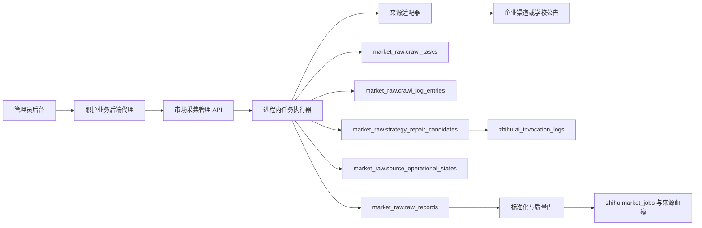
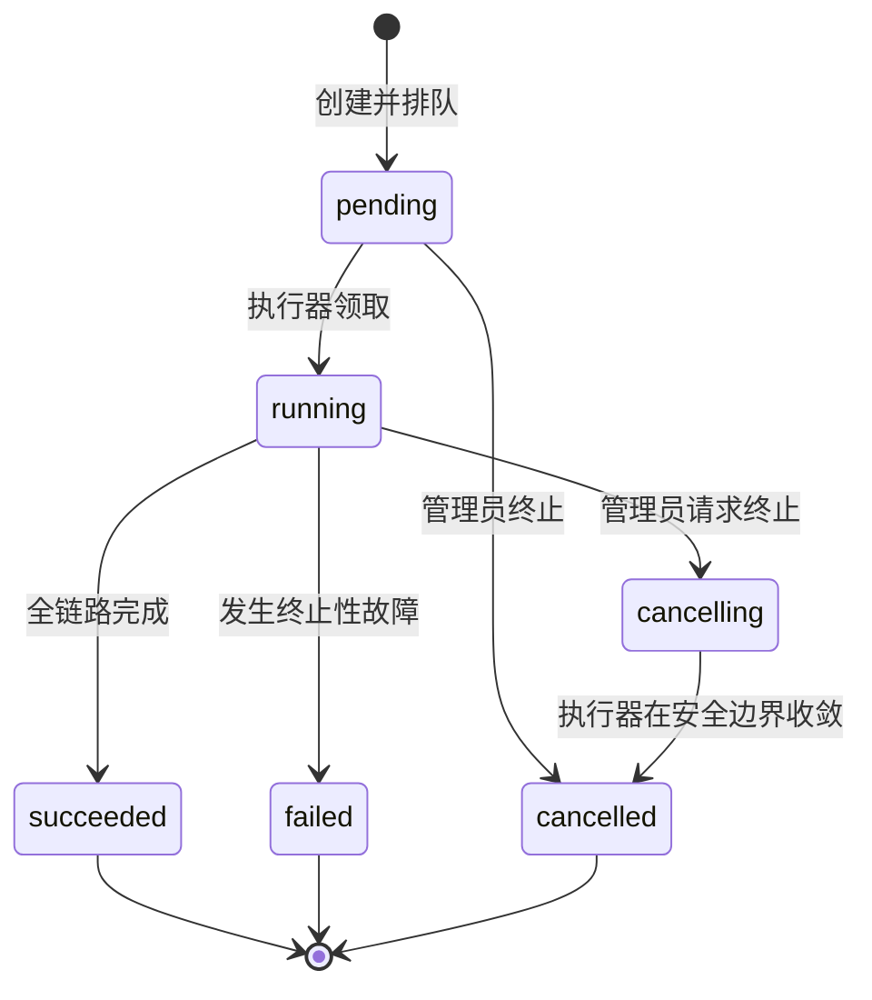

# 采集监控、日志与运维

> 文档状态：当前有效
>
> 适用范围：企业招聘渠道与学校就业公告的采集任务、运行日志、进度、健康恢复、策略修复和管理员操作
>
> 最后核对：2026-08-19

本文描述采集系统的可观测性和运维控制。端到端数据处理事实仍以[招聘数据采集完整链路](./recruitment-collection-pipeline.md)为准；声明式策略候选的安全边界以[采集解析规则恢复与自愈](./collection-rule-self-healing.md)为准。

## 1. 模块边界

采集模块负责访问来源、发现岗位、进入详情、保存 Raw、标准化和准入；监控模块负责回答以下问题：

- 任务是否排队、运行、终止、成功或失败；
- 当前处于入口校验、岗位发现、详情抓取、Raw 写入还是准入阶段；
- 已加载多少页、发现多少岗位、详情成功或失败多少条；
- 使用了什么浏览器模式、采集范围、页数上限、条数上限和随机等待范围；
- 失败属于入口、列表、详情、存储、网络、访问控制还是质量处理；
- 渠道是否健康、何时允许重试、系统建议管理员做什么；
- 是否生成了策略修复候选，AI 调用和回放进行到哪一步；
- 管理员何时发起、终止、审批、回滚或修改了配置。

监控页面不是运行事实的唯一存储。任务、进度、事件和健康状态都写入 MySQL，页面只是经职护后端代理后的受控视图。正式运行不使用 SQLite。

## 2. 可观测架构



主要事实表：

| 实体 | 存储 | 关键内容 |
| --- | --- | --- |
| 采集任务 | `market_raw.crawl_tasks` | 状态、运行快照、请求参数、进度、计数、错误和耗时 |
| 任务事件 | `market_raw.crawl_log_entries` | 时间线、事件码、等级、消息和结构化上下文 |
| 增量边界 | `market_raw.source_collection_checkpoints` | 最近岗位标识、游标、内容指纹、高水位和全量回扫时间 |
| 渠道健康 | `market_raw.source_operational_states` | 连续失败、冷却、阻断、告警、下次重试和恢复动作 |
| 修复候选 | `market_raw.strategy_repair_candidates` | AI/人工候选、租约、回放、Canary、审批和回滚 |
| Raw 处理 | `market_raw.raw_processing_attempts` | 程序标准化、AI 语义整理、证据校验、质量门和晋级尝试 |
| AI 调用 | `zhihu.ai_invocation_logs` | 功能点、模型、状态、耗时、用量、成本和错误类型 |
| 管理员操作 | 对应管理审计表 | 公司、学校、职位及治理配置的动作与前后快照 |

## 3. 任务状态与人工终止



状态含义：

| 状态 | 含义 | 可否终止 |
| --- | --- | --- |
| `pending` | 已创建，尚未被执行器领取 | 可以，直接进入 `cancelled` |
| `running` | 正在访问来源或处理数据 | 可以，先进入 `cancelling` |
| `cancelling` | 已收到终止请求，等待安全边界 | 不重复提交 |
| `cancelled` | 已终止，已写入 Raw 的内容保留 | 否 |
| `succeeded` | 任务正常完成 | 否 |
| `failed` | 任务因故障失败 | 否，可按恢复建议重新发起 |

终止操作使用站内主题确认弹窗。请求写入 `task_cancel_requested`，包含操作者和原因；执行器会在页面等待、翻页、详情等待和逐条 Raw 写入边界检查终止信号，最终写入 `task_cancelled`。终止不是失败，不回滚终止前已经提交的 Raw。

## 4. 六阶段进度

任务列表只显示一条总进度；任务详情显示六个阶段和结构化指标。进度快照保存在 `crawl_tasks.progress_snapshot`，新任务具有实时阶段数据，旧任务只能按最终状态回填终态。

| 阶段 | 页面含义 | 进度性质 | 主要指标 |
| --- | --- | --- | --- |
| `entry_validation` | 正在打开并校验招聘入口 | 不确定进度 | `status`、入口结果、HTTP 状态 |
| `job_discovery` | 正在滚动、加载更多或翻页发现岗位 | 总量未冻结 | `pages_loaded`、`discovered`、`continuing` |
| `detail_capture` | 列表完成后逐条进入岗位详情 | 确定进度 | `completed/total`、`succeeded`、`failed`、`remaining` |
| `raw_write` | 保存 Raw 并识别重复 | 确定进度 | `completed/total`、`stored`、`duplicates`、`failed` |
| `standardization_gate` | 标准化、证据校验、质量门与晋级 | 确定进度 | `completed/total`、`promoted`、`quarantined` |
| `completed` | 汇总结果 | 100% | `elapsed_seconds` 和最终计数 |

岗位发现阶段不能伪造精确百分比：在下一页、加载更多或无限滚动尚未结束时，总量未知，页面显示动态状态。列表边界冻结后，详情阶段才用“详情 12 / 27”一类确定进度。每次进入新阶段会产生 `progress_<stage>` 事件，阶段内数值持续更新任务快照，不为每一个小数值变化写一条事件，避免日志膨胀。

## 5. 运行快照和事件日志

### 5.1 任务运行快照

每次任务把以下内容持久化，不依赖管理员记忆或页面默认值：

- `browser_mode=default|headless|visible` 及其来源；
- `collection_mode=default|full|incremental`；
- `max_pages`，范围 1～200；
- `max_records`，范围 1～2000；
- `detail_delay_min_seconds` / `detail_delay_max_seconds`，范围 1～120 秒且最大值不得小于最小值；
- 检查点版本、策略版本和策略来源；
- 实际分页方式、加载批次、停止原因、详情获取模式和等待统计。

单次运行参数只影响当前任务，不回写渠道长期配置。详情随机等待是访问节奏，页面渲染等待是技术等待，两者分别记录。

### 5.2 关键事件

| 事件码 | 触发时机 | 典型上下文 |
| --- | --- | --- |
| `task_queued` | 任务入队 | 浏览器、范围、策略、检查点和本次参数 |
| `task_started` | 执行器开始运行 | 任务开始时间 |
| `browser_mode_reconciled` | 实际浏览器与计划值不一致 | 计划值、实际值和值来源 |
| `collection_snapshot` | 浏览器采集快照完成 | 分页、详情、等待、停止原因和适配器证据 |
| `source_empty_confirmed` | 来源明确展示“暂无职位” | 命中选择器和空状态原文 |
| `collection_boundary_observed` | 本轮稳定岗位边界形成 | 外部 ID、范围、分页和停止原因 |
| `task_cancel_requested` | 管理员请求终止 | 操作者、原因和之前状态 |
| `task_cancelled` | 执行器完成终止 | 终止前已保存 Raw 数量 |
| `task_succeeded` | 任务正常完成 | 最终计数 |
| `task_failed` | 任务失败 | 底层错误、归一化类别和恢复动作 |
| `source_recovery_scheduled` | 健康状态已更新 | 健康、下次重试和恢复建议 |

任务详情按时间展示事件。结构化上下文可以展开，但普通列表只显示摘要；超长数据库异常在列表中应截断，完整错误在详情中查看。

### 5.3 Raw 证据

管理员可按单条 Raw 查看：

- 完整渲染 HTML 的字符数和字节数；
- 可读正文长度；
- 来源 URL、HTTP 状态和内容类型；
- 详情导航模式、命中选择器和警告；
- 标准化字段、隔离原因；记录晋级后可继续查看对应 Core 岗位。

完整 HTML 只以转义文本展示，不注入管理页面 DOM，不执行脚本或建立 iframe。普通用户和普通任务列表不会取得 Raw 原文。

## 6. 失败归一化与渠道健康

“任务失败”与“来源当前健康”是两个层次。底层错误保留精确原因，健康模块再归一化为可恢复类别：

| 事实 | 健康类别 | 默认恢复动作 |
| --- | --- | --- |
| 入口 404/410 或 URL 已失效 | `entry_invalid` | `repair_entry`，管理员更新入口 |
| 页面打开但列表策略未命中 | `list_parse` | `repair_strategy` |
| 已发现卡片但无法进入详情 | `detail_navigation` | `repair_strategy` |
| 详情打开但正文未取得 | `detail_content` | `repair_strategy` |
| DNS、连接或短时超时 | `transient_network` | 退避或冷却 |
| 一般站点不可达 | `site_unreachable` | 稍后重试 |
| 429 | `rate_limited` | 延长冷却并降低频率 |
| 验证码、403 或访问封禁 | `access_blocked` | 阻断并人工核对 |
| 需要登录或 Session | `authentication_required` | 阻断并配置受控会话 |
| MySQL 列长度或迁移缺失 | `storage_schema` | `repair_storage_schema`，执行正式迁移 |
| 标准化、映射或准入异常 | `quality_pipeline` | 检查 Raw 处理与质量门 |

特别规则：

1. 页面明确展示“暂无职位”是成功的零结果，写 `source_empty_confirmed`，不计解析失败，也不生成 AI 修复候选。
2. `storage_schema` 是数据库迁移问题，不增加解析策略失败次数。
3. 入口失效不能靠模型猜新 URL；管理员必须核对真实招聘入口和允许域名。
4. 成功任务会恢复 `healthy`、清零连续失败并关闭当前告警；策略获批不等于来源已经采集成功。

## 7. 策略修复和 AI 监控

只有可以由声明式规则修复的列表、分页或详情故障才进入策略候选。普通成功任务、明确空来源、入口失效、存储迁移、限流、封禁和质量门失败都不会无差别调用 AI。

```text
规则类故障达到条件
  -> ai_pending
  -> ai_generating
  -> candidate / ai_failed
  -> replay
  -> replay_failed / canary_passed
  -> approved
  -> rolled_back（必要时）
```

管理员能看到候选来源、失败签名、基础版本、模型状态、失败次数、下次重试、回放发现数、详情完整率、审批人和回滚信息。候选最多回放 20 条、3 轮，详情完整率至少 80%，且仍受主机白名单限制。

AI 调用日志记录：

- 系统主体和“采集解析规则自动修复”功能点；
- 供应商、模型、模态、开始时间、状态和耗时；
- 可得的 Token、用量和成本；
- 错误类型与安全摘要。

不记录完整 Prompt、完整 DOM、JD 原文、模型完整回复、Cookie、Token、请求头或浏览器存储。AI 调用日志用于成本和故障追踪，不能替代策略候选、回放和审批记录。

## 8. 管理后台操作面

### 8.1 来源列表

企业渠道与学校公告使用同一套运行语义，但主体分开管理：

- 公司管理维护公司主体；
- 学校管理维护学校/就业服务机构主体；
- 数据采集维护各主体下面的实际入口、规则、状态、运行和证据。

来源列表支持按已启用、待启用、被弃用和待审查筛选。行内状态统一为“启用 / 暂停 / 弃用”；弃用不删除配置、Raw、Core 或审计历史。

### 8.2 任务列表

列表展示状态、总进度条、执行方式、读取/Raw/晋级/隔离/失败计数、时间以及查看和终止入口。只有 `pending`、`running`、`cancelling` 显示终止相关状态。

### 8.3 任务详情

详情展示：

- 六阶段实时进度和指标；
- 任务请求参数与最终生效值；
- 事件时间线和可展开 JSON 上下文；
- 本次新增 Raw、重复和隔离原因；
- Raw HTML/正文证据，以及已晋级记录与 Core 岗位的关联；
- 策略版本、浏览器、分页、检查点和停止原因。

### 8.4 健康与修复

管理员应从来源健康判断下一步：

- `healthy`：按计划运行；
- `degraded`：查看失败证据、映射或策略候选；
- `cooldown`：等待 `next_retry_at`，不要连续点击重试；
- `blocked`：人工核对条款、网络、验证码或会话；
- 最近失败类别为 `storage_schema`：先完成正式 MySQL 迁移，再重跑任务。

## 9. 内部管理接口

以下接口只能由职护后端使用内部令牌访问：

| 用途 | 接口 |
| --- | --- |
| 任务列表 | `GET /internal/admin/tasks` |
| 任务详情与事件 | `GET /internal/admin/tasks/{task_id}` |
| 单来源启动 | `POST /internal/admin/sources/{source_code}/runs` |
| 公司多渠道启动 | `POST /internal/admin/collection/companies/{company_code}/runs` |
| 请求终止 | `POST /internal/admin/tasks/{task_id}/cancel` |
| Raw 证据 | `GET /internal/admin/raw-records/{record_id}/evidence` |
| 修复候选列表 | `GET /internal/admin/strategy-repairs` |
| 修复证据 | `GET /internal/admin/sources/{source_code}/strategy-repair-evidence` |
| 候选回放 | `POST /internal/admin/strategy-repairs/{candidate_id}/replay` |
| 候选审批 | `POST /internal/admin/strategy-repairs/{candidate_id}/approve` |
| 候选回滚 | `POST /internal/admin/strategy-repairs/{candidate_id}/rollback` |

前端不得直连市场服务，Raw 证据和内部令牌不得暴露给浏览器中的普通用户请求。

## 10. 当前运行边界

- 当前任务执行器位于市场服务进程内，最大并发 2；它不是独立分布式队列。
- 任务状态、进度和事件已持久化，但市场服务进程退出后，其他 Worker 不会自动接管旧的排队任务。
- 页面使用轮询读取任务和进度，不应描述为已经具备消息队列或 WebSocket 推送。
- 告警状态和恢复建议已落库；邮件、短信或外部通知系统尚不是当前采集闭环的必需能力。
- 动态数量、实时健康和当前任务状态必须查询管理后台或 MySQL，文档不固化当前计数。

## 11. 运维验收清单

一次正式验收至少确认：

1. 任务入队、开始、阶段切换和结束都有事件；
2. 列表阶段总量未知时显示动态进度，详情阶段总数冻结后显示确定进度；
3. 本次页数、条数、浏览器、范围和随机等待与任务日志一致；
4. 终止运行中任务后最终进入 `cancelled`，已写 Raw 保留；
5. 明确空来源成功为零，不出现策略修复候选；
6. 入口、列表、详情、存储、网络和质量错误进入正确恢复动作；
7. Raw 证据能追溯到完整 HTML/正文和来源；已晋级记录能追溯到对应 Core 岗位；
8. AI 日志可见状态、模型、耗时和用量，但不泄露原文和凭据；
9. 企业渠道与学校公告都使用相同任务、Raw、准入和监控语义；
10. 管理员操作、策略审批和回滚均有持久化审计。

## 12. 相关文档

- [招聘数据采集完整链路](./recruitment-collection-pipeline.md)
- [采集解析规则恢复与自愈](./collection-rule-self-healing.md)
- [岗位质量门](./job-quality-gate.md)
- [当前数据库结构](./current-database-architecture.md)
- [当前进度与交接](../../progress/PROGRESS.md)
