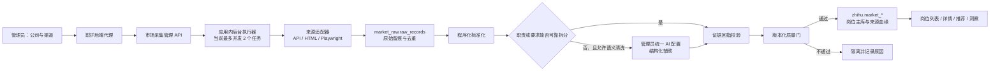
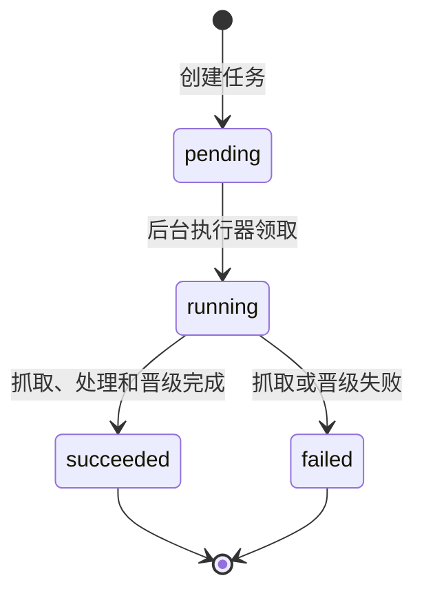

# 职护招聘数据采集完整链路

> 文档状态：当前实现的唯一事实说明
>
> 适用范围：`market_raw` 招聘渠道采集、Raw 处理、质量门、`zhihu.market_*` 晋级及管理后台
>
> 最后核对：2026-08-17

本文说明职护当前招聘数据从“管理员发起采集”到“用户侧岗位可见”的完整过程。后续修改采集模型、数据库、适配器、质量门或管理后台时，应同步更新本文；专题文档只补充某一环节，不应与本文产生另一套链路定义。

本文只描述职护仓库内已经维护的能力。旧 Pin 项目可作为历史设计参考，但不是运行时依赖，也不是配置来源。

## 1. 目标与不可破坏的原则

采集系统的目标不是“尽可能多地抓标题”，而是持续得到可追溯、可解释、能用于应届生求职判断的岗位事实。

必须长期保持以下约束：

1. **公司与招聘渠道分开管理**：一家公司可以有校招、实习、社招等多个入口，每个入口独立配置、独立运行、独立记录增量边界和健康状态。
2. **平台能力与公司差异分开维护**：平台模板复用浏览器、分页和解析能力；公司渠道只描述入口与必要差异。
3. **Raw 先留痕，Core 后准入**：任何新数据先进入 `market_raw`，完成标准化、证据校验、去重和质量门后，才能进入 `zhihu.market_*`。
4. **用户页面只读主库事实**：用户侧岗位列表、详情、推荐和图表不直接读取 Raw、历史迁移库或旧项目。
5. **详情完整性是硬要求**：只有标题、地点而没有有意义职责、要求或完整 JD 的记录不得晋级主库。
6. **AI 只能整理已有事实**：模型可以拆分混合正文，不能补写来源页面不存在的岗位职责、要求、技能或待遇。
7. **增量边界只在成功后推进**：抓取失败、处理失败或质量门隔离都不能更新“已经抓到哪里”。
8. **运行时不执行 AI 生成脚本**：自愈只生成声明式策略候选，经回放、审批后才能启用；不把模型生成的任意代码直接放入生产采集器。
9. **管理员可选择浏览器模式**：渠道保存默认的无头或可见模式，每次任务还可以临时覆盖，且实际模式必须留痕。
10. **配置和凭据分离**：数据库只保存白名单、公开入口和不透明代理/会话引用，不保存 Cookie、Authorization、Token、密码或代理密钥。

## 2. 总体架构与信任边界



浏览器不会直接访问市场采集服务。管理页面请求先到职护后端，再由后端使用 `MARKET_INTERNAL_TOKEN` 调用市场服务内部接口。Raw 原文和系统凭据不返回浏览器。

当前后台任务由市场服务进程内的 `ThreadPoolExecutor` 执行，最大并发数为 2。任务状态会持久化到数据库，但它还不是独立的分布式任务队列：如果市场服务进程在任务执行中退出，数据库中的排队任务不会由另一个 Worker 自动接管，管理员需要根据任务状态重新发起或恢复。这是当前实现边界，不应在文档或页面上描述为已经具备“独立分布式 Worker”。

## 3. 三个数据域

### 3.1 `pin_legacy_staging`：历史迁移隔离域

只用于历史备份审计和授权迁移，用户接口和实时采集任务无权直接使用。

主要表：

- `legacy_import_batches`
- `legacy_table_stats`
- `legacy_job_records`
- `legacy_company_records`
- `legacy_job_source_records`
- `legacy_raw_records`

### 3.2 `market_raw`：采集控制与原始事实域

保存公司、渠道、模板、任务、策略、增量边界、Raw、处理尝试、运行日志和恢复状态。

| 表 | 作用 |
| --- | --- |
| `recruitment_companies` | 招聘主体；同一公司在此只保留一个治理对象 |
| `data_sources` | 具体招聘渠道；保存入口、白名单、适配器、渠道配置、审核和启用状态 |
| `collection_templates` | 平台级共用能力，例如同一招聘平台的列表、分页和详情策略 |
| `crawl_batches` | 一次公司级采集发起，下面可包含多个渠道任务 |
| `crawl_tasks` | 单个渠道的一次实际任务及其执行快照、状态、计数和错误 |
| `collection_strategy_versions` | 已发现、已验证、已启用或已失效的声明式采集策略版本 |
| `source_collection_checkpoints` | 每个渠道的增量游标、近期岗位标识、内容指纹和发布时间高水位 |
| `source_operational_states` | 渠道健康、连续失败、冷却、阻断、告警和恢复建议 |
| `strategy_repair_candidates` | 页面变化后的修复候选、回放、审批和回滚记录 |
| `raw_records` | 不可变内容版本；按来源和内容指纹去重并保留来源血缘 |
| `raw_processing_attempts` | 标准化、AI 辅助、质量门和晋级尝试的元数据与原因码 |
| `crawl_log_entries` | 任务过程事件，供管理后台查看时间线和排障 |

### 3.3 `zhihu`：产品主库

Core 是“已通过质量门的逻辑事实层”，不是另一个名为 `market_core` 的数据库。

主要市场表：

- `market_companies`
- `market_jobs`
- `market_job_sources`
- `market_job_families`
- `market_cities`
- `market_recruitment_types`
- `market_skills`
- `market_job_skills`
- `market_core_promotion_batches`
- `market_rejected_legacy_jobs`
- `market_quality_gate_policies`
- `market_insight_snapshots`

`market_jobs` 保存岗位标准事实，`market_job_sources` 保存该事实来自哪个渠道、哪个 Raw、哪个抓取任务、何时第一次和最后一次观察到。没有来源血缘的岗位不能作为正式市场事实提供给用户。

## 4. 配置模型

### 4.1 公司

公司是管理员审核、批量启用和发起采集的顶层对象。一家公司可以关联多个招聘渠道，但不同渠道不能共享健康状态、游标和任务计数。

### 4.2 招聘渠道

`data_sources` 中每个渠道至少包含：

- 公司与渠道代码、名称；
- `adapter_type`；
- HTTPS 招聘入口 `base_url`；
- 允许访问的主机白名单 `allowed_hosts`；
- 校招、实习、社招等 `channel_type`；
- 适配器配置 `config`；
- 超时、重试、最小采集间隔；
- 条款审核状态、审核人和审核时间；
- 是否启用；
- 字段晋级映射 `promotion_mapping`；
- 默认 `browser_mode=headless|visible`（浏览器渠道）。

真实采集只有同时满足以下条件才可启动：

1. 配置校验通过；
2. 采集和使用条款已人工审核为 `approved`；
3. 渠道已显式启用；
4. 未处于冷却或阻断状态；
5. 距离上次运行已满足最小间隔；
6. 晋级映射完整；
7. URL 为 HTTPS，目标主机在白名单内。

### 4.3 平台模板

平台模板负责可复用能力，例如：

- 列表容器和岗位卡片的候选选择器；
- 列表字段和详情字段提取方式；
- 加载更多、下一页、无限滚动的通用动作；
- 详情展开、详情链接和新标签页读取；
- 平台级等待条件和稳定判定。

公司渠道只覆盖入口、渠道类型和平台无法统一的差异。兼容解析器作为职护仓库内的静态版本化资产维护，运行时不读取旧 Pin 目录。

### 4.4 任务快照

发起任务时会把以下信息写入 `crawl_tasks`，保证后续能解释这次任务到底如何运行：

- 全量或增量模式；
- 使用的检查点版本；
- 最终浏览器模式和来源（渠道默认或本次覆盖）；
- 实际使用的策略版本及其来源；
- 触发方式和发起人；
- 适配器类型；
- 尝试次数和过程计数。

任务执行中修改渠道配置不会偷偷改变已经排队任务的执行语义。

## 5. 管理员发起任务

管理员可以：

- 按单个渠道启动；
- 按公司启动该公司所有可运行渠道；
- 使用渠道默认浏览器模式；
- 临时强制全部使用无头模式；
- 临时强制全部使用可见浏览器模式。

单次覆盖不会回写渠道默认值。最终模式及其来源保存在任务记录中。

### 5.1 无头与可见浏览器

| 模式 | 特点 | 推荐用途 |
| --- | --- | --- |
| `headless` | 不显示 Chromium 窗口；资源占用通常更低，适合定时和无人值守 | 已验证稳定的日常渠道 |
| `visible` | 打开可见 Chromium；管理员可以观察点击、滚动、弹窗、验证码和站点拦截 | 首次接入、规则排障、人工验收 |

两种模式使用相同的渠道白名单、加载策略、质量门和增量逻辑。是否更容易触发站点风控不能只由“有头/无头”决定，还取决于访问频率、浏览器指纹、网络出口、会话、页面行为和站点规则。因此系统保留管理员选择权，并通过限速、冷却和健康状态控制风险；不把切换模式当作绕过访问控制的手段。

## 6. 任务生命周期



当前任务状态为 `pending`、`running`、`succeeded`、`failed`。

一次任务依次执行：

1. 校验渠道是否可运行；
2. 决定全量或增量模式；
3. 读取并快照当前检查点；
4. 解析本次浏览器模式；
5. 选择已启用策略或渠道配置策略；
6. 适配器访问来源并读取岗位；
7. 记录实际加载机制、批次数、停止原因和详情获取证据；
8. 写入或命中已有 Raw 内容版本；
9. 对本次新增 Raw 执行处理与质量门；
10. 晋级合格岗位，隔离不合格岗位；
11. 任务成功后推进增量检查点；
12. 更新渠道健康、任务计数和批次汇总。

管理后台展示的核心计数含义：

| 计数 | 含义 |
| --- | --- |
| 读取 | 来源页面本次观察到的岗位记录数 |
| Raw 新增 | 本次新产生的来源内容版本数 |
| 重复 | 内容指纹已存在、未新增 Raw 的记录数 |
| 晋级主库 | 通过处理与质量门并写入或更新主库的记录数 |
| 隔离 | 未通过质量门或缺少必要证据的记录数 |
| 失败 | 采集、解析或处理阶段失败数 |

“晋级 20”不是主库总量增加 20 的充分证明：同一岗位的新内容版本可能更新已有主库事实。市场总量必须按 `zhihu.market_jobs` 当前符合用户侧条件的实际计数计算。

## 7. 来源适配器

### 7.1 结构化 API 适配器

适用于官方公开 JSON 接口。支持：

- 配置岗位数组路径和字段路径；
- 配置岗位详情 URL 模板；
- `json_body` 页码分页；
- 每页 1～500 条；
- 最多 100 页；
- 空页、短页、已达到来源报告总量或增量边界时停止；
- 请求间限速、超时和重试。

可配置请求头受到白名单约束，只允许常见内容协商和来源头；`origin`、`referer` 仍必须是 HTTPS 且主机在渠道白名单内。

### 7.2 静态 HTML 适配器

适用于无需浏览器执行脚本的页面，当前支持：

- 页面内嵌 JSON；
- 直接解析岗位卡片；
- HTTP 超时、限速和重试。

### 7.3 公司招聘渠道浏览器适配器

适用于动态列表、展开详情、无限滚动或点击分页页面，使用 Playwright Chromium。

当前执行过程：

1. 根据任务快照选择无头或可见模式；
2. 应用服务端网络出口、代理池或会话配置引用；
3. 打开渠道入口；
4. 等待页面到达配置的加载状态；
5. 等待任一可信列表选择器出现；
6. 解析首批岗位；
7. 自动执行加载循环；
8. 按稳定外部 ID 合并岗位，并优先保留详情更完整的版本；
9. 对缺少详情的岗位执行展开或详情页补抓；
10. 输出岗位、实际策略和传输元数据。

当前每个浏览器任务使用 `CareerGuardianMarketBot/1.0` User-Agent。合规授权、合理频率和站点条款仍由管理员审核负责。

## 8. 自动识别加载更多机制

分页能力属于平台引擎，不是只针对某家公司写死的脚本。

支持的声明式模式：

- `single_page`：页面没有继续加载；
- `infinite_scroll`：持续滚动到底部；
- `load_more`：点击“加载更多 / 查看更多”等按钮；
- `next_button`：点击下一页按钮；
- `auto`：根据页面实际能力选择动作；
- API 分页：由结构化 API 适配器根据请求配置处理。

浏览器渠道在 `auto` 模式下优先尝试可见且可点击的“加载更多”，其次尝试“下一页”，否则按无限滚动处理。每轮动作后等待页面稳定，再重新解析整个可见列表并合并新增项。

加载循环有统一保护：

- 最大记录数默认 500，硬上限 2000；
- 最大批次数由渠道配置决定，硬上限 200；
- 每轮等待 200～5000 毫秒；
- 连续稳定轮数限制在 1～5；
- 按外部岗位 ID 和内容指纹合并；
- 记录实际模式、批次数与停止原因。

可能的停止原因包括：

- 达到增量边界；
- 达到发布时间重叠边界；
- 达到来源报告总量；
- 达到最大记录数；
- 单页模式完成；
- 加载按钮不存在或不可用；
- 页面已无新增项；
- 达到最大批次数。

因此，列表显示 20 条只代表当前首批读取 20 条，不能自动视为“该公司只有 20 个岗位”。任务详情必须同时查看加载批次、报告总量和停止原因。

## 9. 列表、展开内容与详情页

岗位采集分三层证据：

1. **列表卡片**：标题、地点、渠道类型、发布时间、外部 ID 和详情链接；
2. **列表内展开详情**：点击岗位后在当前页面展开的职责与要求；
3. **独立详情页**：打开详情链接，在新标签页读取完整正文。

对平台模板已知的页面，适配器先读取页面中的结构化详情；仍缺少职责和要求时，会点击岗位卡片并重新解析展开节点；若渠道配置了独立详情选择器，则继续打开详情页补抓。

任务传输元数据记录详情获取模式和详情完整数。页面成功打开但只取得标题，不算完整采集成功；即使 Raw 已留痕，空职责、空要求且没有完整 JD 的记录也会被质量门隔离。

## 10. 实际策略发现与版本化

渠道配置描述预期策略，运行结果描述实际命中的策略。

一次成功采集后，系统可以沉淀：

- 实际命中的列表选择器；
- 实际加载模式；
- 实际点击的分页或加载按钮；
- 详情来自嵌入数据、列表展开还是详情页；
- 实际命中的详情选择器；
- 发现和验证时间。

策略文档是声明式 JSON，不包含脚本、Cookie 或凭据。与当前策略相同则刷新验证状态；不同则生成新版本并使旧版本进入被替代状态。只有成功且具备足够详情证据的行为可以成为可复用策略，“本次详情缺失”只作为故障证据保存。

## 11. 增量采集

增量机制不依赖易漂移的“上次抓到第几页”，而使用岗位事实边界。

### 11.1 检查点保存内容

每个渠道在 `source_collection_checkpoints` 保存：

- 检查点版本；
- 近期稳定外部岗位 ID；
- 对应内容指纹；
- 可信发布时间高水位；
- 上次实际加载模式；
- 上次停止原因；
- 上次观察数量和任务 ID；
- 连续成功增量次数；
- 上次成功任务和上次全量回扫时间。

近期 ID 窗口默认 500，可配置 20～5000。

### 11.2 已知岗位批次边界

新任务始终从来源当前最新批次开始读取。只有当一整批岗位同时满足：

- 外部 ID 已存在；
- 内容指纹没有变化；

该批次才算“已知且未变化”。连续命中默认 2 个这样的批次后，增量任务可以停止。阈值可配置 1～10。

如果相同外部 ID 的内容指纹变化，说明旧岗位内容被更新，仍需生成新 Raw 内容版本并重新处理。

### 11.3 发布时间重叠边界

当渠道缺少稳定外部 ID 时，系统使用“发布时间高水位减重叠窗口”。默认重叠 7 天，可配置 0～90 天。

只有连续多个批次的发布时间都完整、可信且全部早于截止时间，才允许停止。缺失发布时间的批次绝不能触发提前结束，以免跳过新数据。

### 11.4 周期性全量回扫

默认每连续 10 次成功增量执行一次全量回扫，可配置 1～100。它用于发现：

- 来源排序变化；
- 历史岗位内容更新；
- 旧岗位重新开放；
- 列表入口或加载机制变化；
- 增量边界长期累积偏差。

### 11.5 检查点推进条件

只有任务完成采集、Raw 处理和质量门晋级后，已接受的来源岗位才进入新检查点。没有任何合格晋级岗位时，检查点不推进。失败和隔离记录不会让系统误以为已经覆盖了对应区间。

## 12. Raw 留痕与去重

`raw_records` 以 `(source_id, content_hash)` 唯一约束识别同一渠道的同一内容版本。

每条 Raw 主要保留：

- 来源 ID、任务 ID；
- 来源外部岗位 ID；
- 原始岗位 URL；
- 来源发布时间与抓取时间；
- 原始结构化数据、可处理文本和标准化结果；
- 浏览器或 HTTP 传输元数据；
- 内容指纹和模式版本；
- 校验状态、处理状态、处理次数和错误；
- 第一次和最后一次观察时间。

同一岗位内容没有变化时更新最后观察时间并计为重复，不创建无意义的新 Raw。内容变化时生成新内容版本，使后续能够追踪职责、要求、状态或发布时间的变化。

外部 ID 是来源身份，内容指纹是版本身份，两者不能相互替代。

## 13. Raw 处理：程序化标准化与按需 AI

当前处理版本为 `raw-processing-v1`，语义提示版本为 `market-detail-evidence-v1`。

### 13.1 程序化标准化

处理器首先：

- 要求 Raw 中存在结构化 `raw_payload`；
- 清理多余空白和空字段；
- 识别“工作职责、岗位职责、任职要求、任职资格、福利待遇”等显式标题；
- 将正文拆分到职责、要求和福利字段；
- 当来源有完整详情但缺少统一描述时，以来源详情填充描述；
- 应用渠道的晋级字段映射和类型转换。

缺少结构化 Raw 时标记失败，并写原因 `structured_raw_payload_required`。

### 13.2 何时调用 AI

同时满足以下条件才调用语义清洗：

1. 来源存在可用详情正文；
2. 程序化处理仍不能可靠得到职责或要求；
3. 渠道没有关闭 `semantic_cleaning.enabled`；
4. 管理员统一 AI 配置可用。

发送给后端的正文最多 20,000 字，并包含岗位标题、公司和来源代码作为上下文。AI 用于把混合长文本结构化，不负责编造岗位事实。

### 13.3 逐字证据约束

AI 返回的每一条职责、要求和技能都要经过来源回指：压缩空白后必须能在来源正文中找到对应文本。无法找到的项目被拒绝并计入处理指标。

AI 调用失败会写一条失败的语义处理尝试，但不会删除 Raw；之后仍按已有程序化结果进入质量判断。

### 13.4 处理审计

`raw_processing_attempts` 记录：

- Raw、任务和来源；
- 阶段与状态；
- 第几次尝试；
- 程序、AI 或质量门等处理器类型；
- 模型、供应商和 Prompt 版本；
- 输入输出指纹；
- 原因码和指标；
- 开始、结束和耗时。

该表不保存完整 Prompt、简历、Cookie 或来源请求头。

## 14. 质量门与晋级

### 14.1 硬性放行条件

新岗位必须具备：

- 可识别岗位和公司；
- 可追溯来源 URL；
- 内容指纹；
- 观察时间；
- 有意义的职责、要求或足够完整的 JD；
- 可执行的晋级字段映射；
- 来源血缘。

只有标题、城市或部门而没有正文的空壳岗位不得进入 `zhihu.market_jobs`。

### 14.2 质量评分

当前 100 分评分维度：

| 维度 | 分值 |
| --- | ---: |
| 岗位与公司身份 | 30 |
| 来源链接与血缘 | 15 |
| 内容指纹 | 5 |
| JD 正文达到最小有效长度 | 15 |
| 城市 | 10 |
| 发布时间 | 5 |
| 观察时间 | 5 |
| 技能信息 | 5 |
| 可信薪资 | 10 |

默认阈值为 55 分，但评分达到阈值不能替代硬性条件。

### 14.3 岗位状态

历史导入的 `open` 不直接视为当前仍在招。历史开放状态统一降为待确认；近期连续观察到的岗位才可以根据规则被标记为当前可用事实。默认近期窗口为 14 天。

### 14.4 晋级与隔离

通过后写入或更新：

- 公司、城市、职类和招聘类型等维表；
- `market_jobs` 岗位事实；
- `market_job_sources` 来源血缘；
- 岗位技能关联；
- 晋级批次和质量结果。

未通过则保留 Raw，写隔离原因和质量门处理尝试。管理员可以根据原因修复规则后重新处理，但不得手工绕过质量门直接写产品主表。

质量门支持草稿、预览和发布。草稿预览最多抽取 500 条 Core 数据评估影响；发布后形成不可变版本，后续任务记录实际使用的门版本。

## 15. 用户侧可见条件

岗位只有同时满足以下条件才会出现在用户侧：

- 已进入 `zhihu.market_jobs`；
- 有 `market_job_sources` 来源血缘；
- 通过当前业务查询的状态与质量条件；
- 详情接口能找到对应正式岗位事实。

新抓取岗位一旦通过质量门，就自动进入搜索和推荐候选池，不需要再复制到另一张推荐表。仍在 Raw、映射失败或已隔离的数据不参与岗位排序和市场洞察。

市场总量、企业数、城市数和图表应从主库事实或其快照计算。新批次完成后需要刷新 `market_insight_snapshots`，否则列表已更新而页面顶部快照仍可能显示旧值。

## 16. 渠道健康、失败分类与自动恢复

系统不会对所有失败进行无差别重试，而是先分类，再决定退避、冷却、阻断或修复。

| 失败类型 | 状态 | 首次建议等待 | 最大等待 | 建议动作 |
| --- | --- | ---: | ---: | --- |
| `selector_changed` | degraded | 5 分钟 | 60 分钟 | 进入策略修复 |
| `site_unreachable` | cooldown | 15 分钟 | 360 分钟 | 稍后重试并检查站点 |
| `rate_limited` | cooldown | 30 分钟 | 1440 分钟 | 降低频率 |
| `access_blocked` | blocked | 1440 分钟 | 4320 分钟 | 人工核对网络与授权 |
| `authentication_required` | blocked | 1440 分钟 | 4320 分钟 | 人工核对会话与权限 |
| `transient_network` | cooldown | 5 分钟 | 180 分钟 | 自动退避后重试 |
| `quality_pipeline` | degraded | 5 分钟 | 60 分钟 | 检查字段映射和质量链路 |
| `unknown` | degraded | 10 分钟 | 240 分钟 | 查看任务证据后处理 |

连续失败的等待时间按倍数增长并受最大值限制。处于 `blocked` 或尚未到 `next_retry_at` 的渠道不能重复启动。

成功任务会：

- 恢复 `healthy`；
- 清零连续失败；
- 清除下次重试时间；
- 更新最近成功时间；
- 关闭当前告警。

策略修复成功只说明解析规则已恢复，不会伪造“最近采集成功”。

代理和登录会话使用 `proxy_pool_id`、`session_profile_id` 等不透明引用，由部署环境解析。系统可以在合规授权范围内切换网络资源或冷却重试，但不会把“换 IP”作为绕过站点访问控制的默认行为。

## 17. 解析规则自愈

当列表选择器失效、页面打开却没有岗位、详情完整率明显下降时，可以进入规则修复流程。

### 17.1 修复证据

系统使用无头浏览器获取有限、脱敏的公开 DOM 结构证据。证据不包含：

- Cookie；
- Local/Session Storage；
- Authorization；
- 完整请求头；
- 完整页面原文；
- 个人登录信息。

### 17.2 候选生成

管理员可以手动编辑声明式候选，也可以让 AI 根据证据建议：

- 列表选择器；
- 卡片字段选择器；
- 加载更多或下一页按钮；
- 详情展开或详情页选择器；
- 等待和稳定参数。

候选不能包含任意脚本、动态导入或凭据。

### 17.3 回放与启用

候选最多抓取 20 条、最多执行 3 轮回放。只有同时满足：

- 找到岗位；
- 详情完整率达到 80%；
- 不突破主机白名单和安全约束；

才进入 `canary_passed`，之后仍需要管理员审批才能成为新启用策略。旧策略保留，可随时回滚。

当前状态流转包括候选、回放失败、回放通过、已审批和已回滚。它是“AI 辅助、系统验证、人工发布”的半自动闭环，不是无人监督地重写并替换生产爬虫代码。

## 18. 管理后台应展示什么

### 18.1 公司与渠道

管理员需要能看到：

- 公司下有哪些校招、实习、社招渠道；
- 配置是否完整；
- 条款是否已审核；
- 是否启用和可运行；
- 默认浏览器模式；
- 最近成功、最近失败和最近抓取时间；
- 当前健康、连续失败、冷却截止和恢复建议；
- 上次全量/增量方式、停止原因和检查点摘要；
- Raw、晋级和隔离累计数。

### 18.2 最近采集与清洗过程

每条任务可展开查看：

- 公司和渠道；
- 状态和错误分类；
- 浏览器模式及来源；
- 全量/增量模式；
- 检查点和策略版本；
- 实际加载机制、批次和停止原因；
- 读取、Raw 新增、重复、晋级、隔离和失败数；
- 开始、结束和耗时；
- 过程日志时间线；
- 本次 Raw 的岗位摘要、标准化预览、隔离原因和 Core 关联。

任务详情返回的是经过权限控制的预览，不应把凭据或未经脱敏的原始网络数据暴露给前端。

### 18.3 管理员判断是否需要再抓

页面应优先提供：

- 最近成功抓取时间；
- 最近全量回扫时间；
- 连续成功增量次数；
- 下次允许运行时间；
- 最近新增、重复和更新比例；
- 渠道当前健康；
- 来源是否报告岗位总量；
- 上次停止原因。

管理员不应只根据“上次抓了 20 条”判断渠道是否已完整覆盖。

## 19. 内部管理接口

市场服务当前主要内部接口如下，均需内部管理令牌：

### 19.1 公司、渠道和任务

- `GET /internal/admin/sources`
- `GET /internal/admin/collection/companies`
- `PUT /internal/admin/collection/companies/{company_code}/governance`
- `POST /internal/admin/collection/companies/{company_code}/runs`
- `PUT /internal/admin/sources/{source_code}`
- `PUT /internal/admin/sources/{source_code}/configuration`
- `POST /internal/admin/sources/{source_code}/runs`
- `GET /internal/admin/tasks`
- `GET /internal/admin/tasks/{task_id}`

公司级启动接口支持本次 `browser_mode=default|headless|visible` 选择。

### 19.2 策略修复

- `GET /internal/admin/strategy-repairs`
- `GET /internal/admin/sources/{source_code}/strategy-repair-evidence`
- `POST /internal/admin/sources/{source_code}/strategy-repairs`
- `POST /internal/admin/strategy-repairs/{candidate_id}/replay`
- `POST /internal/admin/strategy-repairs/{candidate_id}/approve`
- `POST /internal/admin/strategy-repairs/{candidate_id}/rollback`

### 19.3 质量门

- `GET /internal/admin/gate`
- `PUT /internal/admin/gate/draft`
- `POST /internal/admin/gate/draft/preview`
- `POST /internal/admin/gate/draft/publish`

## 20. 运行与部署配置

市场服务至少需要：

```bash
MARKET_PROVIDER=core
MARKET_RAW_DATABASE_URL=mysql+pymysql://.../market_raw
MARKET_CORE_DATABASE_URL=mysql+pymysql://.../zhihu
MARKET_INTERNAL_TOKEN=<服务端强随机令牌>
```

动态浏览器渠道还需安装：

```bash
.venv/bin/python -m pip install -r requirements-playwright.txt
.venv/bin/playwright install chromium
```

本地统一启动：

```bash
./scripts/run-market.sh
./scripts/run-backend.sh
./scripts/run-frontend.sh
```

公司目录、渠道、模板和兼容解析资产均在职护仓库内维护；迁移脚本只把版本化资产幂等写入新项目数据库，不读取旧项目运行目录，也不会自动审批或启动真实采集。

## 21. 验收标准

一个新渠道只有满足以下项目，才算完成接入：

### 21.1 配置与安全

- [ ] 公司与渠道拆分正确；
- [ ] HTTPS 入口和主机白名单正确；
- [ ] 条款已人工审核；
- [ ] 渠道启用状态明确；
- [ ] 默认浏览器模式可配置；
- [ ] 单次任务可覆盖为无头或可见；
- [ ] 数据库和前端均看不到凭据。

### 21.2 加载与增量

- [ ] 能识别真实加载模式；
- [ ] 不把首批 20 条误认为完整结果；
- [ ] 任务详情显示批次数和停止原因；
- [ ] 同一岗位未变化时不会重复新增 Raw；
- [ ] 岗位内容变化时会生成新 Raw 版本；
- [ ] 连续已知批次能结束增量；
- [ ] 缺失发布时间不会提前越界；
- [ ] 周期性全量回扫可达。

### 21.3 详情质量

- [ ] 随机抽查岗位与来源页面展开详情一致；
- [ ] 职责和要求不是空字符串、占位文案或错误容器文本；
- [ ] 需要点击展开的页面确实执行了展开；
- [ ] 独立详情页渠道能读取详情；
- [ ] 详情缺失记录被隔离而非晋级；
- [ ] AI 拆分字段均能回指来源正文。

### 21.4 主库与用户侧

- [ ] 晋级岗位具备 `market_job_sources`；
- [ ] 主库总量按实际岗位事实计算；
- [ ] 最近抓取排序能看到新岗位或更新岗位；
- [ ] 岗位详情可正常打开；
- [ ] 新晋级岗位进入搜索和推荐候选；
- [ ] 洞察快照刷新后与主库口径一致。

### 21.5 恢复与可观测性

- [ ] 选择器失效被分类为规则变化；
- [ ] 限流、阻断、网络失败分别处理；
- [ ] 冷却期间不能重复启动；
- [ ] 管理员能查看 Raw 预览、处理尝试和隔离原因；
- [ ] 修复候选必须回放和审批；
- [ ] 新策略可回滚。

## 22. 常见问题排查

### 22.1 任务几秒完成且总是 20 条

依次检查：

1. 任务详情中的 `actual pagination mode`；
2. 加载批次数是否只有 1；
3. 停止原因是否为 `single_page`、按钮不存在或无新增；
4. 来源是否报告总量大于 20；
5. 是否过早命中增量边界；
6. 页面真实使用滚动、加载更多还是下一页；
7. 当前策略选择器是否命中了错误按钮。

### 22.2 显示成功，但岗位没有职责和要求

“打开页面并读到列表”不等于数据合格。检查：

1. 任务 Raw 预览是否存在完整详情；
2. 详情获取模式是否为列表卡片而非展开/详情页；
3. 展开点击是否成功；
4. 详情选择器是否抓到了正确容器；
5. `raw_processing_attempts` 是否为 `insufficient_source_detail`；
6. 质量门是否错误放行；
7. 随机选一条与官网展开内容逐项比对。

如果来源真实有详情但 Raw 没有，应修复采集策略并重抓；如果来源确实没有详情，应隔离而不是让 AI 猜测。

### 22.3 列表已出现新岗位，但市场总量没变

检查：

1. 本次是新增岗位还是更新已有岗位；
2. 页面顶部读取的是实时 Core 还是洞察快照；
3. `market_insight_snapshots` 是否刷新；
4. 用户侧总量是否带有状态或质量过滤；
5. 是否存在缓存未失效。

### 22.4 页面结构更新

检查任务错误分类和策略证据。如果属于 `selector_changed`：生成或编辑声明式候选，执行回放，详情完整率达标后审批；不能直接把临时 AI 脚本替换进生产运行时。

### 22.5 站点阻断或验证码

系统应进入 `blocked` 并停止反复访问。管理员核对站点条款、访问频率、网络出口和授权会话；未经确认不得通过技术手段绕过访问限制。

## 23. 当前实现边界与后续演进

以下是当前明确边界：

1. 后台任务执行器位于市场服务进程内，还没有独立分布式队列和进程重启后的自动接管；
2. 自动策略修复需要管理员审批，不是完全无人值守；
3. 加载机制由声明式能力和实际页面证据识别，特殊站点仍可能需要新增平台模板；
4. 代理池和会话档案只定义服务端引用边界，具体解析由部署环境提供；
5. 市场图表使用快照，晋级完成后需要刷新快照才能与实时列表完全同步；
6. AI 语义清洗只处理有来源正文的结构化问题，不能修复根本没抓到详情的采集缺陷。

未来如引入独立 Worker、调度器、消息队列、代理服务或更复杂的全量校验，应保持任务快照、增量边界、Raw 证据、质量门和来源血缘不变。

## 24. 相关文档

- [职护当前数据库结构](./current-database-architecture.md)
- [岗位数据质量门](./job-quality-gate.md)
- [采集解析规则恢复与自愈](./collection-rule-self-healing.md)
- [市场数据服务说明](../../market-data/README.md)
- [本地开发基线](../development.md)
