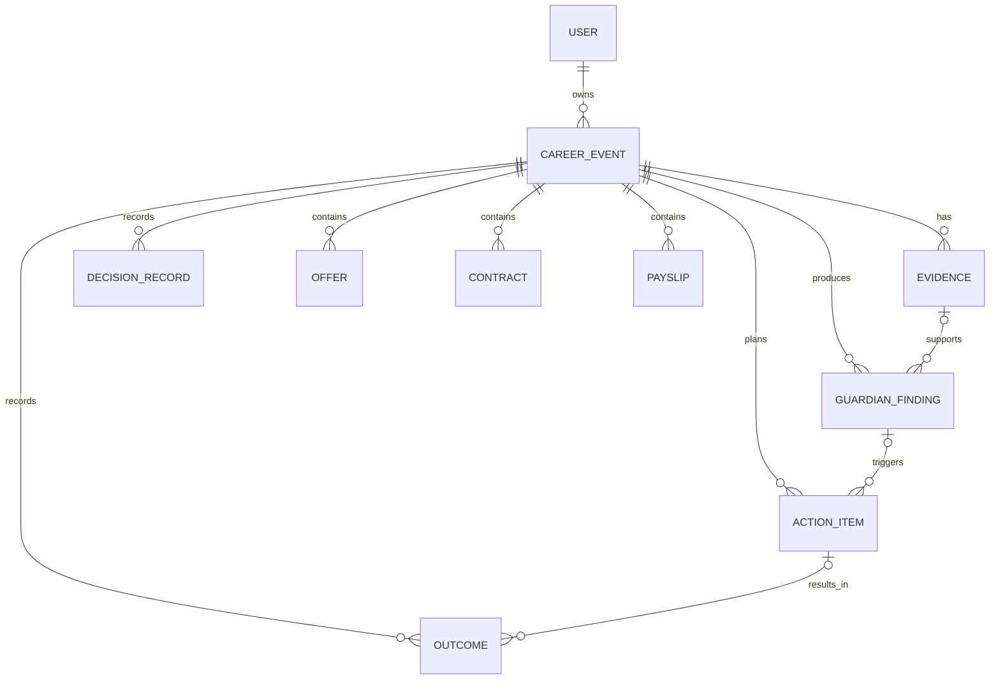

# 职护 V2 职业事件领域模型

## 核心原则

职护以 `CareerEvent` 而不是单个页面、单份文件或一次 AI 对话作为持久化业务单位。一个职业事件代表用户正在处理的一件真实问题，所有事实依据、守护结论、待办行动、用户决定和最终结果都回链到该事件。

## 五类职业事件

| `event_type` | 用户问题 | 主要产物 |
|---|---|---|
| `opportunity` | 岗位是否真实、适合 | 岗位事实、企业信息、匹配差距 |
| `decision` | Offer 是否值得接受 | 收入、市场位置、城市成本与条件化建议 |
| `rights` | 合同和用工条件是否有风险 | 条款解释、规则依据、承诺差异与确认话术 |
| `income` | 工资和扣款是否正确 | 工资条核对、扣款解释与跨材料一致性 |
| `growth` | 应该学什么、何时调整选择 | 技能差距、阶段任务、成长记录与机会变化 |

## 对象与关系

- `CareerEvent`：五域共用的事件根，状态为 `active`、`attention`、`completed` 或 `archived`。
- `Evidence`：支撑结论的可追溯依据，可保留摘要、外部引用、附加结构和置信度。
- `GuardianFinding`：系统对某个守护领域得出的可状态化结论，必须声明来源类型；可选绑定具体证据。
- `ActionItem`：由结论导出的下一步行动，默认需要用户确认。
- `DecisionRecord`：用户实际做出的选择和理由，与 AI 建议分开记录。
- `Outcome`：行动或事件的真实结果，用于后续复盘和成长记录。

## 来源类型

`Evidence.source_type` 和 `GuardianFinding.source_type` 使用同一契枚举：

| 值 | 含义 | 产品展示边界 |
|---|---|---|
| `user_material` | 用户材料或用户确认的事实 | 展示材料与摘要，不扩展为材料外事实 |
| `calculation` | 按明确口径计算的结果 | 展示输入、口径和版本 |
| `rule` | 法规、制度或业务规则 | 展示规则来源和适用条件 |
| `market_data` | 经质量检查的公共市场数据 | 展示来源、样本量、时间和质量等级 |
| `ai_assistance` | AI 归纳、解释或建议 | 明确标识为辅助内容，不当成事实 |

## 守护状态聚合

`GET /api/guardian/state` 每个领域只聚合当前用户最新的未归档事件：

1. 没有事件时为 `empty`，并返回明确的起始行动。
2. 有未解决的高风险结论时为 `attention`，高风险优先于更新的一般提醒。
3. 有事件但无高风险时为 `active`。
4. 事件完成时为 `complete`。
5. 首要行动按 `attention`、`active`、`empty`、`complete`、`unavailable` 的顺序选择。

## 权限与迁移

- 事件及其所有子资源都通过 `CareerEvent.user_id` 进行所有权校验，越权读写统一返回 404。
- 旧 `CareerCase` 在迁移时会回填为职业事件；Offer 、合同和工资条同步回链到该事件。
- 新建 Offer 和合同时，如果没有传入事件，API 会在同一用户边界内自动建立对应的 `decision` 或 `rights` 事件。
