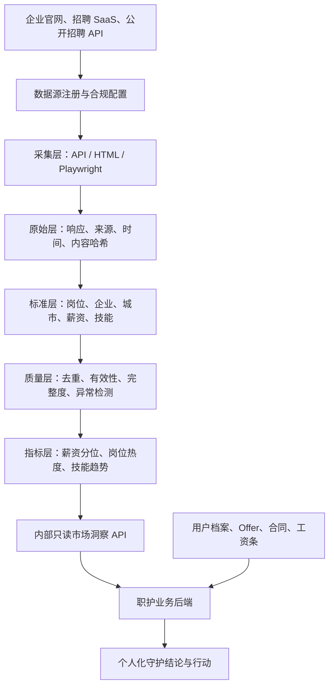

# 职护 V2 产品蓝图

> 文档状态：产品方向讨论稿，待确认后进入信息架构、数据字典和技术方案阶段  
> 版本：V2.0 Blueprint Draft  
> 日期：2026-08-15  
> 适用范围：职护产品重构与 Pin（zhaogebanshang）数据能力重构  
> 说明：本文描述目标产品，不代表当前代码已经实现。

---

## 1. 文档目的

本文件用于回答四个根本问题：

1. 职护究竟为谁服务，解决什么问题。
2. “对应届生和职场新人的全方位守护”具体包含哪些产品能力。
3. 首页、导航和用户旅程如何围绕“守护”重新组织，而不是继续堆叠工具页面。
4. 如何重构并复用 Pin 的数据获取能力，使数据经过业务清洗、质量治理和指标加工后再服务职护。

本文先建立统一的产品语言和目标边界。字段级数据字典、接口契约、技术架构和迭代排期应在本文确认后继续细化。

---

## 2. 当前项目判断

### 2.1 当前职护已经具备的基础

现有职护已经形成比赛型 PoC，具备以下可复用能力：

- 用户注册、登录、档案和旅程。
- Offer 录入、字段确认、分析、比较和 HR 问题清单。
- 薪资、个税、五险一金、生活结余和部分财务规划计算。
- 合同规则检查、Offer—合同一致性检查和签约清单。
- 工资条数字核对、知识内容和角色专场页面。
- 管理员与合同规则管理基础能力。

这些能力证明了业务方向，但现有产品仍以“页面和工具集合”为主，尚未形成连续的职业守护系统。

### 2.2 当前职护的主要缺口

- 市场薪资仍是内置模拟数据，未形成真实、可追溯的数据证据。
- 岗位、企业、技能和机会变化尚未成为用户旅程的一部分。
- 合同和工资条主要依赖粘贴或手工录入，真实文件解析链路不完整。
- 首页更像功能入口，尚未根据用户所处阶段主动组织风险、机会和行动。
- 各功能之间共享的是少量页面状态，而不是统一的职业事件、证据、结论和行动模型。
- 演示、隐私、安全、数据权限和当前实现之间仍有差距。

### 2.3 Pin 已经具备的基础

Pin 是一套招聘数据聚合系统，已经包含：

- 企业招聘官网、招聘 SaaS 和部分企业 API 的采集适配能力。
- Playwright、HTML 解析和 LLM 结构化抽取能力。
- 招聘数据清洗、薪资解析、城市标准化、技能抽取和去重入库逻辑。
- 职位、企业、来源、技能、薪资、城市和趋势分析接口。
- 历史数据备份、企业采集配置、抓取中间数据和大量适配器代码。

Pin 的现有模型服务于“招聘数据平台”，不能直接等同于职护的产品数据模型。职护需要复用它的数据生产能力，但不能直接复制整个系统、直接展示原始表或让前端连接其管理接口。

---

## 3. 产品定义

### 3.1 一句话定位

> 职护是一款面向应届生和入职 0～3 年职场新人的个人职业保障系统，在关键职业事件中帮助用户看清事实、识别风险、算清利益、完成行动，并持续跟踪结果。

### 3.2 产品使命

降低年轻人第一次进入职场时因为信息不对称、规则不熟悉、经验不足而付出的可避免成本。

这些成本包括但不限于：

- 错过真实、适合自己的机会。
- 因不了解市场而接受明显不合理的 Offer。
- 没有问清绩效、年终奖、试用期和工作地点。
- 没发现 Offer、HR 承诺与合同之间的差异。
- 看不懂工资条、社保和公积金扣款。
- 入职后不知道该积累什么能力，也不知道外部市场发生了什么变化。

### 3.3 目标用户

核心用户：

- 大三、大四及研究生毕业年级学生。
- 正在寻找实习、校招或第一份正式工作的年轻人。
- 已获得 Offer、准备签约或即将入职的应届生。
- 入职 0～3 年、仍在建立基本职场认知的新人。

暂不作为首期核心用户：

- 资深管理者和高阶专家。
- 需要企业招聘管理系统的 HR。
- 需要劳动仲裁代理或正式法律服务的用户。
- 以匿名讨论、企业点评或职场社交为主要诉求的用户。

### 3.4 核心产品承诺

每次用户遇到重要职场问题，职护至少帮助其回答四个问题：

1. 现在发生了什么，哪些是已经确认的事实？
2. 这件事对我意味着什么，可能有哪些风险或机会？
3. 结论依据是什么，数据和规则是否足够可信？
4. 我接下来应该做什么，做完以后如何继续？

---

## 4. 五大守护领域

五大守护领域是职护 V2 的一级业务结构，也是首页和导航设计的基础。

| 守护领域 | 用户真实问题 | 职护提供的结果 |
|---|---|---|
| 机会守护 | 这个岗位真实吗、适合我吗、市场情况如何 | 岗位事实、企业信息、匹配差距、机会提醒 |
| 决策守护 | Offer 值不值得去，两份怎么选 | 真实收入、市场位置、城市成本、条件化建议 |
| 权益守护 | 合同、试用期、竞业、加班有没有坑 | 条款解释、法规规则、承诺差异、确认话术 |
| 收入守护 | 工资为什么变少，社保公积金对不对 | 工资条核对、扣款解释、Offer—合同—工资一致性 |
| 成长守护 | 入职后学什么、何时该跳槽、能力差在哪里 | 技能差距、阶段任务、成长记录、机会变化 |

### 4.1 机会守护

#### 用户场景

- 用户看到一个岗位，但不知道岗位是否仍然有效。
- 用户不知道企业官网、招聘平台和转发信息是否一致。
- 用户不知道自己的专业、学历和技能是否满足要求。
- 用户不想每天重复搜索，希望在合适的机会出现时得到提醒。

#### 输入

- 用户专业、学历、技能、目标城市和目标岗位。
- 职位链接、截图、招聘信息或关键词。
- Pin 采集并加工后的企业、职位和市场数据。

#### 处理

- 检查来源是否为企业官方渠道或可信招聘渠道。
- 检查发布时间、截止时间、当前有效状态和重复来源。
- 将岗位映射到统一岗位族、城市、学历和技能体系。
- 对比用户档案与岗位要求，识别已满足项、缺口和不确定项。
- 根据用户目标生成可解释的机会排序，而不是只给一个匹配分数。

#### 输出

- 岗位事实卡：来源、有效期、工作地点、招聘类型、关键要求。
- 企业招聘卡：企业基本信息、近期招聘活跃度、同类岗位情况。
- 匹配说明：适合点、能力缺口、需要确认的要求。
- 行动：查看原始岗位、准备材料、设置截止提醒、加入跟进。

### 4.2 决策守护

#### 用户场景

- 用户拿到第一份或多份 Offer，不知道该怎么判断。
- 用户只看到税前月薪，不知道真实年收入和可支配结余。
- 用户不知道当前薪资在目标城市和岗位中的位置。
- 用户不知道哪些条件必须向 HR 问清楚。

#### 输入

- Offer 文件、文本或手动确认字段。
- 用户城市、生活预算、储蓄目标和决策偏好。
- 市场薪资、岗位供需、技能趋势和企业招聘数据。

#### 处理

- 提取并确认公司、岗位、城市、薪资结构、试用期和工作条件。
- 计算税前、税后、固定收入、浮动收入、试用期损失和城市结余。
- 根据真实样本计算薪资位置，并展示样本量和统计周期。
- 识别不确定条件，生成 HR 确认问题。
- 多 Offer 对比时输出条件化建议，解释建议为什么变化。

#### 输出

- “这份工作真实能给我什么”的完整回答。
- 市场位置和数据证据。
- 一定要问清、建议确认、可以争取的事项。
- HR 沟通话术和回复记录。
- 下一步：比较、确认、检查合同或放弃。

### 4.3 权益守护

#### 用户场景

- 用户第一次看劳动合同，不理解法律和条款语言。
- 用户不知道试用期、竞业限制、违约金、加班和调岗条款是否合理。
- 用户担心合同与 Offer 或 HR 承诺不一致。

#### 输入

- 合同文件、补充协议、Offer 和 HR 书面回复。
- 经过版本管理的法规规则和审查规则。

#### 处理

- 文档解析、OCR、字段提取和原文定位。
- 规则引擎执行可确定的事实检查。
- LLM 负责条款解释、语义对齐和沟通话术，不直接认定违法。
- 对比 Offer、HR 承诺和合同字段。
- 对无法判断的事项明确标记并建议人工确认或专业咨询。

#### 输出

- 原文、通俗解释、规则依据和行动建议。
- Offer—合同承诺差异。
- 签约前行动清单。
- 可复制的确认话术。
- 对高风险事项提供“寻求专业帮助”路径。

### 4.4 收入守护

#### 用户场景

- 用户不知道到手工资为什么比预期少。
- 用户无法判断社保、公积金和个税计算是否合理。
- 用户不知道工资条是否与 Offer、合同和考勤情况一致。

#### 输入

- 工资条文件或确认后的工资字段。
- Offer、合同、考勤、请假和绩效信息。
- 城市社保、公积金和税务规则。

#### 处理

- 解析应发、实发、补贴、绩效、社保、公积金、个税和其他扣款。
- 进行工资条内部数字校验。
- 与薪资计算结果、Offer 和合同进行跨材料对比。
- 对差异区分正常波动、信息不足和需要确认。

#### 输出

- 钱去了哪里以及计算过程。
- 与预期收入的差异及可能原因。
- 社保、公积金和个税的基础核对。
- 向 HR 或财务确认的清单和话术。
- 连续月份收入变化趋势。

### 4.5 成长守护

#### 用户场景

- 用户入职后不知道优先学习什么。
- 用户不知道目标岗位市场正在要求哪些新技能。
- 用户不知道自己什么时候适合转岗、晋升或跳槽。

#### 输入

- 用户目标、当前岗位、已有技能、项目经历和成长记录。
- Pin 加工后的岗位技能、城市需求和市场变化数据。

#### 处理

- 将用户能力映射到标准技能体系。
- 对比当前岗位、目标岗位和市场高频要求。
- 区分短期必备技能、长期成长能力和低价值跟风项。
- 结合用户职业事件持续更新成长计划。

#### 输出

- 当前能力画像及证据来源。
- 目标岗位技能差距。
- 30/60/90 天成长任务。
- 市场变化提醒。
- 是否具备转岗、晋升或跳槽准备度的解释性判断。

---

## 5. 职业事件驱动的产品主线

职护 V2 不以“进入了哪个工具页面”作为主线，而以用户发生了什么职业事件作为主线。


### 5.1 统一守护闭环

每个职业事件必须遵循统一结构：

1. **识别事件**：用户主动发起或系统根据时间和数据发现事件。
2. **收集证据**：获得材料、用户确认信息和外部市场事实。
3. **形成判断**：分别执行确定性计算、规则判断和 AI 语义理解。
4. **解释影响**：告诉用户事实对收入、权益、机会和目标的影响。
5. **生成行动**：提供问题、话术、清单、提醒或下一步入口。
6. **人工确认**：用户决定是否采纳并记录真实结果。
7. **更新档案**：沉淀事件、材料、结论和结果，为后续阶段提供上下文。

### 5.2 首条核心连续旅程

V2 首期应优先打通：

> 发现真实岗位 → 判断是否适合 → 收到 Offer → 核对市场位置 → 向 HR 确认 → 检查合同 → 完成签约 → 核对首月工资

这条旅程同时验证机会、决策、权益和收入四大守护领域。成长守护在首期提供目标岗位技能差距和入职 90 天任务，后续再扩展为长期能力。

---

## 6. 信息架构与导航

### 6.1 一级信息架构

桌面端一级导航建议为：

| 导航 | 定位 | 默认展示内容 |
|---|---|---|
| 今天 | 个人守护首页 | 当前最重要行动、五域状态、提醒和变化 |
| 机会守护 | 找到并判断机会 | 岗位验证、匹配、关注机会和截止提醒 |
| 决策守护 | 做出有依据的选择 | Offer 分析、比较、HR 确认和城市结余 |
| 权益守护 | 签约和工作权益 | 合同审查、承诺差异、签约清单 |
| 收入守护 | 看懂并核对收入 | 薪资计算、工资条、社保公积金和收入趋势 |
| 成长守护 | 持续积累职业能力 | 技能差距、阶段任务、市场变化和成长记录 |

用户头像菜单承载：

- 我的职业档案。
- 材料与报告。
- 隐私和数据管理。
- 通知设置。
- 管理后台入口（仅管理员）。

### 6.2 导航设计原则

- 五大守护领域是稳定的业务边界，不随具体工具增加而变化。
- 工具必须归属于某个守护领域，不能无序增加一级入口。
- “知识学堂”不再作为孤立一级业务，而是在五大领域和事件中按需出现。
- “我的旅程”成为首页与档案中的连续时间线，不与守护领域争夺一级导航心智。
- 角色专场可以作为首次引导和内容运营方式，但不再承担系统主导航职责。
- 移动端可采用“今天 + 守护 + 旅程 + 消息 + 我的”底部导航；“守护”页展开五大领域，保持业务模型一致。

### 6.3 页面归属调整

| 现有或目标页面 | V2 归属 |
|---|---|
| 岗位验证、岗位匹配、机会关注 | 机会守护 |
| Offer 上传、确认、报告、比较、HR 问题 | 决策守护 |
| 合同上传、条款解释、一致性检查、签约清单 | 权益守护 |
| 薪资计算、工资条、社保公积金、生活结余 | 收入守护 |
| 技能差距、入职任务、市场技能趋势、成长记录 | 成长守护 |
| 文章和术语解释 | 嵌入对应守护领域和职业事件 |
| 旅程时间线 | 今天首页和我的职业档案 |

---

## 7. 首页设计

首页不是功能目录，而是用户当前职业状态的“守护驾驶舱”。

### 7.1 首页目标

- 让用户在 10 秒内知道现在最需要处理什么。
- 展示五大守护领域中与用户当前阶段真正相关的状态。
- 将市场变化、时间节点和材料差异转成具体行动。
- 建立“职护了解我正在经历什么”的连续感。

### 7.2 首页结构

```text
┌──────────────────────────────────────────────────────────┐
│ 问候 + 当前阶段                                           │
│ “距离 Offer 回复还有 3 天，你还有 2 个条件没有确认。”       │
├──────────────────────────────────────────────────────────┤
│ 当前最重要行动                                             │
│ [继续确认绩效工资] [查看依据] [稍后提醒]                    │
├──────────────────────────────────────────────────────────┤
│ 五大守护状态                                               │
│ 机会  决策  权益  收入  成长                               │
│ 每张卡只显示与用户有关的状态、变化和下一步                   │
├──────────────────────────────────────────────────────────┤
│ 与我有关的变化                                             │
│ 目标岗位薪资变化 / 新增匹配岗位 / 高频技能变化               │
│ 显示来源、样本量、统计周期和更新时间                         │
├──────────────────────────────────────────────────────────┤
│ 我的职业旅程                                               │
│ 已完成事件、待办节点、未来提醒                              │
├──────────────────────────────────────────────────────────┤
│ 最近材料与守护记录                                         │
└──────────────────────────────────────────────────────────┘
```

### 7.3 五大守护卡不是静态入口

每张守护卡应根据用户阶段返回状态，而不是始终展示相同文案。

示例：

| 领域 | 空状态 | 有进行中事件 | 有重要变化 |
|---|---|---|---|
| 机会守护 | 设置目标岗位，开始关注机会 | 正在关注 6 个岗位，2 个即将截止 | 新增 3 个匹配机会 |
| 决策守护 | 收到 Offer 后可以一起分析 | 杭州 Offer 还有 2 项待确认 | HR 回复导致收入结构变化 |
| 权益守护 | 签约前一起检查合同 | 合同中有 3 项建议确认 | 合同与 Offer 的试用期不同 |
| 收入守护 | 入职后可核对工资条 | 首月工资条待确认 | 实发比预估少 860 元 |
| 成长守护 | 建立目标岗位能力画像 | 30 天计划完成 4/7 | 目标岗位高频技能发生变化 |

### 7.4 首页排序规则

首页只突出一个最重要行动，排序优先级建议为：

1. 明确截止时间且即将到期。
2. 可能造成权益或收入损失。
3. 阻塞下一职业事件。
4. 用户主动标记为重要。
5. 与长期成长相关但不紧急。

排序必须可解释，不使用无法说明来源的黑盒“综合分”。

---

## 8. 核心产品对象

V2 应以以下业务对象连接所有页面和服务：

| 对象 | 作用 | 示例 |
|---|---|---|
| UserCareerProfile | 用户长期职业上下文 | 阶段、专业、城市、目标、技能、偏好 |
| CareerEvent | 一次关键职业事件 | 收到 Offer、签合同、收到工资条 |
| Evidence | 用户材料或外部事实 | Offer、合同、HR 回复、岗位来源、市场数据 |
| GuardianFinding | 经过分类的守护结论 | 信息缺失、合同差异、工资异常、技能缺口 |
| ActionItem | 用户可以完成的动作 | 向 HR 确认、补充材料、设置提醒 |
| DecisionRecord | 用户最终决定及理由 | 接受 Offer、拒绝 Offer、暂缓签约 |
| Outcome | 行动后的真实结果 | HR 已确认、合同已修改、工资已补发 |

### 8.1 统一结论结构

每条重要结论至少包含：

- `domain`：属于哪个守护领域。
- `event_id`：关联哪个职业事件。
- `finding_type`：事实、差异、风险、机会、缺失或建议。
- `summary`：用户可理解的结论。
- `evidence`：材料原文、市场数据或规则依据。
- `source_type`：用户材料、计算、规则、市场数据或 AI。
- `confidence`：置信度或数据质量等级。
- `impact`：对收入、权益、机会或成长的影响。
- `recommended_action`：建议下一步。
- `status`：待确认、已确认、已处理或已忽略。

---

## 9. 数据在职护中的角色

### 9.1 四类信息必须明确区分

| 信息类型 | 定义 | 展示要求 |
|---|---|---|
| 用户事实 | 用户材料和人工确认的内容 | 标记材料来源和确认状态 |
| 市场事实 | Pin 加工后的职位、企业和统计数据 | 标记样本量、周期、来源和更新时间 |
| 规则与计算 | 法规规则、薪税公式和确定性比较 | 展示规则版本或计算过程 |
| AI 判断 | 抽取、解释、匹配和话术建议 | 显示置信度和依据，不冒充确定事实 |

### 9.2 数据可信原则

- 没有来源的数据不能作为市场结论。
- 样本量不足时必须显示“样本不足”，不能回退成看似精确的默认数字。
- 数据过期时必须降低可信等级或不参与结论。
- 相同职位的薪资比较必须先统一岗位族、城市、薪资单位和发薪周期。
- 不能因为字段为空就自动推断对用户有利或不利。
- 用户确认过的事实优先于模型抽取结果。
- 所有自动行动建议均由用户确认后才进入业务记录。

---

## 10. Pin 数据能力重构

### 10.1 重构原则

Pin 不作为职护的第二套前端，也不作为用户直接访问的公共 API。它应重构为内部“招聘市场数据平台”。

应复用：

- 已验证的数据源配置和抓取经验。
- Playwright、API 直连和招聘 SaaS 适配模式。
- HTML 清洗、LLM 解析、薪资解析和城市标准化逻辑。
- 原始数据、标准数据和来源回链的设计经验。
- 数据监控、任务状态和增量更新思想。

不应直接复用：

- 将全部历史字段原样搬入职护业务库。
- 将 781 个自动生成适配器不经验证整体上线。
- 让职护浏览器直接访问 Pin API。
- 将爬虫启动、数据修改和删除接口暴露给普通用户。
- 将历史备份中的记录直接宣称为当前有效招聘数据。

### 10.2 目标数据架构



### 10.3 数据层次

#### 原始层 Raw

用途：审计、重放和解析改进。

保留：

- 数据源 ID。
- 原始地址。
- 抓取时间和响应状态。
- 内容哈希和原始响应。
- 解析版本和错误记录。

原始层不直接供职护产品查询。

#### 标准层 Canonical

用途：形成统一、可比较的市场事实。

保留真正影响职护业务的字段，并维护原始来源回链。

#### 指标层 Insight

用途：为个人决策提供统计依据。

典型指标：

- 岗位族 × 城市的薪资 P25/P50/P75。
- 岗位数量、增长率和有效岗位占比。
- 高频技能、技能组合和技能变化。
- 校招、实习岗位比例。
- 学历和专业要求分布。
- 企业近期招聘活跃度。

#### 业务层 Guardian

用途：将市场事实与用户上下文结合。

业务层只保存当次结论使用的数据快照和来源引用，不复制整套市场库。

### 10.4 首批标准字段

#### 职位字段

| 字段 | 业务意义 | 是否首期保留 |
|---|---|---|
| source_id / source_url | 真实性和追溯 | 是 |
| source_type | 官方站、招聘 SaaS、公开 API | 是 |
| external_job_id | 来源侧唯一标识 | 是 |
| company_id | 关联标准企业 | 是 |
| title_raw | 保留原始岗位名称 | 是 |
| job_family / job_role | 跨来源比较 | 是 |
| recruitment_type | 实习、校招、社招 | 是 |
| employment_type | 全职、兼职等 | 是 |
| city / district | 地域判断 | 是 |
| education | 学历匹配 | 是 |
| major | 专业匹配 | 是 |
| experience | 经验门槛 | 是 |
| salary_min / salary_max | 薪资统计 | 是 |
| salary_unit / salary_months | 薪资统一换算 | 是 |
| skills | 技能匹配和趋势 | 是 |
| responsibilities | 岗位理解 | 是，清洗后 |
| requirements | 岗位匹配 | 是，清洗后 |
| benefits | Offer 前置参考 | 选择性保留 |
| publish_at / deadline_at | 时效和提醒 | 是 |
| first_seen_at / last_seen_at | 有效性判断 | 是 |
| status | 开放、关闭、过期 | 是 |
| quality_score | 数据可用性 | 是 |
| raw_html | 产品展示无直接意义 | 不进入标准层 |

#### 企业字段

| 字段 | 业务意义 | 是否首期保留 |
|---|---|---|
| company_id | 标准企业标识 | 是 |
| official_name / aliases | 去重和搜索 | 是 |
| industry | 岗位背景 | 是 |
| company_size | 求职判断 | 有可信来源时保留 |
| ownership_type | 企业性质 | 有可信来源时保留 |
| headquarters / cities | 城市判断 | 是 |
| official_site | 来源验证 | 是 |
| recruitment_sites | 招聘来源验证 | 是 |
| active_job_count | 招聘活跃度 | 是 |
| campus_job_ratio | 对应届生友好度 | 是 |
| latest_recruitment_at | 数据时效 | 是 |
| source_quality | 企业资料可信度 | 是 |

### 10.5 数据质量等级

| 等级 | 条件 | 产品使用方式 |
|---|---|---|
| A | 官方来源、近期更新、关键字段完整 | 可用于个人结论和提醒 |
| B | 可信来源、部分字段缺失 | 可用于参考，展示缺失项 |
| C | 来源可追溯但时间较旧或样本不足 | 只做弱提示，不做强结论 |
| D | 来源不明、冲突严重或解析失败 | 不进入产品结论 |

### 10.6 内部只读服务边界

职护后端需要的不是 Pin 的全部管理接口，而是一组稳定、只读、面向业务的市场洞察接口，例如：

- 查询岗位是否有效及来源证据。
- 查询岗位族、城市的薪资分布和样本量。
- 查询目标岗位的技能分布和变化。
- 查询企业近期招聘活跃度。
- 查询符合用户目标的机会变化。

接口必须返回：

- 数据主体。
- 样本量。
- 统计周期。
- 数据更新时间。
- 来源范围。
- 数据质量等级。
- 口径版本。

---

## 11. AI、规则和人工确认

### 11.1 能力分工

| 能力 | 适合处理 | 不应处理 |
|---|---|---|
| OCR/解析 | 从文件获取文字和页面位置 | 判断条款是否合法 |
| LLM | 字段抽取、语义解释、材料对齐、话术生成 | 无依据地生成市场事实或最终决定 |
| 规则引擎 | 明确阈值、字段缺失、确定性差异 | 复杂价值判断和法律裁决 |
| 计算引擎 | 薪资、税务、社保、公积金、生活结余 | 隐藏默认值或伪造精度 |
| 市场数据 | 薪资分布、岗位数量、技能趋势 | 替代用户个人偏好 |
| 用户本人 | 确认事实、选择行动、记录结果 | 被系统自动替代作重大决定 |

### 11.2 人工确认原则

- 模型提取的信息在进入决策前必须允许修改。
- 涉及用户材料的自动结论默认是草稿。
- 涉及删除数据、发送消息、投递岗位或修改业务记录时必须再次确认。
- 用户忽略建议时保留原因，但不制造负面评价。
- 重大权益问题应提示专业咨询边界。

---

## 12. 产品体验原则

### 12.1 守护而不制造焦虑

- 不说“风险等级极高”，说“这一项签之前一定要确认”。
- 不说“你不适合这个岗位”，说“目前有两项明显匹配，三项需要补充证据”。
- 不说“系统识别失败”，说“这一部分暂时没看清，可以补拍或手动确认”。
- 不给“绝对安全”“一定值得去”等承诺。

### 12.2 行动优先

每个报告必须以行动结束，不能只给分析：

- 去确认什么。
- 为什么要确认。
- 推荐如何表达。
- 什么时候完成。
- 对方回复后需要关注什么。
- 完成后下一步是什么。

### 12.3 可追溯

每个重要结论都能查看：

- 来自哪份材料。
- 原文是什么。
- 使用了什么规则或公式。
- 市场数据的样本、周期和时间。
- 哪部分是 AI 的解释或建议。

### 12.4 渐进式建立档案

- 不在首次进入时要求填写完整简历。
- 每次职业事件只询问完成当前任务所需的信息。
- 用户确认的信息逐步沉淀到职业档案。
- 用户可以查看、导出和删除自己的数据。

---

## 13. 隐私、安全与系统边界

### 13.1 数据分区

- 市场公开数据与用户私人材料分库或至少分 schema、分账号管理。
- Pin 采集服务不能访问用户 Offer、合同和工资条。
- 职护前端不能直接访问采集数据库或爬虫管理接口。
- 职护业务后端只能通过受控的只读接口获取市场数据。

### 13.2 用户材料

- 上传前说明用途、保留策略和删除方式。
- 原文件保存必须由用户明确选择。
- 默认不在日志记录完整合同、身份证号、电话和工资信息。
- 报告和截图中的敏感字段默认脱敏。
- 删除账号和任务时需要验证关联材料是否同步清理。

### 13.3 数据采集

- 建立数据源登记、用途说明和合规状态。
- 遵守来源站点的访问限制和合理频率。
- 对需要登录、验证码或明确限制自动访问的数据源单独评估。
- 采集异常不能静默污染标准数据。

---

## 14. V2 分阶段范围

### 14.1 阶段 0：产品与数据契约

目标：在改代码前统一产品和数据语言。

交付物：

- 本产品蓝图确认版。
- 五大守护领域页面与事件矩阵。
- 核心业务对象和状态定义。
- 市场数据标准字段字典。
- 数据质量、来源和时效规则。
- 首期真实数据源清单。

### 14.2 阶段 1：真实市场证据进入决策守护

目标：先替换职护当前最明显的模拟数据。

范围：

- 选择 3～5 类代表性招聘来源。
- 完成采集、标准化、去重和时效判断。
- 建立岗位族和城市薪资统计。
- Offer 报告接入真实薪资分位数、样本量和更新时间。
- 保留可信降级：无样本时明确显示不可用，不伪造默认市场值。

### 14.3 阶段 2：机会—Offer—合同闭环

目标：让用户从一个真实岗位走到签约前确认。

范围：

- 岗位来源验证和有效性判断。
- 用户目标与岗位要求匹配。
- Offer 录入、确认和市场分析。
- HR 问题与回复记录。
- 合同真实文件解析、原文定位和规则检查。
- Offer—HR 回复—合同三方一致性检查。

### 14.4 阶段 3：首月收入守护

目标：验证用户入职后仍然会回来。

范围：

- 工资条文件解析和人工确认。
- Offer—合同—工资条一致性检查。
- 社保、公积金和个税基础核对。
- 差异原因、确认话术和处理结果记录。

### 14.5 阶段 4：持续成长与机会变化

目标：从一次性决策工具变成长期职业守护。

范围：

- 标准技能体系和个人能力画像。
- 目标岗位技能差距。
- 30/60/90 天成长任务。
- 目标岗位和技能市场变化提醒。
- 转正、转岗、晋升和跳槽事件。

---

## 15. 产品指标

### 15.1 北极星指标

> 完成一次关键职业事件守护闭环，并采取至少一个有效行动的用户比例。

“有效行动”包括：

- 向 HR 确认并记录回复。
- 修改或补充合同条款。
- 完成签约清单。
- 根据工资差异完成确认。
- 完成目标岗位能力任务。

### 15.2 分领域指标

| 领域 | 核心指标 |
|---|---|
| 机会守护 | 有效岗位查看率、设置提醒率、匹配结论确认率 |
| 决策守护 | Offer 完整确认率、市场证据查看率、HR 问题完成率 |
| 权益守护 | 合同核对完成率、差异确认率、签约清单完成率 |
| 收入守护 | 工资条核对完成率、差异原因确认率、次月回访率 |
| 成长守护 | 技能画像完成率、阶段任务完成率、月度回访率 |

### 15.3 数据与信任指标

- 市场数据有来源比例。
- 市场结论带样本量和更新时间比例。
- 数据源更新成功率。
- 标准字段完整度。
- 重复职位率和过期职位率。
- 用户修改模型抽取字段的比例。
- 用户查看依据的比例。
- 高影响错误结论数量。

页面数量、爬取总量、模型调用次数不作为产品成功指标。

---

## 16. 首期验收标准

### 16.1 产品验收

- 用户首页能根据当前阶段展示一个明确的首要行动。
- 五大守护领域均有清晰入口、状态和下一步，不只是静态功能卡。
- 用户可从真实岗位进入 Offer、合同和首月工资连续旅程。
- 所有重要结论明确区分事实、计算、规则、市场数据和 AI 建议。
- 用户完成动作后，结果会更新职业事件和下一步建议。

### 16.2 数据验收

- 真实市场指标不再来自硬编码模拟值。
- 每项市场结论包含样本量、统计周期、更新时间和质量等级。
- 原始数据、标准数据、指标数据和用户数据边界清楚。
- 至少 3 类代表性来源完成增量采集和异常监控。
- 重复、过期、来源不明和解析失败数据不会进入个人结论。

### 16.3 技术与安全验收

- Pin 管理与写接口不暴露给职护前端。
- 职护通过内部只读接口消费市场数据。
- 用户只能访问自己的 Offer、合同、工资条和报告。
- 敏感材料具备明确保存和删除策略。
- 关键计算、规则和数据接口具备自动测试。
- 完成一条真实浏览器端到端验证链路。

### 16.4 业务验收

至少使用一个脱敏但完整的应届生案例跑通：

1. 发现并验证一个真实岗位。
2. 确认个人匹配情况。
3. 录入对应 Offer。
4. 查看真实市场薪资证据。
5. 生成并完成 HR 确认事项。
6. 上传并检查合同。
7. 完成签约前清单。
8. 入职后核对首月工资条。

静态页面、模拟接口或单元计算成功不能代替这条业务验收。

---

## 17. 非目标

V2 首期明确不做：

- 完整招聘网站和海量职位搜索竞争。
- 自动代替用户投递简历。
- 匿名公司点评和职场社区。
- 对企业作无法证实的价值评价。
- 自动认定合同违法或替代律师服务。
- 自动替用户作接受 Offer、签约、离职或跳槽决定。
- 将爬虫后台、数据配置和内部运营工具包装成用户功能。

---

## 18. 待确认决策

以下事项需在进入详细设计前确认：

1. 核心用户范围是否确定为“毕业前 1 年至入职后 3 年”。
2. 首条业务闭环是否确定为“真实岗位—Offer—合同—首月工资”。
3. 是否将五大守护领域确定为稳定一级业务导航。
4. “知识学堂”和“我的旅程”是否按本文建议下沉为事件内容与个人时间线。
5. 首期真实数据源选择哪些招聘 SaaS、企业官网和公开 API。
6. 法规规则的内容审核、版本更新和责任人由谁承担。
7. 市场数据保存周期、原始页面留存周期和合规策略。
8. V2 是在现有代码上渐进重构，还是建立新目录后迁移可复用模块。

---

## 19. 产品愿景

职护最终不是一套“求职工具箱”，而是用户进入职场后可以持续依赖的个人职业守护记录。

当用户面对岗位、Offer、合同、工资和成长选择时，职护始终做到：

> 先把事实弄清楚，再把影响讲明白；重要的事情提醒用户确认，最终决定始终交给用户自己。

