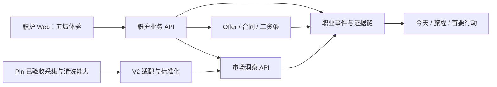

# 职护 V2 开发计划

> 历史说明：本文保留 V2 重构初期的授权、工作包和设计背景，不再作为当前进度或待办入口。继续开发请先阅读 [`../progress/PROGRESS.md`](../progress/PROGRESS.md) 和 [`../docs/README.md`](../docs/README.md)。
>
> 文档状态：执行版
> 版本：V2.1 Development Plan
> 日期：2026-08-15
> 上游文档：[职护 V2 产品蓝图](./职护%20V2%20产品蓝图.md)
> 执行定位：V2 不是从零验证产品方向，而是基于两个已验收项目进行能力复用、重新编排和产品化整合。

---

## 1. 计划目标

职护 V2 面向应届生和入职 0～3 年职场新人，把现有职护和 Pin 中已经实现、已经验收的能力重新组合为一条更有意义的职业守护链路：

> 发现岗位 → 判断机会 → 分析 Offer → 确认关键条件 → 检查合同 → 完成签约 → 核对首月工资 → 持续成长

本次开发的核心不是重复证明每个按钮、页面、算法和采集器能否实现，而是完成四件事：

1. 将既有能力整理为机会、决策、权益、收入、成长五大守护领域。
2. 用统一的职业事件、证据、结论和行动串起原本分散的功能。
3. 把 Pin 已验收的数据能力转化为职护可直接消费的市场事实。
4. 形成一个结构清晰、链路连续、可以集中演示和验收的 V2 产品。

---

## 2. 开发前提

### 2.1 两个参考项目按“已验收资产”处理

本计划确认以下前提：

- 现有职护项目已经完成用户、Offer、薪资计算、合同审查、一致性检查、工资条、旅程和基础管理等核心能力的实现与验收。
- Pin 项目已经完成招聘数据采集、适配器、解析、清洗、去重、标准化、统计接口和趋势分析等核心能力的实现与验收。
- V2 可以直接复用两套项目中的代码、数据结构、页面、规则、算法、测试样本和设计资产。
- 已验收能力不因移动目录、调整导航、替换样式或接入统一模型而自动回到“待验证”状态。

“已验收”表示这些能力可以作为 V2 的可信起点，不表示外部网站、法规、生产环境和第三方服务永远不变化。只有发生实质性逻辑改写、外部依赖变化或高风险数据迁移时，才补做对应验证。

### 2.2 V2 的主要工作类型

| 工作类型 | 典型内容 | 默认处理方式 |
|---|---|---|
| 直接复用 | 页面、组件、计算器、规则、采集器、固定数据结构 | 直接接入，做构建或冒烟检查 |
| 适配重组 | 路由调整、接口适配、状态归并、页面组合、字段映射 | 边开发边联调，做受影响链路测试 |
| 新增能力 | 统一职业事件、跨材料证据链、五域首页状态 | 做针对性单元或集成测试 |
| 高风险变更 | 权限、金额、法律规则、正式迁移、生产配置 | 做完整验证并留下简要记录 |

默认判断顺序是“能否直接复用 → 能否增加适配层 → 是否确实需要重写”。除非现有实现无法满足 V2 结构，否则不为追求架构纯度重复造轮子。

---

## 3. Codex 持续执行授权

### 3.1 本地开发范围内无需逐项确认

在本工作区内，为完成本计划，Codex 可以持续执行以下操作，不需要每个功能点再次请求确认：

- 阅读、修改、新增、移动和重构职护与 Pin 的项目文件。
- 复用两个参考项目中的代码、页面、组件、接口、规则、脚本、样本和资产。
- 调整目录、路由、模块边界、接口契约、数据库模型和本地端口。
- 安装或更新开发依赖，创建本地虚拟环境，运行格式化、迁移、构建和测试命令。
- 启动、停止和重启本地前端、后端、数据库相关开发服务。
- 在开发或测试数据库中建表、迁移、导入本地已有参考数据、生成脱敏演示数据和重建测试数据。
- 为兼容旧功能增加适配层、迁移脚本或临时兼容代码，并在整合完成后清理。
- 同时推进多个没有真实代码依赖的模块，不必等待前一模块形成独立验收报告。
- 自主修复本次开发中发现的构建错误、类型错误、明显缺陷和接口不一致。
- 更新计划、README、进度记录、接口说明和集中验收记录。
- 在 `main` 上直接开发和提交；不创建功能分支，不走 PR 或分支合并流程。

Codex 可以根据当前代码选择实现细节。只要不改变产品定位、核心业务含义或外部数据使用范围，不需要先输出方案等待确认。

### 3.2 Git 执行方式

- 当前仓库以 `main` 为唯一日常开发分支。
- 每完成一批可运行、可说明的变更，Codex 可以直接提交到本地 `main`。
- 提交前只确认本批变更范围，保留用户已有和无关改动，不为整理提交而重置工作区。
- 不要求建立功能分支、开发分支、PR、review gate 或合并流程。
- 需要回退时优先使用小批次提交定位，不使用破坏性重置覆盖用户文件。
- 推送远端仍属于外部状态变更，执行前单独确认；若用户在具体任务中明确要求持续推送，则按该授权执行。

### 3.3 只保留少量必要确认

以下事项会改变外部状态、法律责任或真实数据边界，仍需用户确认：

- 推送远端、公开发布或上线生产环境。
- 使用生产密钥、付费服务或不可逆的生产数据库操作。
- 向外部平台写入数据、发送消息、批量发起真实网络采集或绕过站点访问限制。
- 将真实用户 Offer、合同、工资条或其他敏感材料交给第三方服务。
- 删除原始项目、真实业务数据、数据库备份或无法恢复的重要文件。
- 由系统替用户作出法律结论、签约决定或其他高影响业务决定。

本地代码重组、本地服务运行、测试数据写入、隔离库迁移、直接提交 `main` 和已验收资产复用，不再设置人工决策门。

---

## 4. 执行原则

### 4.1 以集成结果为单位，不以最小功能点为单位

Codex 每次可以承接一个完整工作包，工作包可以同时包含前端、后端、数据、文档和迁移。一个工作包内允许连续完成多个相关功能，不要求每完成一个接口或页面就暂停等待验收。

### 4.2 允许并行推进

只要共享契约已经确定，下列工作流可以并行：

- 产品壳、五域导航、首页和职业旅程。
- 市场数据、岗位标准化、洞察 API 和机会守护。
- Offer、HR 跟进、合同审查和签约清单。
- 工资核对、成长任务和跨域状态汇总。

局部未完成不得自动阻塞整个项目。可以先使用既有接口、适配层或已验收样本完成组合，之后在阶段集成时替换连接点。

### 4.3 优先迁移和适配，减少重写

- 原功能逻辑满足需求时直接搬用。
- 数据结构不同但语义一致时增加映射或适配层。
- 页面结构不同但交互已成立时保留组件，调整入口和信息层级。
- 只有现有实现与 V2 业务模型明显冲突时才重写。
- 重构服务边界不等于重做全部底层能力。

### 4.4 测试服务于风险，不服务于流程

- 没改逻辑的成熟能力不重复做完整验收。
- 普通页面重排以构建、类型检查和关键交互冒烟为主。
- 跨服务契约、迁移、权限、金额计算和规则判断做针对性测试。
- 全量回归、完整浏览器链路和综合报告放在阶段集成点执行。
- 与本次变更无关的历史警告记录即可，不因此停止当前工作包。

### 4.5 保留必要的真实性边界

- 已验收 fixture 可以用于开发和演示，但界面不得把它标成实时市场数据。
- 复用的法律规则仍以辅助解释呈现，不自动宣称合同违法。
- AI 抽取结果可以直接进入流程，但影响金额、合同事实和最终行动时应允许用户修改或确认。
- 用户私人材料与公共招聘数据继续隔离。

---

## 5. V2 目标结构

服务边界继续保持：

| 服务 | 默认端口 | 主要职责 |
|---|---:|---|
| 职护 Web | 3000 | 五域用户界面与完整用户旅程 |
| 职护业务 API | 8000 | 用户、职业事件、材料、结论和行动 |
| 市场洞察 API | 8100 | 标准岗位、薪资、技能和企业市场事实 |
| 采集任务管理 | 8101 | Pin 能力适配、采集任务和数据加工 |

目录可以随整合过程渐进调整，不把“一次性完成理想目录重构”作为业务开发前置条件。

---

## 6. 四个并行工作包

### WP-A：产品壳、职业事件与首页

目标：把分散工具重组为一个连续产品。

主要工作：

- 建立 `CareerEvent`、`Evidence`、`GuardianFinding`、`ActionItem`、`DecisionRecord`、`Outcome` 的统一关系。
- 复用现有用户、档案、Offer、合同、工资条和旅程数据。
- 将一级业务导航固定为机会守护、决策守护、权益守护、收支守护、成长守护；`/today` 作为个人首页，不与五域并列。收入与支出在 `/income` 平级，工资核对只是收入侧子能力。
- 五域页面共享状态卡、证据卡、行动卡和异常状态。
- 首页根据事件、结论和行动生成首要任务，不再只是工具入口。

完成结果：一个用户可以从首页进入五域，并在旅程中看到同一职业事件的连续进展。

### WP-B：市场数据与机会守护

目标：把 Pin 的已验收能力接入职护，而不是重新开发一套招聘平台。

主要工作：

- 复用 Pin 的 API、HTML、Playwright 适配器和解析逻辑。
- 用适配层统一岗位、企业、城市、薪资、技能、来源和时效字段。
- 复用既有清洗、去重和趋势统计能力，补充 V2 需要的来源与质量元数据。
- 建立职护只读的岗位事实、薪资位置、技能趋势和企业活跃度接口。
- 用户侧完成服务端分页岗位库、独立岗位详情、岗位事实、企业信息、市场分析图表、个人匹配、关注和下一行动页面。
- 管理员侧完成数据源配置、采集任务触发、运行日志、失败记录、质量状态和标准数据晋级管理。
- 采集结果必须经过 Raw、标准化、去重、质量门和指标计算后才能进入用户侧，不允许抓取结果直通个人结论。

完成结果：用户可以从一条有来源的岗位进入机会事件，并在 Offer 和成长模块继续使用同一市场事实。

### WP-C：Offer、HR、合同与签约

目标：把现有决策和权益能力串成签约前闭环。

主要工作：

- 复用 Offer 上传、字段抽取、确认、薪资计算、对比和报告页面。
- 将已有 mock 市场位置替换为 WP-B 的市场洞察响应。
- 复用 HR 问题生成，增加回复记录和结论更新。
- 复用合同规则检查、通俗解释和 Offer—合同一致性能力。
- 把 Offer、HR 回复和合同差异统一为签约行动清单。

完成结果：用户完成“Offer → 市场决策 → HR 确认 → 合同检查 → 签约清单”。

### WP-D：收支、成长与跨域汇总

目标：让职护在签约后仍然持续有价值。

主要工作：

- 建立收入、支出和转账平级的统一账本、月度总览、分类和待确认状态；工资核对只是收入侧能力。
- 接入微信、支付宝、银行和通用表格的“批次 → 预览 → 查重 → 用户确认入账”，并把票据本地 OCR、脱敏文本解析和自然语言记账复用到同一候选入口。
- 预算、固定收支、退款/报销关联、AI 分类、月度解释和收支问答均保留在完整功能总图，不按开发批次删减；AI 复用职护既有配置与调用审计。
- 复用工资条录入、计算和差异核对能力。
- 对比 Offer、合同、首月工资与真实到账，形成可追溯的收支行动。
- 使用岗位技能数据生成技能差距和成长任务草稿。
- 将机会、签约、收支和成长状态汇总到首页和旅程。
- 完成桌面端和主要移动端布局整理。

完成结果：用户可以从求职一直走到首月收支整理、工资核对和候选确认，并继续看到成长行动。

---

## 7. 集成节奏

### 阶段 1：建立共同连接点

此阶段不追求所有底层模型一次定型，只完成并行开发需要的共同连接点：

- 确定职业事件、证据、结论和行动的最小公共字段。
- 确定市场洞察响应的最小公共字段。
- 建立旧职护数据和新模型的兼容映射。
- 建立 Pin 输出和市场洞察 API 的适配入口。
- 完成五域路由、共享布局和导航。

阶段检查：前后端可构建；公共 schema 能被各工作包使用；旧核心页面仍可访问。

### 阶段 2：四个工作包并行组装

- WP-A、WP-B、WP-C、WP-D 可同时推进。
- 每个工作包内部允许批量完成页面、接口、迁移和状态联动。
- 遇到未完成依赖时，优先使用适配器或稳定样本继续，不等待完整平台先完工。
- 每个工作包结束时做一次针对性集成检查，不制作冗长的逐功能验收包。

阶段检查：四个工作包各自能走通主要路径，数据来源和降级状态显示真实。

### 阶段 3：完整用户旅程集成

使用一个完整的脱敏应届生案例集中串联：

> 目标岗位 → 机会匹配 → Offer → HR 回复 → 合同 → 签约清单 → 首月工资 → 成长任务

此阶段统一处理：

- 跨模块 ID、状态和字段映射。
- 首页首要行动和旅程状态。
- 页面跳转、空状态和错误状态。
- 市场服务或 AI/OCR 不可用时的降级。
- 桌面端和主要移动端体验。

阶段检查：完整案例可以连续完成，关键结论能回到来源或材料。

### 阶段 4：发布候选集中验收

只在准备 Demo、试点或发布候选时执行：

- 全量自动测试和生产构建。
- 完整浏览器 E2E。
- 两个账号的数据隔离检查。
- 金额计算、跨材料一致性和关键规则抽查。
- 数据迁移、备份和回退演练。
- 已知问题分级和发布说明。

---

## 8. 能力复用清单

| V2 能力 | 主要复用来源 | V2 需要新增或调整 |
|---|---|---|
| 登录、档案、用户旅程 | 现有职护 | 接入五域状态和职业事件 |
| Offer 上传与字段确认 | 现有职护 | 证据关系、版本和 HR 回复 |
| 薪资、个税、五险一金、生活结余 | 现有职护 | 接入市场快照与统一行动 |
| Offer 对比与报告 | 现有职护 | 改为真实市场接口，调整信息层级 |
| 合同审查与通俗解释 | 现有职护 | 接入证据链和统一权益状态 |
| Offer—合同一致性 | 现有职护 | 加入 HR 回复，形成行动清单 |
| 工资条核对 | 现有职护 | 串联 Offer 和合同证据 |
| 招聘数据采集适配器 | Pin | 包装为 V2 适配器契约 |
| 解析、清洗、薪资与城市标准化 | Pin | 补充来源、时效和质量元数据 |
| 岗位、企业、技能和趋势接口 | Pin | 转为内部只读市场洞察 API |
| 五域首页和统一职业事件 | 新增 | 作为 V2 的核心组合层 |
| 机会匹配与成长任务 | 两项目组合 | 连接用户档案、岗位和技能数据 |

Codex 开发前只需快速确认要复用的入口仍存在，不再逐项证明历史能力是否成立。

---

## 9. 风险分级测试策略

| 等级 | 变更类型 | 最低验证要求 |
|---|---|---|
| L1 低风险 | 文案、样式、导航、页面重排、原组件直接复用 | 类型/构建检查 + 关键页面冒烟 |
| L2 中风险 | 接口适配、状态联动、字段映射、跨页面流程 | 针对性测试 + 工作包主链路联调 |
| L3 高风险 | 权限、金额、规则、数据迁移、文件处理、跨服务契约 | 单元/契约/集成测试 + 关键异常场景 |
| RC 发布候选 | 完整系统 | 全量回归 + 浏览器 E2E + 安全与数据抽查 |

执行口径：

- 同一成熟能力未发生逻辑变化时，不重复建立大套测试样本。
- 一个工作包只保留一份简明验证记录：改了什么、跑了什么、结果怎样、还剩什么。
- 浏览器不要求逐页面逐功能重复验收，重点覆盖完整主路径和发生实质变化的交互。
- CI 默认运行快速检查；耗时较长的全量 E2E 和迁移演练放在 `main` 阶段检查点或发布候选执行。
- 已知旧问题若与当前改动无关且不影响主链路，可以登记后继续推进。

---

## 10. 完成标准

### 10.1 工作包完成

一个工作包满足以下条件即可并入 V2：

- 主要用户路径可以走通。
- 新增或改写的关键逻辑经过对应风险等级的测试。
- 数据、接口和页面状态能够与其他工作包连接。
- 没有未披露的主链路阻塞问题。
- 已知限制有简短记录。

不再要求每个子功能同时具备独立验收文档、截图、全量浏览器测试和全套异常证明。

### 10.2 V2 集成完成

V2 以以下产品事实作为最终标准：

- 用户可以从真实岗位或明确标记的演示岗位开始。
- 系统能结合用户档案解释岗位机会和能力差距。
- Offer 能连接市场、HR 确认、合同和签约行动。
- 首月工资可以对照 Offer 与合同完成核对。
- 首页和旅程真实反映五大守护领域的状态和首要行动。
- 关键金额、合同事实和市场结论可查看依据。
- 私人材料与公共市场数据保持隔离。
- 发布候选无未解决的 P0 问题。

---

## 11. 当前状态与下一执行批次

### 11.1 已完成基础

- FP-00 可复现与安全基线已经验收。
- 职护和 Pin 的既有功能按已验收参考实现处理。
- 市场数据固定样本、技术隔离和基础模型已经完成实现验证。
- 单仓库和服务边界已有 ADR，可直接作为 V2 集成基础。

原 FP 编号保留用于追溯已有文档，但不再作为串行解锁门禁。

### 11.2 批次一：共同连接点与界面骨架

Codex 可连续完成：

- 统一职业事件最小模型及旧数据适配。
- 五域导航、路由、共享布局和首页骨架。
- 市场洞察最小响应和 Pin 适配入口。
- 选择一个完整脱敏用户案例作为贯穿数据。

### 11.3 批次二：并行组合核心能力

Codex 可并行或连续批量完成：

- 机会守护与市场洞察。
- Offer、HR、合同和签约清单。
- 工资核对、成长任务和旅程汇总。
- 首页状态、首要行动和跨模块跳转。

不要求“市场平台全部完成后才能改 Offer”，也不要求“Offer 全部完成后才能做合同”。稳定契约或适配层可作为并行连接点。

### 11.4 批次三：集中集成与收口

- 串联完整应届生案例。
- 清理临时适配和重复入口。
- 统一文案、视觉和移动端布局。
- 执行发布候选验证并整理一份综合结果。

---

## 12. 优先级

### P0：V2 主产品必须具备

- 五大守护一级业务导航、个人首页和职业旅程。
- 统一职业事件、证据、结论和行动。
- 市场岗位、薪资和技能事实接入。
- 机会匹配与岗位关注。
- 管理员基础数据源、采集任务、运行结果和质量状态管理。
- Offer 决策、HR 跟进、合同检查和签约清单。
- 首月工资核对与跨材料一致性。
- 完整脱敏案例和集中验收。

### P1：主链路完成后增强

- 消息和截止提醒。
- 连续月份工资趋势。
- 更完整的技能体系与成长任务。
- 更完整的数据运营、规则审核、采集监控告警和健康分析后台。
- 报告导出与更多移动端优化。

### P2：后续扩展

- 谈薪策略模拟。
- 转正、晋升、转岗和跳槽决策。
- 社保转移和跨城市权益。
- 多端同步。
- 经合规评估后的机会订阅与推送。

---

## 13. 项目风险与处理方式

| 风险 | 处理方式 |
|---|---|
| 过度重构导致重复开发 | 默认直接复用，优先适配层，只在确有冲突时重写 |
| 工作包接口相互等待 | 先确定最小契约，允许稳定样本和适配器并行开发 |
| 历史功能在组合后出现回归 | 对实质变化链路做针对性测试，在阶段 3、4 集中回归 |
| 市场数据被误解为实时数据 | 页面明确来源、时间和演示/实时状态 |
| 金额或合同结论出错 | 将计算、规则和跨材料判断列为 L3 高风险验证 |
| 用户材料泄露 | 保留所有权、私有存储、日志脱敏和数据域隔离 |
| 外部站点变化 | 复用 Pin 适配能力；真实批量采集另行确认并监控失败 |
| 旧代码与新模型长期并存 | 允许短期兼容层，在批次三统一清理和记录下线项 |

---

## 14. 执行记录方式

开发过程只维护三类轻量记录：

1. `PROGRESS.md`：当前工作包、已完成结果、下一步和阻塞。
2. 变更对应的必要 ADR 或迁移说明：只记录会长期影响架构的决定。
3. 阶段验收记录：每个阶段一份，不再为每个小功能建立独立材料包。

每次 Codex 完成一批工作后，汇报：

- 已实现的用户结果。
- 主要变更范围。
- 实际执行的验证及结果。
- 仍存在的真实限制。
- 下一批可直接继续的工作。

---

## 15. 计划结论

职护 V2 的开发方式从“逐功能点谨慎验证”调整为“成熟资产复用、并行重组、阶段集成、集中验收”。

两个已验收项目提供底层能力，V2 的价值来自新的产品结构和连续业务链路。Codex 应默认向前推进，在本地工作区自主完成代码复用、重构、联调、迁移、必要测试以及对 `main` 的直接提交；只有涉及远端推送、外部发布、生产数据、付费服务、真实敏感材料或不可逆操作时才暂停确认。

衡量进度的标准不再是完成了多少检查项，而是完整职业守护链路已经组合到什么程度、用户能否连续使用、最终产品是否比原有功能集合更清晰、更统一、更有意义。
