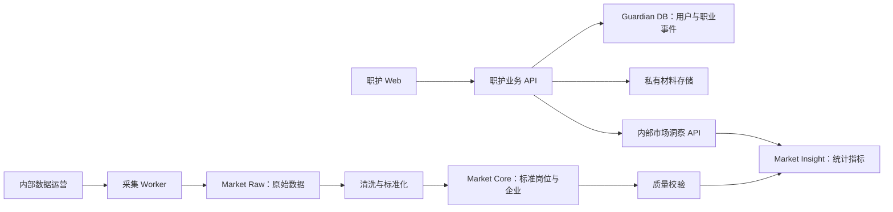

# 职护 V2 开发计划

> 文档状态：执行计划讨论稿  
> 版本：V2.0 Development Plan Draft  
> 日期：2026-08-15  
> 上游文档：[职护 V2 产品蓝图](./职护%20V2%20产品蓝图.md)  
> 说明：本文按可独立验收的功能点组织，供 Codex 逐项实现和验证；不包含人员配置、工期或日常排期，也不代表相关能力已经实现。

---

## 1. 计划目标

本计划用于把现有“职护比赛型 PoC”和 Pin 招聘数据项目，逐步重构为面向应届生和职场新人的职业守护产品。

开发目标不是完成五组页面，而是交付一条真实、可追溯、可持续的业务闭环：

> 发现真实岗位 → 判断是否适合 → 分析 Offer → 确认关键条件 → 检查合同 → 完成签约 → 核对首月工资

最终系统应具备：

- 面向用户的五大守护领域：机会、决策、权益、收入、成长。
- 以职业事件为核心的连续业务模型。
- 独立、受控的招聘市场数据生产链路。
- 来源可追溯、样本可解释、时间可判断的市场数据。
- 用户材料与公共市场数据之间清晰的安全边界。
- 可复现启动、自动测试、浏览器验收和数据质量监控。

---

## 2. Codex 执行口径

### 2.1 基本单位：功能验收点

开发不按人员、日期或 Sprint 计量。Codex 每次只执行一个有明确边界的功能验收点，验收通过后再解锁依赖它的下一项。

每个功能点必须同时写清：

- 用户可感知的结果，而不是“完成某个技术层”。
- 允许修改的模块和明确不做的范围。
- 前置依赖、输入样本和目标数据状态。
- 正常、空数据、异常、无权限和依赖不可用行为。
- 自动测试、API 或浏览器验收方法。
- 需要保留的日志、截图、测试结果或数据质量报告。
- 本次未完成项和真实边界。

### 2.2 功能点状态

| 状态 | 含义 | 进入下一状态的条件 |
|---|---|---|
| `blocked` | 缺少必要输入、权限或关键决策 | 阻塞条件被消除 |
| `ready` | 前置依赖已通过，可由 Codex 开始 | 建立本次实现检查单 |
| `in_progress` | 正在实现或修复 | 代码和迁移完成，进入验证 |
| `verified` | 自动测试及目标链路已通过 | 验收证据已记录 |
| `accepted` | 用户结果符合功能定义 | 无未披露的 P0 问题 |

`mock`、fixture、静态页面和仅返回 200 的接口可以作为中间验证手段，但不能单独将功能点标记为 `accepted`。

### 2.3 Codex 单项执行模板

每次开发都使用同一模板：

1. 读取当前代码、配置、数据状态和已有改动。
2. 重述本功能点的验收结果与不做范围。
3. 实现最小纵向闭环，包括必要的前端、API、数据和权限。
4. 执行针对性测试，再执行受影响范围回归。
5. 使用 API 或浏览器走通用户路径；涉及数据时输出质量证据。
6. 修复本次范围内的失败，不能把未执行测试写成通过。
7. 更新功能状态、变更文件、验证结果、已知限制和下一可执行项。

### 2.4 仍需人工确认的边界

Codex 可以完成实现、测试和证据整理，但以下事项不能由模型自行替用户决定：

- 数据源是否允许采集和使用。
- 劳动法规内容的最终审核和免责声明。
- 是否处理真实用户的 Offer、合同和工资条。
- 生产密钥、公开部署和正式数据迁移授权。
- 会改变产品范围或结论口径的业务决策。

---

## 3. 开发原则

### 3.1 先建立可信基线，再扩功能

- 不在依赖缺失、仓库状态混乱和测试不可运行的基础上继续堆页面。
- 先建立可启动、可测试、可回退的开发基线。
- 现有 PoC 和 Pin 在迁移初期保持可读、可对照，不直接破坏原始目录。

### 3.2 采用纵向闭环，不按技术层堆积

每个功能点都应交付一个用户可走通或系统可独立验证的小闭环，例如：

`岗位链接 → 来源验证 → 标准化岗位 → 匹配说明 → 关注提醒`

不能出现“数据库表已建完、页面已画完，但没有真实业务链路”的完成声明。

### 3.3 先少量真实数据源，再扩覆盖量

- 首期选择 3～5 类具有代表性的数据源。
- 每类数据源必须有固定样本、自动测试、失败状态和更新时间。
- 先验证数据对 Offer 和岗位决策的真实价值，再增加企业数量。

### 3.4 市场数据与用户数据隔离

- 公开招聘数据进入市场数据系统。
- Offer、合同、工资条和个人档案进入职护业务系统。
- 两者通过内部只读市场洞察 API 连接。
- 职护前端不访问采集数据库，也不访问爬虫写接口。

### 3.5 人工确认优先

- AI 抽取结果默认是待确认草稿。
- 用户材料的修改、保存、删除和业务决策需要用户确认。
- 市场数据不足时返回“不可用/样本不足”，不使用伪精确默认值。

### 3.6 每个功能点都留下验证证据

每个功能点至少包含：

- 代码或配置变更。
- 自动测试结果。
- 数据质量结果（涉及数据时）。
- API 或浏览器验证证据。
- 已知问题和未完成范围。
- 文档与迁移状态。

---

## 4. 当前基线与必须先解决的问题

### 4.1 代码和仓库基线

当前工作区存在外层 Git 仓库、未提交的整个 `zhihu/` 与 `Pin/` 目录，以及前端内部独立 Git 仓库。正式开发前需要确定统一版本管理策略。

FP-00 必须完成：

- 盘点所有现有改动、生成物、数据库备份和敏感配置。
- 确定单仓库或多仓库方案。
- 保留原始工作区快照，禁止使用破坏性重置清理。
- 将 `.env`、`node_modules`、`.next`、上传材料和数据库备份排除在源码版本控制之外。
- 为真正需要版本管理的迁移脚本、数据字典和测试样本建立明确目录。

### 4.2 可复现环境

当前需要重新建立：

- 职护前端依赖安装和锁文件一致性。
- 职护后端 Python 虚拟环境与依赖。
- Pin/市场数据服务的独立 Python 环境。
- MySQL 数据库与 schema 初始化方式。
- 统一的本地启动、停止和健康检查脚本。
- macOS、Windows 路径差异处理。

### 4.3 已知安全问题

在接入真实用户材料前必须修复：

- Offer、合同、报告和 Finding 详情接口的用户所有权校验。
- 创建合同时对 `case_id`、`linked_offer_id` 的归属校验。
- 默认 JWT 密钥和生产配置边界。
- Pin API 的无认证写接口与全开放 CORS。
- 用户原文保存、删除和日志脱敏策略。

### 4.4 端口冲突

当前职护和 Pin 都默认使用前端 3000、后端 8000。建议统一保留：

| 服务 | 建议端口 | 暴露范围 |
|---|---:|---|
| 职护 Web | 3000 | 用户访问 |
| 职护业务 API | 8000 | Web 调用 |
| 市场洞察 API | 8100 | 仅内部调用 |
| 采集任务管理 | 8101 | 仅管理员/内网 |
| MySQL | 3306 | 本地或受控网络 |
| Redis/任务队列 | 6379 | 本地或受控网络 |

端口仅作为开发约定，最终以部署方案为准。

---

## 5. 目标系统结构

### 5.1 服务边界



### 5.2 推荐目录方向

在 FP-00 的架构决策确认前不立即搬迁文件。建议目标结构为：

```text
zhihu/
├── apps/
│   └── web/                    # 用户端 Next.js
├── services/
│   ├── guardian-api/           # 职护业务 API
│   ├── market-api/             # 内部只读市场洞察 API
│   └── crawler-worker/         # 数据源采集和任务执行
├── packages/
│   ├── contracts/              # OpenAPI/共享数据契约
│   ├── taxonomy/               # 岗位、城市、技能标准体系
│   └── rules/                  # 可版本化业务规则
├── migrations/
│   ├── guardian/
│   └── market/
├── tests/
│   ├── fixtures/               # 脱敏固定样本
│   ├── contract/
│   ├── integration/
│   ├── data-quality/
│   └── e2e/
└── docs/
```

如果选择多仓库，仍应保持相同的服务和数据边界。

### 5.3 数据库建议

| 数据域 | 建议 schema/库 | 主要内容 |
|---|---|---|
| 用户业务 | `guardian` | 用户、档案、职业事件、材料、结论、行动和结果 |
| 原始市场数据 | `market_raw` | 原始响应、抓取任务、内容哈希和解析结果 |
| 标准市场数据 | `market_core` | 企业、岗位、来源、岗位族、城市和技能 |
| 市场指标 | `market_insight` | 薪资分布、岗位热度、技能趋势和快照 |
| 历史隔离区 | `pin_legacy_staging` | 旧备份导入和质量审计，不直接供产品使用 |

首期可以使用同一 MySQL 实例的不同 schema，但账号和权限必须分离。

---

## 6. 能力域拆分

整个 V2 分为六个能力域。它们用于标明代码和数据边界，不代表团队分工或并行排期；实际执行仍以第 7 节的功能验收点及其依赖关系为准。

### 6.1 产品与体验工作流

- 五大守护领域信息架构。
- 首页守护驾驶舱。
- 职业事件流程和状态。
- 空状态、异常状态和数据不可用文案。
- 桌面端和移动端导航。
- 脱敏演示案例和用户验收脚本。

### 6.2 业务平台工作流

- 用户档案与权限。
- CareerEvent、Evidence、GuardianFinding、ActionItem、DecisionRecord、Outcome。
- Offer、合同和工资条材料关系。
- 统一结论与行动编排。
- 删除、导出和隐私策略。

### 6.3 市场数据工作流

- 数据源注册和适配器契约。
- Raw、Canonical、Quality、Insight 数据层。
- 岗位、企业、城市、薪资和技能标准化。
- 增量采集、去重、有效性和快照。
- 市场洞察只读 API。

### 6.4 文档智能与规则工作流

- Offer、合同和工资条文件解析。
- OCR 和页面定位。
- LLM 结构化抽取与 Pydantic 校验。
- 规则库版本化和法规内容审核。
- Offer—HR—合同—工资条跨材料一致性。

### 6.5 质量与安全工作流

- 用户资源所有权和管理员权限。
- 自动测试、数据质量和 E2E。
- 隐私、日志脱敏和材料生命周期。
- 性能、错误监控和数据源健康。

### 6.6 基础设施工作流

- 开发环境、CI 和依赖缓存。
- 数据库迁移和测试数据库。
- 对象存储和本地开发替代。
- 任务队列、定时任务和监控。
- 演示环境和发布回退。

---

## 7. 功能验收点总览

| ID | 可验收功能点 | 用户或系统可见结果 | 前置依赖 | 当前状态 | 通过证据 |
|---|---|---|---|---|---|
| FP-00 | 可复现与安全基线 | 项目可启动、可测试，两个用户数据隔离 | 无 | `accepted` | 启动记录、健康检查、权限测试 |
| FP-01 | 职业事件与五域骨架 | 五域页面和首页状态来自统一事件模型 | FP-00 | `in_progress` | 迁移、契约测试、浏览器空状态 |
| FP-02 | 市场原始数据链路 | 代表性来源能进入 Raw 层并回链来源 | FP-00 | `in_progress` | 固定样本已验证；真实采集与正式 staging 迁移待人工授权 |
| FP-03 | 招聘数据清洗与质量 | 原始岗位变成可比较、可判定质量的标准岗位 | FP-02 | `blocked` | Raw→Core 数据质量报告 |
| FP-04 | 市场洞察 API | 返回带样本量、时间和质量等级的薪资/技能事实 | FP-03 | `blocked` | 契约测试、集成测试 |
| FP-05 | 机会守护闭环 | 用户可验证岗位、查看匹配依据并关注机会 | FP-01、FP-04 | `blocked` | 岗位→匹配浏览器 E2E |
| FP-06 | Offer 市场决策 | Offer 使用真实市场快照，不再使用 mock 薪资 | FP-04、FP-05 | `blocked` | Offer 报告 E2E、mock 清除检查 |
| FP-07 | Offer 字段确认与 HR 跟进 | 用户确认抽取字段、生成问题并记录 HR 回复 | FP-01、FP-06 | `blocked` | 上传→确认→回复→重算 E2E |
| FP-08 | 合同解析与权益解释 | 每条合同结论可定位原文和规则依据 | FP-01、FP-07 | `blocked` | 合同解析、所有权和规则测试 |
| FP-09 | Offer—HR—合同一致性 | 系统输出差异并形成签约前行动清单 | FP-08 | `blocked` | 完整签约链路 E2E |
| FP-10 | 工资条解析与收入核对 | 实发可复算，差异能关联 Offer/合同证据 | FP-09 | `blocked` | 工资条→差异→行动 E2E |
| FP-11 | 成长守护 | 用户看到技能差距并确认成长任务 | FP-01、FP-04 | `blocked` | 技能依据和任务状态 E2E |
| FP-12 | 五域首页与职业旅程 | 首页展示真实五域状态、首要行动和事件进展 | FP-05～FP-11 | `blocked` | 五类用户状态浏览器测试 |
| FP-13 | 发布级验收 | 完整链路、安全、数据质量和回退均可重复验证 | FP-00～FP-12 | `blocked` | 综合验收报告，无 P0 问题 |

推荐执行顺序不是按时间切片，而是按依赖解锁：

```text
FP-00 → FP-01
FP-00 → FP-02 → FP-03 → FP-04
FP-01 + FP-04 → FP-05 → FP-06 → FP-07 → FP-08 → FP-09 → FP-10
FP-01 + FP-04 → FP-11
FP-05～FP-11 → FP-12 → FP-13
```

每次 Codex 开发从最靠前且状态为 `ready` 的功能点中选择一项。不得因为下游页面更显眼而跳过其数据、权限或契约依赖。

---

## 8. 功能验收包详细说明

## FP-00：建立可复现和安全基线

### 目标

停止在不确定工作区状态上继续叠加功能，建立后续开发的可信起点。

### 工作项

#### 仓库与配置

- 记录外层仓库、内层前端仓库和所有未提交文件状态。
- 确定单仓库或多仓库方案，形成 ADR-001。
- 建立根级 `.gitignore`，排除密钥、依赖、构建产物、上传材料和 SQL 备份。
- 将实际密钥保留在本机配置，仓库只保留 `.env.example`。
- 建立当前可用代码的非破坏性基线提交策略。

#### 环境与启动

- 固定 Node、Python、MySQL 版本。
- 恢复职护前端、职护后端和数据服务依赖。
- 统一端口和健康检查。
- 提供 macOS 启动说明，保留 Windows 说明但移除硬编码路径依赖。
- 建立测试数据库初始化与清理方法。

#### 安全修复

- 为 Offer、合同、报告和 Finding 查询增加用户所有权过滤。
- 创建合同和关联 Offer 时验证所有权。
- 将 JWT 默认密钥改为开发环境显式配置。
- 限制 Pin 管理接口只在内部环境使用。

### 交付物

- 仓库策略 ADR。
- 环境依赖和启动文档。
- 端口与服务清单。
- 基础健康检查脚本。
- 当前 API 权限修复。
- 现状验证报告。

### 验收

- 全新开发环境可按文档启动职护前后端。
- 健康检查返回服务版本和依赖状态。
- 两个测试用户不能互相访问 Offer、合同和报告。
- 密钥和 SQL 备份不进入待提交源码清单。
- 所有失败项明确记录，不能以“历史曾运行”代替本次验证。

---

## FP-01：领域模型、信息架构和数据契约

### 目标

建立五大守护领域共享的业务骨架，避免后续每个模块继续自建状态。

### 工作项

#### 业务模型

- 定义 `CareerEvent` 类型、状态和生命周期。
- 定义 `Evidence`、`GuardianFinding`、`ActionItem`、`DecisionRecord`、`Outcome`。
- 建立 Offer、合同、工资条与职业事件的关系。
- 定义事实、计算、规则、市场数据和 AI 建议五类来源。

#### API 契约

- 建立统一错误结构和数据不可用状态。
- 建立结论、证据和行动响应 schema。
- 建立市场洞察 API 契约，先使用固定 fixture 实现契约测试。
- 统一时间、金额、城市、岗位族和质量等级表达。

#### 前端骨架

- 将一级导航调整为今天、机会、决策、权益、收入、成长。
- 建立五域布局和统一状态卡组件。
- 建立首页真实状态接口的空壳，不在前端硬编码完成状态。
- 将知识内容改为可嵌入守护领域的内容组件。

### 交付物

- 领域模型说明和数据库迁移。
- OpenAPI/Schema 契约。
- 五域导航和首页骨架。
- 脱敏端到端案例 fixture。
- ADR-002：市场服务边界。

### 验收

- 同一职业事件可关联多份证据、多条结论和多项行动。
- 结论接口能明确返回来源类型、证据和状态。
- 五个守护领域均有可访问页面和明确空状态。
- 契约测试无需真实 Pin 数据即可运行。

---

## FP-02：市场数据平台基础

### 目标

从 Pin 中选择性迁移数据生产能力，建立独立的市场数据最小骨架。

### 工作项

#### 历史数据隔离

- 将 Pin 备份只导入 `pin_legacy_staging`。
- 统计真实记录数、有效时间范围、空值率、重复率和来源分布。
- 不允许职护业务接口直接查询 staging。
- 形成历史数据可用性报告和可迁移字段清单。

#### 数据模型

- 建立 `data_source`、`crawl_task`、`raw_record`、`company`、`job`、`job_source`。
- 建立岗位族、城市、技能和招聘类型标准表。
- 建立内容哈希、来源时间、首次发现和最后发现字段。

#### 适配器契约

- 定义 API、HTML、Playwright 三类适配器接口。
- 适配器统一输出 RawRecord，不直接写标准岗位表。
- 建立超时、重试、限速、错误类型和运行日志。
- 选择首批代表性固定样本。

### 建议首批来源类型

1. 一个结构化招聘 API 来源。
2. 一个 Moka/飞书招聘类 SaaS 来源。
3. 一个北森/Hotjob 类招聘 SaaS 来源。
4. 可选一个必须使用 Playwright 的企业官网。

首期按来源类型选样本，不按企业数量追求覆盖率。

### 交付物

- 市场数据 schema 和迁移。
- 数据源注册表。
- 统一适配器协议。
- 三类固定抓取样本及解析测试。
- 历史备份质量报告。

### 验收

- 相同 RawRecord 可重复解析且结果稳定。
- 适配器失败不会写入标准岗位表。
- 每条标准岗位都能回链到来源和抓取时间。
- staging、raw、core 数据权限分离。
- FP-02 不要求全量联网抓取成功，固定样本和代表性真实采集必须分别标记。

---

## FP-03：招聘数据清洗与质量

### 目标

把 RawRecord 转换成可比较、可追溯、可判定是否可用的标准岗位。

### 工作项

- 岗位名称映射为 `job_family` 和 `job_role`。
- 城市、区域和远程办公标准化。
- 学历、专业、经验和招聘类型标准化。
- 薪资上下限、单位、发薪周期和币种统一。
- 技能标签清洗、同义词归并和版本管理。
- 计算来源可信度、字段完整度和时间有效性。
- 识别薪资异常、跨来源重复、关闭和过期岗位。

### 交付物

- 标准化字典 V1。
- Raw→Core 转换任务。
- 数据质量规则 V1。
- 数据质量报告。

### 验收

- 每条标准岗位都能回链到原始记录、来源和转换版本。
- 相同输入重复执行得到一致结果，不重复生成岗位。
- 重复、过期和关键字段缺失记录不会被标为当前有效岗位。
- 固定样本的标准化、去重、过期和薪资边界测试通过。

---

## FP-04：市场指标与内部洞察 API

### 目标

把通过质量门槛的标准岗位聚合为职护可消费的市场事实。

### 工作项

- 计算岗位族 × 城市薪资 P25/P50/P75。
- 计算岗位数量、变化、高频技能、技能变化和企业招聘活跃度。
- 保存样本量、统计窗口、更新时间、口径版本和质量等级。
- 提供岗位有效性、薪资位置、技能分布和企业活跃度查询。
- API 使用只读账号、内部访问控制和可失效缓存。

### 交付物

- 市场指标任务和快照表。
- 内部市场洞察 API V1。
- OpenAPI/Schema 契约与数据质量报告。

### 验收

- 每个薪资结论都包含样本量、统计周期、更新时间和口径版本。
- 样本不足返回明确状态，不返回硬编码默认 P50。
- 重复和过期记录不进入当前市场指标。
- 至少三个来源类型完成 Raw→Core→Insight 链路。
- API 契约、访问控制、数据库集成和数据质量测试通过。

---

## FP-05：机会守护闭环

### 目标

让用户从一条真实岗位开始，得到岗位事实和可解释的个人匹配结果。

### 工作项

- 用户输入岗位链接、关键词或选择市场岗位。
- 展示岗位官方来源、有效时间、企业和关键要求。
- 将用户档案与岗位要求进行可解释匹配。
- 支持关注岗位和截止时间提醒。
- 记录“发现目标岗位”CareerEvent 和下一行动。

### 交付物

- 机会守护 V1。
- 岗位事实、匹配解释和关注状态接口。
- 岗位到匹配结果的浏览器 E2E。

### 验收

- 用户可从一条有来源的岗位建立职业事件。
- 用户可看到岗位是否有效、为什么匹配以及每项判断依据。
- 岗位过期、来源失效和市场服务不可用均显示不同状态。
- 浏览器完成“岗位 → 事实 → 匹配 → 关注/下一行动”。

---

## FP-06：Offer 真实市场决策

### 目标

用可追溯的市场样本替换 Offer 报告里的 mock 薪资结论。

### 工作项

- 将 Offer 岗位映射到标准岗位族和城市。
- 查询真实薪资分位并保存本次使用的市场快照引用。
- 报告展示样本量、统计周期、更新时间、口径和质量等级。
- 市场数据不可用时保留 Offer 自身计算，但不展示模拟市场位置。
- 决策守护状态和下一行动读取真实 Offer 事件。

### 交付物

- Offer 报告真实市场数据接入。
- 市场快照引用和降级状态。
- Offer 市场报告浏览器 E2E。

### 验收

- Offer 报告不再读取现有 `MOCK_SALARY_DATA`。
- 用户可从市场位置回查统计口径和样本信息。
- 数据服务不可用或样本不足时页面如实显示，不伪装成功。
- 浏览器完成“岗位 → Offer → 市场报告 → 决策行动”。

---

## FP-07：Offer 确认与 HR 行动闭环

### 目标

从“生成报告”升级为“推动用户完成确认”。

### 工作项

- 完善 Offer PDF、图片和文本解析。
- 每个字段保存置信度、证据、页码和用户确认状态。
- 建立 Offer 版本，区分原始抽取和用户修改。
- 根据缺失、浮动和异常条件生成 HR 问题。
- 支持记录 HR 回复和附件。
- HR 回复触发 Offer 结论重算。
- 用户可标记问题已确认、无需确认或待跟进。
- 首页首要行动根据回复截止和待确认项更新。

### 交付物

- Offer 材料解析 V2。
- 字段证据与确认组件。
- HR 问题、回复和状态模型。
- Offer 版本与报告重算。

### 验收

- 低置信度字段未确认前不能形成强结论。
- HR 回复会改变相关结论和行动状态。
- 用户可以查看报告结论对应的材料原文和市场数据。
- 完成“Offer 上传 → 字段确认 → HR 问题 → 回复 → 报告更新”E2E。

---

## FP-08：合同解析与权益解释

### 目标

让用户逐项确认合同事实，并让每条权益提示都能回到合同原文和规则依据。

### 工作项

- 支持 PDF、图片和可选 Office 文件。
- OCR 结果保留页面和坐标。
- 提取主体、岗位、薪资、地点、试用期、工时、竞业、违约和解除条件。
- 用户逐项确认合同字段，低置信度结果不能自动成为事实。
- 规则保存版本、生效时间、依据和审核状态。
- LLM 解释绑定原文，不直接输出“违法”结论。
- 高影响但无法判断的事项提示补充材料或专业咨询。

### 交付物

- 合同文件解析和确认页。
- 规则库版本 V1。
- 权益解释及证据定位接口。

### 验收

- 每条合同结论可定位到文件、页码和原文。
- 所有合同和关联 Offer 均进行用户所有权校验。
- 规则版本、依据和审核状态可追溯。
- 不能以关键词命中直接宣称合同违法。

---

## FP-09：Offer—HR—合同一致性

### 目标

把 Offer 承诺、HR 回复和合同条款合并为签约前可执行的差异清单。

### 工作项

- 对比 Offer、HR 回复和已确认合同字段。
- 输出一致、表述不同、明确差异、合同缺失和无法判断。
- 每条差异绑定两侧证据，并生成确认话术或行动。
- 用户完成行动后记录 DecisionRecord 和 Outcome。

### 交付物

- Offer—HR—合同一致性引擎。
- 签约前行动清单和结果记录。
- 权益守护状态接口。

### 验收

- 每条差异都能查看比较字段、两侧证据和判断类型。
- 信息不足时返回“无法判断”，不自动推断承诺成立。
- 用户可以完成行动并让相关结论状态更新。
- 浏览器完成“Offer → HR 回复 → 合同 → 差异 → 签约清单”。

---

## FP-10：收入守护与首月工资

### 目标

验证用户入职后继续使用职护的价值。

### 工作项

- 支持工资条文件解析和手动确认。
- 提取应发、基本工资、绩效、补贴、社保、公积金、个税、其他扣款和实发。
- 执行工资条内部数字校验。
- 对比 Offer、合同和工资条。
- 区分固定差异、月份特殊情况、信息不足和异常。
- 生成 HR/财务确认清单和话术。
- 支持记录确认结果和后续处理。
- 建立月度工资快照，首期不扩展为完整记账产品。

### 交付物

- 工资条解析和确认页。
- Offer—合同—工资条一致性服务。
- 收入差异解释与行动。
- 收入守护首页状态。

### 验收

- 工资条数字计算可独立复算。
- 差异结论能指出涉及哪份 Offer/合同证据。
- 无法判断原因时明确要求补充考勤、绩效或 HR 信息。
- 浏览器完成“工资条上传 → 确认 → 差异 → 行动 → 结果”。

---

## FP-11：成长守护

### 目标

让用户看到有市场依据的技能差距，并把建议转成可确认、可记录的成长任务。

### 工作项

- 建立用户技能、熟练度和证据模型。
- 将用户技能映射到标准技能字典。
- 对比当前岗位和目标岗位的市场技能要求。
- 生成 30/60/90 天任务草稿，由用户确认后生效。
- 记录任务完成、成长证据和目标变化。

### 交付物

- 成长守护 V1。
- 技能差距、任务和成长证据接口。
- 技能市场依据组件。

### 验收

- 每项技能差距都能查看来源、样本量和统计时间。
- 未经用户确认的任务保持草稿状态。
- 用户完成任务并添加证据后，成长状态按确定规则更新。
- 浏览器完成“目标岗位 → 技能差距 → 确认任务 → 记录证据”。

---

## FP-12：五域首页与职业旅程

### 目标

让首页真正贯彻五大守护理念，统一展示当前状态、首要行动和职业事件进展。

### 工作项

- 五域卡片全部从真实事件和结论生成状态。
- 首要行动按截止、影响、阻塞和用户优先级排序。
- “与我有关的变化”接入市场指标快照。
- 职业旅程展示事件、行动、决策和结果。
- 空状态根据求职、签约、入职等用户阶段动态变化。
- 完成桌面端六项导航和移动端“今天、守护、旅程、消息、我的”。
- 验证键盘操作、对比度和主要移动端尺寸。

### 交付物

- 五域首页 V1。
- 职业旅程 V2。
- 首要行动排序器和响应式导航。

### 验收

- 首页不存在硬编码“已完成”状态。
- 每张守护卡均能跳转到对应事件或明确下一步。
- 首要行动排序原因可解释。
- 用户可以看到市场变化的来源、样本和时间。
- 五类用户状态的浏览器场景和主要移动端视口通过。

---

## FP-13：系统验收、试点和发布准备

### 目标

将功能完成转化为可以被真实试点用户使用的交付状态。

### 工作项

#### 完整业务验收

- 使用脱敏但完整的应届生案例跑通全链路。
- 使用至少两个账号验证数据隔离。
- 验证数据服务、LLM、OCR 不可用时的降级表现。
- 验证删除材料、删除任务和删除账号。

#### 数据验收

- 数据源成功率、时效、重复率和异常率。
- 薪资指标样本和离群逻辑抽查。
- 岗位关闭和过期识别抽查。
- 来源回链可访问性抽查。

#### 安全与隐私

- 资源所有权和管理员权限测试。
- 文件类型、大小、路径和恶意内容边界测试。
- 日志敏感信息检查。
- CORS、密钥、默认账号和内部接口检查。

#### 发布

- 数据库备份和迁移演练。
- 服务健康、告警和仪表盘。
- 发布检查表和回退步骤。
- 试点用户反馈表。

### 交付物

- 端到端验收报告。
- 数据质量报告。
- 安全检查报告。
- 发布与回退手册。
- 试点版本和已知问题清单。

### 验收

- 完整业务链路在目标环境通过。
- 无未解决 P0 安全或数据错误。
- 所有 P1 问题均有状态、影响范围和解除条件。
- 试点用户能够独立完成至少一个守护闭环。
- 线上数据、演示数据和不可用状态能够明确区分。

---

## 9. 测试计划

### 9.1 测试层次

| 层次 | 覆盖对象 | 最低要求 |
|---|---|---|
| 单元测试 | 薪资、规则、标准化、去重、状态排序 | 关键分支和边界值 |
| Schema/契约测试 | Web、Guardian API、Market API | 请求响应兼容和错误状态 |
| 数据质量测试 | Raw→Core→Insight | 完整度、时效、重复和异常 |
| 数据库集成测试 | 权限、事务、迁移和关联 | 独立测试库运行 |
| 服务集成测试 | 业务 API 调用市场 API | 正常、超时、不可用和缓存 |
| 浏览器 E2E | 用户关键旅程 | 每个用户功能点至少一条真实链路 |
| 安全测试 | 越权、文件、密钥、CORS | 发布前必跑 |
| 业务验收 | 脱敏完整案例 | 验收结果和未通过项有记录 |

### 9.2 固定测试样本

需要建立并版本化：

- 三类招聘数据源的脱敏 HTML/API 响应。
- 一份正常 Offer、一份字段缺失 Offer、一份模糊图片 Offer。
- 一份正常合同、一份包含多个待确认项合同。
- 一份正常工资条、一份数字不一致工资条。
- 两个用户账号的数据隔离场景。
- 市场数据样本不足、过期和服务不可用场景。

### 9.3 每个功能点的证据要求

- 静态检查成功不等于浏览器验收成功。
- 固定样本成功不等于真实数据源成功。
- API 返回 200 不等于业务结论正确。
- 无数据或 no-op 必须如实标记，不能作为“采集成功”宣传。
- 数据库备份存在不等于当前数据库已导入或数据有效。

---

## 10. 数据迁移计划

### 10.1 Pin 历史备份

迁移步骤：

1. 校验备份文件哈希和导出时间。
2. 导入隔离 schema `pin_legacy_staging`。
3. 统计表记录数、来源、日期范围和字段空值率。
4. 识别重复、过期、未来时间和薪资异常。
5. 建立旧字段到新标准字段的显式映射。
6. 只将通过质量门槛的记录转换到 `market_core`。
7. 为每批迁移记录批次、口径版本和拒绝原因。
8. 重新计算指标，不迁移旧聚合结论作为当前事实。

### 10.2 现有职护业务数据

- 用户、Offer、合同和工资条保留原始 ID 映射。
- 新增 CareerEvent 后，为旧记录生成迁移事件。
- 无法确定来源的旧结论标记为 `legacy_unverified`。
- 不将旧 mock 市场结果迁移为市场事实。
- 用户材料的原文保存策略需在迁移前确认。

### 10.3 回退

- 每次迁移先在副本运行。
- 迁移脚本必须幂等或明确一次性边界。
- 记录迁移前后计数和拒绝数。
- 不使用手工 SQL 修复代替正式迁移脚本。
- 正式切换前保留只读旧系统查询窗口。

---

## 11. CI/CD 与环境计划

### 11.1 环境

| 环境 | 用途 | 数据要求 |
|---|---|---|
| Local | 日常开发 | 固定 fixture + 最小测试库 |
| CI | 自动验证 | 每次全新初始化，不依赖开发者本机 |
| Demo | 演示和业务验收 | 脱敏完整案例，可重复恢复 |
| Staging | 集成和试点前验证 | 受控真实市场数据，无真实用户敏感材料或严格脱敏 |
| Production | 正式用户 | 单独密钥、权限、备份和监控 |

### 11.2 CI 门禁

每个合并请求至少执行：

- 前端类型检查、lint、单元测试和构建。
- 后端 lint/类型检查、单元测试和数据库迁移检查。
- API 契约测试。
- 数据质量固定样本测试。
- 关键权限测试。

主分支或发布候选额外执行：

- 服务集成测试。
- 浏览器关键路径。
- 数据库升级和回退演练。
- 敏感配置扫描。

---

## 12. 监控计划

### 12.1 数据源监控

- 最近成功抓取时间。
- 抓取成功率和连续失败次数。
- 解析成功率。
- 新增、更新、关闭职位数量。
- 页面结构变化或字段骤降。
- 来源访问限制和错误类型。

### 12.2 数据质量监控

- 有效职位数量。
- 重复率、过期率和无来源率。
- 城市、岗位族和薪资字段完整度。
- 薪资异常率。
- 各指标样本量和数据新鲜度。
- 质量等级分布。

### 12.3 业务监控

- 各守护领域事件创建和完成率。
- 待确认行动数量和逾期率。
- 用户修改 AI 抽取字段比例。
- 报告查看依据比例。
- 从岗位到 Offer、合同和工资条的漏斗。

### 12.4 技术监控

- API 延迟、错误率和依赖超时。
- OCR/LLM 调用成功率和耗时。
- 任务队列积压。
- 数据库连接和慢查询。
- 文件存储和删除失败。

---

## 13. Definition of Done

一个功能只有同时满足以下条件才算完成：

- 用户场景和边界已确认。
- 前后端接口有明确 schema。
- 权限和数据所有权经过验证。
- 正常、空、错误和依赖不可用状态均有处理。
- 关键逻辑有自动测试。
- 涉及市场数据时包含来源、样本量、时间和质量状态。
- 涉及 AI 时包含证据、置信度和人工确认。
- 已在目标浏览器走通关键路径。
- 文档、迁移和已知问题已更新。
- 没有把 fixture、mock 或历史快照宣传成实时生产结果。

单纯完成页面、接口返回 200 或历史构建成功均不满足 Definition of Done。

---

## 14. 优先级清单

### P0：首个试点版本必须完成

- 仓库和环境可复现。
- 用户资源所有权安全修复。
- CareerEvent、Evidence、Finding、Action、Outcome 模型。
- 五大守护导航和首页状态骨架。
- 三类真实数据源的最小采集链路。
- 市场数据标准化、质量和只读 API。
- 岗位有效性与个人匹配。
- Offer 真实市场位置和 HR 确认。
- 合同文件解析与 Offer—HR—合同一致性。
- 工资条解析与 Offer—合同—工资一致性。
- 用户材料保存和删除策略。
- 完整浏览器 E2E、安全和数据质量验收。

### P1：试点后增强

- 更多数据源和企业覆盖。
- 消息与截止提醒。
- 连续月份工资趋势。
- 更完整的技能体系和成长任务。
- 合同规则后台审核工作流。
- 数据运营和采集健康后台。
- 报告导出。

### P2：后续扩展

- 谈薪策略模拟。
- 转正、晋升、转岗和跳槽决策。
- 社保转移和跨城市权益。
- 多端同步。
- 经合规评估后的机会订阅与推送。

---

## 15. 风险与应对

| 风险 | 影响 | 应对 |
|---|---|---|
| 五域同时展开导致失控 | 所有模块都浅，核心闭环不可用 | 严格按岗位—Offer—合同—工资关键路径交付 |
| 数据源页面频繁变化 | 采集静默失效或污染数据 | 固定样本、契约测试、字段骤降告警和适配器版本 |
| 历史备份质量未知 | 错误数据进入市场结论 | 只导入 staging，质量审计后分批转换 |
| 岗位名称无法直接比较 | 薪资和技能结论失真 | 建立岗位族 taxonomy 和人工抽查 |
| 薪资样本不足 | 给用户错误精确感 | 设置最小样本和数据质量等级 |
| 法规规则过期 | 误导用户权益判断 | 规则版本、审核人、生效时间和定期复核 |
| LLM 输出不稳定 | 字段或解释错误 | 固定 schema、证据绑定、置信度和人工确认 |
| 敏感材料越权 | 严重隐私问题 | 所有权过滤、租户测试、私有存储和日志脱敏 |
| Pin 管理接口被公开 | 数据被修改或触发抓取 | 内部网络、认证、只读业务 API 和权限隔离 |
| 旧代码与新模型并存 | 状态不一致 | 明确迁移窗口、兼容层和下线标准 |

---

## 16. Codex 首批执行队列

下面不是按天排期，而是必须依次验收的最小功能点。前一项未通过，不开始依赖它的后一项。

### Q-01：仓库与运行基线

**实现范围**

- 记录 Git、依赖、服务、数据库和端口现状，保留用户已有改动。
- 建立安全的忽略规则和示例配置，不移动或删除原项目。
- 恢复职护前后端依赖，固定本地启动与健康检查方式。

**通过条件**

- 新终端按文档可启动前端、业务 API，并获得健康检查结果。
- 待提交清单不包含密钥、上传材料、依赖、构建产物和数据库备份。
- 启动失败时能指出具体依赖或配置，不以历史运行记录代替本次验证。

### Q-02：用户数据隔离

**实现范围**

- 修复 Offer、合同、报告和 Finding 的越权读写。
- 创建合同及关联 Offer 时验证资源归属。
- 建立两个测试用户的固定权限样本。

**通过条件**

- 用户 A 对用户 B 的上述资源执行查询、修改和关联均被拒绝。
- 权限测试可重复运行，正常用户路径不受破坏。

### Q-03：职业事件最小模型

**实现范围**

- 落地 CareerEvent、Evidence、Finding、Action、Outcome 的最小 schema。
- 让 Guardian API 返回当前用户的真实事件状态。
- 为旧 Offer/合同建立兼容关系，不迁移旧 mock 结论为事实。

**通过条件**

- 一个职业事件可关联证据、结论、行动和结果。
- 数据库迁移可在空库运行，关联和权限测试通过。

### Q-04：五域导航与真实空状态

**实现范围**

- 建立今天、机会、决策、权益、收入、成长六项桌面导航。
- 五域页面读取统一状态接口，不在前端硬编码完成状态。
- 为未创建事件、数据不可用和请求失败分别提供状态。

**通过条件**

- 五域页面均可访问，并能正确区分三类状态。
- 使用浏览器走通导航，前端测试和构建通过。

### Q-05：市场洞察 walking skeleton

**实现范围**

- 定义 Market API 最小只读契约。
- 使用版本化 fixture 返回带来源、样本量、统计时间和质量等级的薪资响应。
- Offer 报告通过业务 API 调用 Market API，不允许浏览器直连数据服务。

**通过条件**

- 契约测试和服务集成测试通过。
- Market API 不可用时 Offer 页面显示“市场数据不可用”，不回退到模拟 P50。
- 浏览器走通一次 Offer 市场报告，并明确标记当前数据是 fixture 而非真实市场事实。

Q-01～Q-05 全部通过后，才进入 FP-02 的真实数据采集与清洗。这样首批实现会形成可运行、可测试、可替换数据源的纵向骨架，而不是一组互不连通的页面或表结构。

---

## 17. 关键决策门

### Gate A：开始业务开发前

必须确认：

- 仓库策略。
- 服务边界和端口。
- 用户数据与市场数据分区。
- 首个完整用户案例。
- FP-00 与 FP-01 的验收命令和证据位置。

### Gate B：真实数据进入产品前

必须确认：

- 数据源合规状态。
- 标准字段和岗位族口径。
- 最小样本量和数据过期规则。
- 来源回链和质量等级。
- 历史数据迁移报告。

### Gate C：合同和工资条试点前

必须确认：

- 用户材料保存与删除策略。
- 资源所有权测试。
- 法规规则的人工审核机制和免责声明。
- OCR/LLM 不可用降级。

### Gate D：发布试点前

必须确认：

- 完整业务 E2E。
- 数据质量报告。
- 安全检查报告。
- 发布和回退步骤。
- 已知问题、影响级别和解除条件。

---

## 18. 待确认事项

1. 采用单仓库还是多仓库。
2. 首批试点是否允许使用真实敏感材料；未确认前只使用脱敏样本。
3. 首批三类数据源的具体选择及采集合规边界。
4. OCR、LLM、对象存储和消息通知的技术选型。
5. 法规规则采用什么人工审核机制。
6. 是否需要公网部署以及目标环境。
7. 历史 Pin 备份是否允许导入本机隔离库做质量审计。
8. 当前职护已有用户数据是否需要保留迁移。

---

## 19. 计划完成标准

本开发计划完成后的最终结果，不以页面数量或抓取记录数衡量，而以以下事实衡量：

- 用户可以从一条有来源、有时效的真实岗位开始。
- 系统能结合用户档案解释岗位是否适合。
- Offer 报告使用经过质量治理的真实市场样本。
- HR 回复、合同和工资条形成连续证据链。
- 用户可以完成明确行动并记录结果。
- 首页真实反映五大守护领域当前状态。
- 所有重要结论可查看事实、规则、计算或市场数据依据。
- 用户私人材料与公共招聘数据严格隔离。
- 系统能够通过自动测试、浏览器验收和数据质量门禁重复验证。

只有同时满足这些条件，职护才从“功能较多的 PoC”转变为“可以持续守护应届生和职场新人的产品”。
